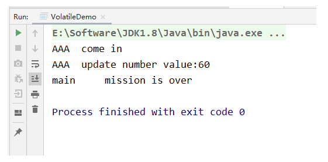
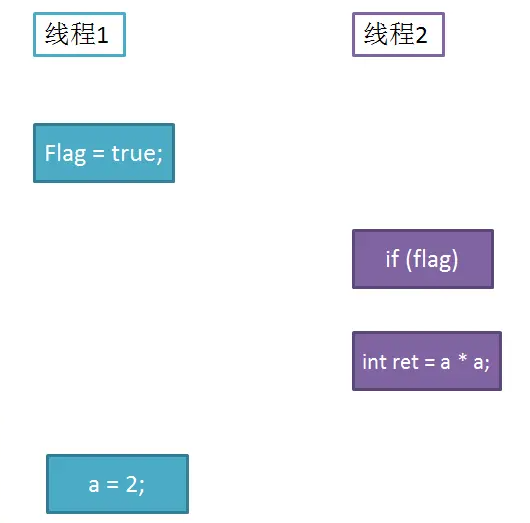

# 谈谈对Volatile的理解

- Volatile是Java虚拟机提供的轻量级的同步机制（三大特性）
  - 保证可见性
  - 不保证原子性
  - 禁止指令重排
  
  被volatile修饰的共享变量，就具有了以下两点特性：
  
  1 . 保证了不同线程对该变量操作的内存可见性;
  
  2 . 禁止指令重排序

## 1.JMM是什么

JMM是Java内存模型，也就是Java Memory Model，简称JMM，本身是一种抽象的概念，实际上并不存在，它描述的是一组规则或规范，通过这组规范定义了程序中各个变量（包括实例字段，静态字段和构成数组对象的元素）的访问方式

JMM关于同步的规定：

```
线程解锁前，必须把共享变量的值刷新回主内存
线程解锁前，必须读取主内存的最新值，到自己的工作内存
加锁和解锁是同一把锁
```

由于JVM运行程序的实体是线程，而每个线程创建时JVM都会为其创建一个工作内存（有些地方称为栈空间），工作内存是每个线程的私有数据区域，而Java内存模型中规定所有变量都存储在主内存，主内存是共享内存区域，所有线程都可以访问，**但线程对变量的操作（读取赋值等）必须在工作内存中进行，首先要将变量从主内存拷贝到自己的工作内存空间，然后对变量进行操作，操作完成后再将变量写会主内存**，不能直接操作主内存中的变量，各个线程中的工作内存中存储着主内存中的变量副本拷贝，因此不同的线程间无法访问对方的工作内存，线程间的通信（传值）必须通过主内存来完成，其简要访问过程：


上面提到了两个概念：主内存 和 工作内存

- 主内存：就是计算机的内存，也就是经常提到的8G内存，16G内存
- 工作内存：但我们实例化 new student，那么 age = 25 也是存储在主内存中
- 当同时有三个线程同时访问 student中的age变量时，那么每个线程都会拷贝一份，到各自的工作内存，从而实现了变量的拷贝，即：JMM内存模型的可见性，指的是当主内存区域中的值被某个线程写入更改后，其它线程会马上知晓更改后的值，并重新得到更改后的值。


### 1.1缓存一致性问题

缓存一致性的问题——就是当多个处理器运算任务都涉及到同一块主内存区域的时候，将可能导致各自的缓存数据不一。

为了解决缓存一致性的问题，需要各个处理器访问缓存时都遵循一些协议，在读写时要根据协议进行操作，这类协议主要有MSI、MESI等等。

#### 1.1.1MESI（缓存行无效）

当CPU**写数据**时，如果发现操作的变量是共享变量，即在其它CPU中也存在该变量的副本，会发出信号通知其它CPU将该内存变量的缓存行设置为无效，因此当其它CPU读取这个变量的时，发现自己缓存该变量的缓存行是无效的，那么它就会从内存中重新读取。

#### 1.1.2总线嗅探

为什么主线程中某个值被更改后，其它线程能马上知晓呢？其实这里是用到了总线嗅探技术

总线嗅探技术——就是每个处理器通过嗅探在总线上传播的数据来检查自己缓存值是否过期了，当处理器发现自己的缓存行对应的内存地址被修改，就会将当前处理器的缓存行设置为无效状态，当处理器对这个数据进行修改操作的时候，会重新从内存中把数据读取到处理器缓存中。

#### 1.1.3总线风暴

总线嗅探技术有哪些缺点？

由于Volatile的MESI缓存一致性协议，需要不断的从主内存嗅探和CAS循环，无效的交互会导致总线带宽达到峰值。因此不要大量使用volatile关键字，至于什么时候使用volatile、什么时候用锁以及Syschonized都是需要根据实际场景的。

## 2.JMM的特性

JMM的三大特性，volatile只保证了两个，即可见性和有序性，不满足原子性、

**当写一个volatile变量时，JMM会把该线程对应的本地内存中的共享变量刷新到主内存**

**当读一个volatile变量时，JMM会把该线程对应的本地内存置为无效，线程接下来将从主内存中读取共享变量。**

###  2.1可见性代码验证

 当一个变量被volatile修饰时，那么对它的修改会立刻刷新到主存，当其它线程需要读取该变量时，会去内存中读取新值。而普通变量则不能保证这一点。

其实通过synchronized和Lock也能够保证可见性，线程在释放锁之前，会把共享变量值都刷回主存，但是synchronized和Lock的开销都更大。

```java
/**
 * Volatile Java虚拟机提供的轻量级同步机制
 *
 * 可见性（及时通知）
 * 不保证原子性
 * 禁止指令重排
 *
 */

import java.util.concurrent.TimeUnit;

/**
 * 假设是主物理内存
 */
class MyData {

    int number = 0;

    public void addTo60() {
        this.number = 60;
    }
}

/**
 * 验证volatile的可见性
 * 1. 假设int number = 0， number变量之前没有添加volatile关键字修饰
 */
public class VolatileDemo {

    public static void main(String args []) {

        // 资源类
        MyData myData = new MyData();

        // AAA线程 实现了Runnable接口的，lambda表达式
        new Thread(() -> {

            System.out.println(Thread.currentThread().getName() + "\t come in");

            // 线程睡眠3秒，假设在进行运算
            try {
                TimeUnit.SECONDS.sleep(3);
            } catch (InterruptedException e) {
                e.printStackTrace();
            }
            // 修改number的值
            myData.addTo60();

            // 输出修改后的值
            System.out.println(Thread.currentThread().getName() + "\t update number value:" + myData.number);

        }, "AAA").start();

        while(myData.number == 0) {
            // main线程就一直在这里等待循环，直到number的值不等于零
        }

        // 按道理这个值是不可能打印出来的，因为主线程运行的时候，number的值为0，所以一直在循环
        // 如果能输出这句话，说明AAA线程在睡眠3秒后，更新的number的值，重新写入到主内存，并被main线程感知到了
        System.out.println(Thread.currentThread().getName() + "\t mission is over");

        /**
         * 最后输出结果：
         * AAA	 come in
         * AAA	 update number value:60
         * 最后线程没有停止，并行没有输出  mission is over 这句话，说明没有用volatile修饰的变量，是没有可见性
         */

    }
}

```

输出结果：

最后线程没有停止，并行没有输出 mission is over 这句话，说明没有用volatile修饰的变量，是没有可见性

当我们修改MyData类中的成员变量时，并且添加volatile关键字修饰

最后输出结果为：

### 2.2原子性

 Java中，对基本数据类型的读取和赋值操作是原子性操作，所谓原子性操作就是指这些操作是不可中断的，要做一定做完，要么就没有执行。 比如：

```
i = 2;
j = i;
i++;
i = i + 1；
复制代码
```

上面4个操作中，`i=2`是读取操作，必定是原子性操作，`j=i`你以为是原子性操作，其实吧，分为两步，一是读取i的值，然后再赋值给j,这就是2步操作了，称不上原子操作，`i++`和`i = i + 1`其实是等效的，读取i的值，加1，再写回主存，那就是3步操作了。所以上面的举例中，最后的值可能出现多种情况，就是因为满足不了原子性。

这么说来，只有简单的读取，赋值是原子操作，还只能是用数字赋值，用变量的话还多了一步读取变量值的操作。有个例外是，虚拟机规范中允许对64位数据类型(long和double)，分为2次32为的操作来处理，但是最新JDK实现还是实现了原子操作的。

举例：

```java
public class Test {
    public volatile int inc = 0;
 
    public void increase() {
        inc++;
    }
 
    public static void main(String[] args) {
        final Test test = new Test();
        for(int i=0;i<10;i++){
            new Thread(){
                public void run() {
                    for(int j=0;j<1000;j++)
                        test.increase();
                };
            }.start();
        }
 
        while(Thread.activeCount()>1)  //保证前面的线程都执行完
            Thread.yield();
        System.out.println(test.inc);
    }
```

按道理来说结果是10000，但是运行下很可能是个小于10000的值。因为这里的操作inc++是个复合操作，包括读取inc的值，对其自增，然后再写回主存。

假设线程A，读取了inc的值为10，这时候被阻塞了，因为没有对变量进行修改，触发不了volatile规则。

线程B此时也读读inc的值，主存里inc的值依旧为10，做自增，然后立刻就被写回主存了，为11。

此时又轮到线程A执行，由于工作内存里保存的是10，所以继续做自增，再写回主存，11又被写了一遍。所以虽然两个线程执行了两次increase()，结果却只加了一次。

有人说，**volatile不是会使缓存行无效的吗**(1.1.1MESI)？但是这里线程A读取到线程B也进行操作之前，并没有修改inc值，所以线程B读取的时候，还是读的10。

又有人说，线程B将11写回主存，**不会把线程A的缓存行设为无效吗**？但是线程A的读取操作已经做过了啊，只有在做读取操作时，发现自己缓存行无效，才会去读主存的值，所以这里线程A只能继续做自增了。

综上所述，在这种复合操作的情景下，原子性的功能是维持不了了。但是volatile在对变量的读/写操作都是单步的的例子里，还是能保证原子性的。

要想保证原子性，只能借助于synchronized,Lock以及并发包下的atomic的原子操作类了，即对基本数据类型的 自增（加1操作），自减（减1操作）、以及加法操作（加一个数），减法操作（减一个数）进行了封装，保证这些操作是原子性操作。

### 2.3有序性

JMM是允许编译器和处理器对指令重排序的，但是规定了as-if-serial语义，即不管怎么重排序，程序的执行结果不能改变。比如下面的程序段：

```java
double pi = 3.14;    //A
double r = 1;        //B
double s= pi * r * r;//C
```

上面的语句，可以按照`A->B->C`执行，结果为3.14,但是也可以按照`B->A->C`的顺序执行，因为A、B是两句独立的语句，而C则依赖于A、B，所以A、B可以重排序，但是C却不能排到A、B的前面。JMM保证了重排序不会影响到单线程的执行，但是在多线程中却容易出问题。

比如这样的代码:

```java
int a = 0;
bool flag = false;

public void write() {
    a = 2;              //1
    flag = true;        //2
}

public void multiply() {
    if (flag) {         //3
        int ret = a * a;//4
    }
    
}
```

假如有两个线程执行上述代码段，线程1先执行write，随后线程2再执行multiply，最后ret的值一定是4吗？结果不一定：



如图所示，write方法里的1和2做了重排序，线程1先对flag赋值为true，随后执行到线程2，ret直接计算出结果，再到线程1，这时候a才赋值为2,很明显迟了一步。

这时候可以为flag加上volatile关键字，禁止重排序，可以确保程序的“有序性”，也可以上重量级的synchronized和Lock来保证有序性,它们能保证那一块区域里的代码都是一次性执行完毕的。

另外，JMM具备一些先天的**有序性**,即不需要通过任何手段就可以保证的有序性，通常称为**happens-before**原则。`<<JSR-133：Java Memory Model and Thread Specification>>`定义了如下happens-before规则：

> 1. **程序顺序规则**： 一个线程中的每个操作，happens-before于该线程中的任意后续操作
> 2. **监视器锁规则**：对一个线程的解锁，happens-before于随后对这个线程的加锁
> 3. **volatile变量规则**： 对一个volatile域的写，happens-before于后续对这个volatile域的读
> 4. **传递性**：如果A happens-before B ,且 B happens-before C, 那么 A happens-before C
> 5. **start()规则**： 如果线程A执行操作`ThreadB_start()`(启动线程B) ,  那么A线程的`ThreadB_start()`happens-before 于B中的任意操作
> 6. **join()原则**： 如果A执行`ThreadB.join()`并且成功返回，那么线程B中的任意操作happens-before于线程A从`ThreadB.join()`操作成功返回。
> 7. **interrupt()原则**： 对线程`interrupt()`方法的调用先行发生于被中断线程代码检测到中断事件的发生，可以通过`Thread.interrupted()`方法检测是否有中断发生
> 8. **finalize()原则**：一个对象的初始化完成先行发生于它的`finalize()`方法的开始

## 3.volatile底层的实现机制

如果把加入volatile关键字的代码和未加入volatile关键字的代码都生成汇编代码，会发现加入volatile关键字的代码会多出一个lock前缀指令。

lock前缀指令实际相当于一个内存屏障，内存屏障提供了以下功能：

> 1 . 重排序时不能把后面的指令重排序到内存屏障之前的位置 
>
> 2 . 使得本CPU的Cache写入内存 
>
> 3 . 写入动作也会引起别的CPU或者别的内核无效化其Cache，相当于让新写入的值对别的线程可见。

## 4.使用到volatile的两个例子

1. 状态量标记，就如上面对flag的标记

```java
int a = 0;
volatile bool flag = false;

public void write() {
    a = 2;              //1
    flag = true;        //2
}

public void multiply() {
    if (flag) {         //3
        int ret = a * a;//4
    }
}
```

这种对变量的读写操作，标记为volatile可以保证修改对线程立刻可见。比synchronized,Lock有一定的效率提升。

2.单例模式的实现，典型的双重检查锁定（DCL）

```java
class Singleton{
    private volatile static Singleton instance = null;
 
    private Singleton() {
 
    }
 
    public static Singleton getInstance() {
        if(instance==null) {
            synchronized (Singleton.class) {
                if(instance==null)
                    instance = new Singleton();
            }
        }
        return instance;
    }
}
```

这是一种懒汉的单例模式，使用时才创建对象，而且为了避免初始化操作的指令重排序，给instance加上了volatile。
