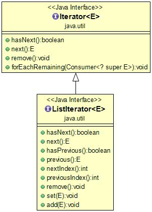

# 迭代器（Iterator）

Java Iterator（迭代器）不是一个集合，它是一种用于访问集合的方法，可用于迭代 [ArrayList](https://www.runoob.com/java/java-arraylist.html) 和 [HashSet](https://www.runoob.com/java/java-hashset.html) 等集合。

Iterator 是 Java 迭代器最简单的实现，ListIterator 是 Collection API 中的接口， 它扩展了 Iterator 接口。



## 1-基本操作

迭代器 it 的两个基本操作是 next 、hasNext 和 remove。

调用 it.next() 会返回迭代器的下一个元素，并且更新迭代器的状态。

调用 it.hasNext() 用于检测集合中是否还有元素。

调用 it.remove() 将迭代器返回的元素删除。

Iterator 的独到之处：**能够将遍历序列的操作与序列底层的结构分离**。

当容器通过 **iterator**() 方法返回 **Iterator** 对象后，这时候就不需要再为容器中的元素的数量操心了，因为这些事情交给 **hashNext**() 和 **next**() 去关心就行了。**remove**() 方法是用来删除 next() 产生的最后一个元素，所以在调用 remove() 方法前必须先调用 next() 方法。

## 2-使用方法

```java
// 引入 ArrayList 和 Iterator 类
import java.util.ArrayList;
import java.util.Iterator;

public class RunoobTest {
    public static void main(String[] args) {

        // 创建集合
        ArrayList<String> sites = new ArrayList<String>();
        sites.add("Google");
        sites.add("Runoob");
        sites.add("Taobao");
        sites.add("Zhihu");

        // 获取迭代器
        Iterator<String> it = sites.iterator();

        // 输出集合中的第一个元素
        System.out.println(it.next());
    }
}
/*结果：
Google
```

```java
//让迭代器 it 逐个返回集合中所有元素最简单的方法是使用 while 循环：
while(it.hasNext()) {
    System.out.println(it.next());
}
```

删除元素：

```java
// 引入 ArrayList 和 Iterator 类
import java.util.ArrayList;
import java.util.Iterator;

public class RunoobTest {
    public static void main(String[] args) {
        ArrayList<Integer> numbers = new ArrayList<Integer>();
        numbers.add(12);
        numbers.add(8);
        numbers.add(2);
        numbers.add(23);
        Iterator<Integer> it = numbers.iterator();
        while(it.hasNext()) {
            Integer i = it.next();
            if(i < 10) {  
                it.remove();  // 删除小于 10 的元素
            }
        }
        System.out.println(numbers);
    }
}
```

# ListIterator

ListIterator 是一个更加强大的 Iterator 的子类型，它只能用于各种 LIst 类的访问。它有以下特点：

- Iterator 只能向前移动，但是 ListIterator 可以**双向移动**；
- ListIterator 可以产生迭代器在列表中指向的当前位置的前一个和后一个元素的索引，并且可以使用 **set**() 方法替换它访问过的最后一个元素；
- ListIterator 可以通过 listIterator() 方法产生一个指向 List 开始出的 LIstIterator，还可以通过 **listIterator(n)** 方法创建一个开始就指向列表索引为 n 的元素处的 ListIterator。

```java
public static void main(String[] args) {
        //创建 list
        List<Integer> list = Arrays.asList(1,2,3,4,5);
        //通过 list 获取索引为 1 的 listIterator 对象
        ListIterator listIterator = list.listIterator(1);
        while(listIterator.hasNext()){
            System.out.println("当前元素：" + listIterator.next() +
                    ",下一个元素索引：" + listIterator.nextIndex() +
                    ",上一个元素索引：" + listIterator.previousIndex() + ";");
        }
        //向前移动
        while(listIterator.hasPrevious()){
            System.out.println("向前移动:" + listIterator.previous());
        }
        //向后移动
        while(listIterator.hasNext()){
            //获取当前元素
            listIterator.next();
            //将元素的值设置为 10
            listIterator.set(10);
        }
        System.out.println("修改后的集合：" + list);
    }
/*结果如下：

当前元素：3,下一个元素索引：3,上一个元素索引：2;
当前元素：4,下一个元素索引：4,上一个元素索引：3;
当前元素：5,下一个元素索引：5,上一个元素索引：4;
向前移动5
向前移动4
向前移动3
向前移动2
向前移动1
修改后的集合：[10, 10, 10, 10, 10]
```

代码直接通过 listIterator(1) 方法获取指向索引为 1 的 ListIterator，并通过 **nextIndext**() 和 **previousIndex**() 方法来获取当前元素的前一个和后一个元素的索引，通过 **hasPrevious**() 方法来是否还有上一个元素，通过 **previous**() 方法来获取当前元素，并指向上一个元素，**set**() 方法可对当前元素进行修改操作。

# Foreach

foreach 语法主要用于数组和任何 Collection 对象，之所以能工作，是因为 Collection 继承了 Iterable 接口，Iterable 接口被 foreach 用来在序列中移动。因此，任何实现了 Iterable 的类，都可以将它用在 foreach 语句中。

**foreach** 语句可以用于数组或其他任何的 Iterable，但是这并不意味着数组肯定也是一个 Iterable，而任何自动包装也不会发生：

```java
/**
     * 遍历 iterable
     *
     * @param iterable
     * @param <T>
     */
    public static <T> void display(Iterable<T> iterable) {
        for (T t : iterable) {
            System.out.print(t + ",");
        }
    }

    public static void main(String[] args) {
        //创建 Integer 数组
        Integer[] ints = {1, 2, 3};
        //将数组转换成 List 然后调用 display 方法
        display(Arrays.asList(ints));
        //调用 display 方法报错
        //display(ints);
    }	
```

代码尝试将数组当做 Iterable 对象传递给 display() 方法，但是失败了，但是将数组转换成 List 对象传递给 display() 方法成功了。这说明**不存在任何从数组到 Iterable 的自动转换，必须手动转换**。

补充一下，如果数组是基本数据类型，比如 int，那么将其转换为 List 集合然后将其当做 Iterable 参数传递的时候，虽然编译不会报错，但是结果是错误的，因为 Java 中泛型要求是对象类型，而基本数据类型不是对象，需要使用其包装类才行。