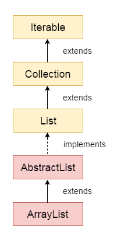
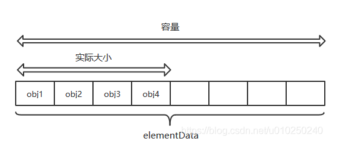
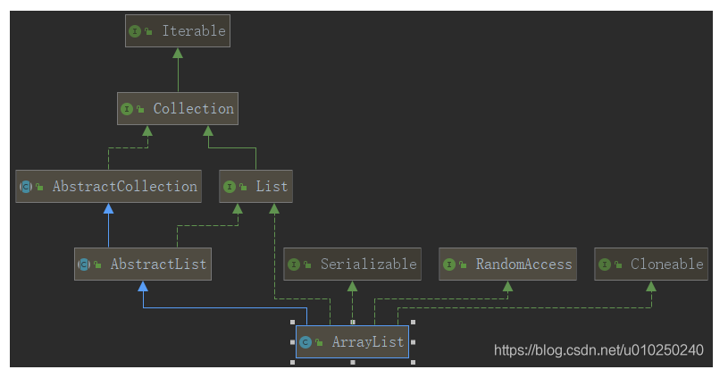
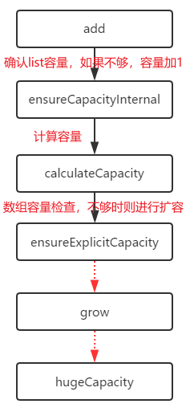
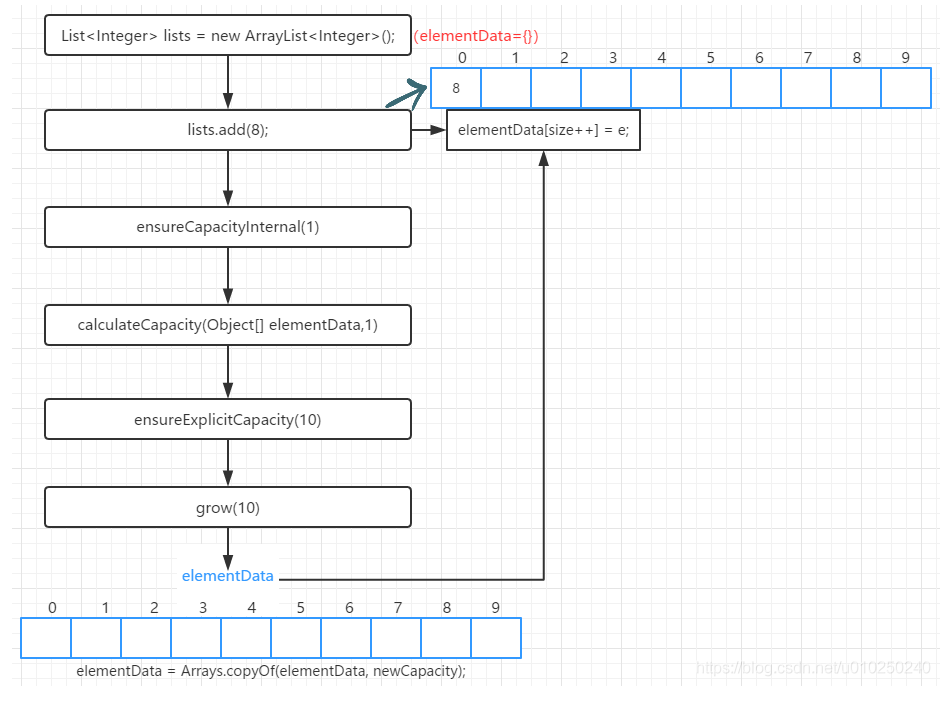
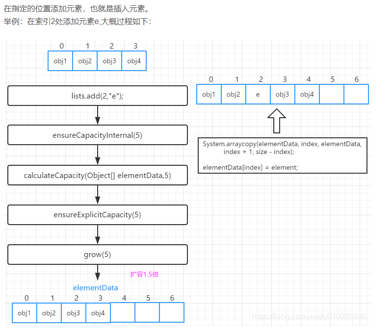

# ArrayList

## 1- ArrayList概述

### 1.1- ArrayList简介

ArrayList 类是一个可以动态修改的数组，与普通数组的区别就是它是没有固定大小的限制，我们可以添加或删除元素。

ArrayList 继承了 AbstractList ，并实现了 List 接口。是一个数组队列，提供了相关的添加、删除、修改、遍历等功能。

ArrayList是List接口的**大小可变数组**的实现；ArrayList**允许null**元素；ArrayList的**容量可以自动增长**；ArrayList**不是同步的**；ArrayList的iterator和listIterator方法返回的迭代器是**fail-fast**的



### 1.2-ArrayList数据结构

容量：CAPACITY ； 实际大小：size；
ArrayList底层的数据结构就是数组，数组元素类型为Object类型，即可以存放所有类型数据。我们对ArrayList类的实例的所有的操作底层都是基于数组的。



## 2-源码分析

### 2.1 ArrayList继承结构和层次关系

```java
public class ArrayList<E> extends AbstractList<E>
        implements List<E>, RandomAccess, Cloneable, java.io.Serializable
```



- ArrayList：说明ArrayList支持泛型。
- extends AbstractList ：继承了AbstractList。[为什么要先继承AbstractList，而让AbstractList先实现List？而不是让ArrayList直接实现List？](https://www.cnblogs.com/zhangyinhua/p/7687377.html#_label2)
  这里是有一个思想，接口中全都是抽象的方法，而抽象类中可以有抽象方法，还可以有具体的实现方法，正是利用了这一点，让AbstractList是实现接口中一些通用的方法，而具体的类， 如ArrayList就继承这个AbstractList类，拿到一些通用的方法，然后自己在实现一些自己特有的方法，这样一来，让代码更简洁，就继承结构最底层的类中通用的方法都抽取出来，先一起实现了，减少重复代码。所以一般看到一个类上面还有一个抽象类，应该就是这个作用。
- 实现了List接口：[ArrayList的父类AbstractList也实现了List接口，那为什么子类ArrayList还是去实现一遍呢？](https://www.cnblogs.com/zhangyinhua/p/7687377.html#_label2)collection 的作者Josh说他写这代码的时候觉得这个会有用处，但是其实并没什么用，但因为没什么影响，就一直留到了现在。
- 实现了RandomAccess接口：表明ArrayList支持快速（通常是固定时间）随机访问。在ArrayList中，我们可以通过元素的序号快速获取元素对象，这就是快速随机访问。
- 实现了Cloneable接口：实现了该接口，就可以使用Object.Clone()方法了。
- implements java.io.Serializable：表明该类具有序列化功能，该类可以被序列化，什么是序列化？简单的说，就是能够从类变成字节流传输，然后还能从字节流变成原来的类。

### 2.2-类的属性

```java
// 序列化id
private static final long serialVersionUID = 8683452581122892189L;

/**
* Default initial capacity. 默认的初始化容量
*/
private static final int DEFAULT_CAPACITY = 10;

/**
* Shared empty array instance used for empty instances.
* 指定该ArrayList容量为0时，返回该空数组。
*/
private static final Object[] EMPTY_ELEMENTDATA = {};

/**
* 当调用无参构造方法，返回的是该数组。刚创建一个ArrayList 时，其内数据量为0。
* 它与EMPTY_ELEMENTDATA的区别就是：该数组是默认返回的，而EMPTY_ELEMENTDATA是在用户指定容量为0时返回。
*/
private static final Object[] DEFAULTCAPACITY_EMPTY_ELEMENTDATA = {};

/**
* 保存添加到ArrayList中的元素。 
* ArrayList的容量就是该数组的长度。 
* 该值为DEFAULTCAPACITY_EMPTY_ELEMENTDATA 时，当第一次添加元素进入ArrayList中时，数组将扩容值DEFAULT_CAPACITY。 
* 被标记为transient，在对象被序列化的时候不会被序列化。
*/
transient Object[] elementData; // non-private to simplify nested class access

/**
* ArrayList的实际大小（数组包含的元素个数/实际数据的数量）默认为0
* @serial
*/
private int size;
  
/**
* 分派给arrays的最大容量
* 为什么要减去8呢？
* 因为某些VM会在数组中保留一些头字，尝试分配这个最大存储容量，可能会导致array容量大于VM的limit，最终导致OutOfMemoryError。
*/
private static final int MAX_ARRAY_SIZE = Integer.MAX_VALUE - 8;
//备注：MAX.VALUE为0x7fffffff，转换成十进制就是2147483647，也就是数组的最大长度是2147483639；
```

### 2.3 -构造方法

ArrayList提供了三种构造方法：

- ArrayList(int initialCapacity)：构造一个指定容量为capacity的空ArrayList。这是一个带初始容量大小的有参构造函数。
  - 初始容量大于0,实例化数组，将自定义的容量大小当成初始化elementData的大小
  - 初始容量等于0，将空数组赋给elementData
  - 初始容量小于0，抛异常

```java
   /**
     * Constructs an empty list with the specified initial capacity.
     * 构造具有指定初始容量的空List
     * @param  initialCapacity  the initial capacity of the list （list的初始化容量）
     * @throws IllegalArgumentException if the specified initial capacity is negative
	 * 如果指定的初始容量为负，抛出异常
     */
    public ArrayList(int initialCapacity) {
        if (initialCapacity > 0) {
            this.elementData = new Object[initialCapacity];
        } else if (initialCapacity == 0) {
            this.elementData = EMPTY_ELEMENTDATA;
        } else {
            throw new IllegalArgumentException("Illegal Capacity: "+
                                               initialCapacity);
        }
    }
```

- ArrayList()：构造一个初始容量为 10 的空列表。

  如果我们创建ArrayList对象的时候不传入参数，则使用此无参构造方法创建ArrayList对象。从前面可以知道DEFAULTCAPACITY_EMPTY_ELEMENTDATA是一个空的Object[]，将elementData初始化，elementData也是个Object[]类型。空的Object[]会给默认容量10。**当有元素被加入时(add方法)即进行第一次add的时候，elementData将会变成默认的长度：10。**

```java
    /**
	 * 构造一个初始容量为10的空列表
     */
    public ArrayList() {
        this.elementData = DEFAULTCAPACITY_EMPTY_ELEMENTDATA;
    }
```

- ArrayList(Collection<? extends E> c)：构造一个包含指定 collection 的元素的列表，这些元素是按照该 collection 的迭代器返回它们的顺序排列的。第二个有参构造方法构造时赋的值是它的父类Collection对象。
  - 将collection对象转换成数组，然后将数组的地址赋给elementData。
  - 如果数组的实际大小等于0（c中没有元素），将空数组EMPTY_ELEMENTDATA赋值给elementData
  - 如果size的值大于0，则执行Arrays.copy方法，把collection对象的内容（可以理解为深拷贝）copy到elementData中。

```java

    /**
     * 构造一个包含指定 collection 的元素的列表，这些元素是按照该 collection 的迭代器返回它们的顺序排列的。
	 * 其元素将放置在此列表中的 collection
	 * 如果指定的 collection 为 null
     */
    public ArrayList(Collection<? extends E> c) {
        elementData = c.toArray();
        if ((size = elementData.length) != 0) {
            // c.toArray might (incorrectly) not return Object[] (see 6260652)
            //每个集合的toarray()的实现方法不一样，所以需要判断一下，如果不是Object[].class类型，那么就需要使用ArrayList中的方法去改造一下。
            if (elementData.getClass() != Object[].class)
		//copyOf(要复制的数组,要返回的副本的长度,要返回的副本的类)
                elementData = Arrays.copyOf(elementData, size, Object[].class);
        } else {
            // replace with empty array.
            this.elementData = EMPTY_ELEMENTDATA;
        }
    }
```

### 2.4 主要方法

#### 2.4.1 get()方法

```java
    /**
     * 返回list中指定位置的元素
     * @param  index  要返回的元素的索引
     * @return 位于list中指定位置的元素
     * @throws IndexOutOfBoundsException {@inheritDoc}
     */
    public E get(int index) {
        rangeCheck(index);//越界检查
        return elementData(index);//返回索引为index的元素
    }
    /**
	 检查指定索引是否在范围内。如果不在，抛出一个运行时异常。
	 这个方法不检查索引是否为负数，它总是在数组访问之前立即优先使用，
	 如果给出的索引index>=size，抛出一个越界异常
     */
    private void rangeCheck(int index) {
        if (index >= size)
            throw new IndexOutOfBoundsException(outOfBoundsMsg(index));
    }
    private String outOfBoundsMsg(int index) {
        return "Index: "+index+", Size: "+size;
    }

    // Positional Access Operations 位置访问操作
	// 返回索引为index的元素
    @SuppressWarnings("unchecked")
    E elementData(int index) {
        return (E) elementData[index];
    }
//因为ArrayList底层是数组，所以它的get方法非常简单，先是判断一下有没有越界（索引小于0或者大于等于数组实际长度，错误信息返回索引和数组的实际长度），之后就直接通过数组下标来获取元素。
```

#### 2.4.2 set()方法

```java
    /**
     * 用指定的元素替换列表中指定位置的元素。
     * @param index  要替换的元素的索引
     * @param element   要存储在指定位置的元素
     * @return 先前位于指定位置的元素(返回被替换的元素)
     * @throws IndexOutOfBoundsException {@inheritDoc} 如果参数指定索引index>=size，抛出一个越界异常
     */
    public E set(int index, E element) {
		//检查索引是否越界。如果参数指定索引index>=size，抛出一个越界异常
        rangeCheck(index);
		//记录被替换的元素（旧值）
        E oldValue = elementData(index);
		//替换元素（新值）
        elementData[index] = element;
		//返回被替换的元素
        return oldValue;
    }
```

#### 2.4.3 add()方法（一个参数）

```java
    /**
     * 将指定的元素追加到此列表的末尾
     * @param e  被添加到list的元素
     * @return <tt>true</tt> (as specified by {@link Collection#add})
     */
    public boolean add(E e) {
		//确认list容量，如果不够，容量加1。注意：只加1，保证资源不被浪费
        ensureCapacityInternal(size + 1); 
        //将元素e放在size的位置上,并且size++
        elementData[size++] = e;
        return true;
    }
	//数组容量检查，不够时则进行扩容，只供类内部使用 
    private void ensureCapacityInternal(int minCapacity) {
        ensureExplicitCapacity(calculateCapacity(elementData, minCapacity));
    }
    private static int calculateCapacity(Object[] elementData, int minCapacity) {
		// 若elementData == DEFAULTCAPACITY_EMPTY_ELEMENTDATA，则取minCapacity为DEFAULT_CAPACITY和参数minCapacity之间的最大值。DEFAULT_CAPACITY在此之前已经定义为默认的初始化容量是10。
        if (elementData == DEFAULTCAPACITY_EMPTY_ELEMENTDATA) {
            return Math.max(DEFAULT_CAPACITY, minCapacity);
        }
        return minCapacity;
    }
	//数组容量检查，不够时则进行扩容，只供类内部使用 
	// minCapacity 想要的最小容量
    private void ensureExplicitCapacity(int minCapacity) {
        modCount++;
        // overflow-conscious code
		//最小容量>数组缓冲区当前长度
        if (minCapacity - elementData.length > 0)
            grow(minCapacity);//扩容
    }
```

这个add 方法是在list的末尾添加一个元素。
size是数组中数据的个数，因为要添加一个元素，所以size+1，先判断size+1的这个个数数组能否放得下。calculateCapacity方法用来计算容量。判断初始化的elementData是不是空的数组，如果是空数组长度size就是0，否则数组长度就不是0。

- 如果elementData元素是空的，就是第一次添加元素，minCapacity=size+1，其实就是等于1，空的数组没有长度就存放不了，所以就将minCapacity变成10，也就是默认容量的大小。也就是elementData数组的此时需要的最小容量为变10了，此时ensureExplicitCapacity()方法中的minCapacity就是10。到此只是说elementData数组需要的容量至少是10，还没有改变elementData的大小。
- 如果elementData数组中的元素不是空的，那么它此时需要的最小容量就是原先的数组长度加1，minCapacity代表着elementData中元素增加之后的实际数据个数。
- 要始终记住minCapacity = size+1,在ensureExplicitCapacity()方法中，首先操作数自增1，再把需要的最小空间容量与数组当前实际长度进行比较：
  - 如果elementData中的元素是空的，它现在需要的容量是10，但是elementData.length为0，所以要扩容。
  - 如果elementData数组中的元素不是空的，若它添加一个元素后需要的容量比原数组长度大，就需要扩容，否则就不需要扩容。

ArrayList能自动扩展大小的关键方法就在下面的grow()方法里：

```java
    /**
      *扩容，保证ArrayList至少能存储minCapacity个元素 
	 * 第一次扩容，逻辑为newCapacity = oldCapacity + (oldCapacity >> 1);即在原有的容量基础上增加一半。
	 第一次扩容后，如果容量还是小于minCapacity，就将容量扩充为minCapacity。
     * @param minCapacity the desired minimum capacity
     */
    private void grow(int minCapacity) {
		// 获取当前数组的容量
        int oldCapacity = elementData.length;
		// 扩容。新的容量=当前容量+当前容量/2.即将当前容量增加一半（当前容量增加1.5倍）。
        int newCapacity = oldCapacity + (oldCapacity >> 1);
		//如果扩容后的容量还是小于想要的最小容量
        if (newCapacity - minCapacity < 0)
			//将扩容后的容量再次扩容为想要的最小容量
            newCapacity = minCapacity;
//elementData就空数组的时候，length=0，那么oldCapacity=0，newCapacity=0，在这里就是真正的初始化elementData的大小了，就是为10.
		//如果扩容后的容量大于临界值，则进行大容量分配
        if (newCapacity - MAX_ARRAY_SIZE > 0)
            newCapacity = hugeCapacity(minCapacity);
        //新的容量大小已经确定好了，就copy数组，改变容量大小。
        //copyof(原数组，新的数组长度)
        elementData = Arrays.copyOf(elementData, newCapacity);
    }
	//进行大容量分配
    private static int hugeCapacity(int minCapacity) {
		//如果minCapacity<0，抛出异常
        if (minCapacity < 0) // overflow
            throw new OutOfMemoryError();
		//如果想要的容量大于MAX_ARRAY_SIZE，则分配Integer.MAX_VALUE，否则分配MAX_ARRAY_SIZE	
        return (minCapacity > MAX_ARRAY_SIZE) ?
            Integer.MAX_VALUE :
            MAX_ARRAY_SIZE;
    }
```

综合以上在list末尾追加数据的方法，如果原数组是空的，添加1个元素时数组容量变为10，如果原数组不为空，追加元素时容量变为原来的1.5倍。如果扩容后的容量大于分配给ArrayList的容量，判断需要的容量是否比分派的容量大，是就把Integer.MAX_VALUE:2147483647赋值给minCapacity，否就用MAX_ARRAY_SIZE：2147483639。
我们调用add方法时，函数调用过程如下：



例1（扩容的情况）：

```java
　　List<Integer> lists = new ArrayList<Integer>();
　　lists.add(8);
```



在add方法之前开始elementData = {}；调用add方法时会继续调用直至grow，最后elementData的大小变为10，再返回到add函数，把8放在elementData[0]中。
例2（不扩容的情况):

```java
　List<Integer> lists = new ArrayList<Integer>(6);
　　lists.add(8);
```

调用的ArrayList(int)型构造函数，initialCapacity 等于 6，elementData = new Object[6]，elementData被初始化为大小为6的Object数组，在调用add方法之前，elementData的大小已经为6，之后再进行传递，不会进行扩容处理。在调用add(8)方法时，具体的步骤如下：


#### 2.4.3 add()方法（两个参数）

- void add(int index, E element)方法

```java
    /**
     *将指定元素插入到列表中的指定位置。将当前位于该位置的元素(如果有的话)和随后的任何元素向右移动(将一个元素添加到它们的索引中)。
     * @param index  要插入指定元素的索引(即将插入元素的位置)
     * @param element 即将插入的元素
     * @throws IndexOutOfBoundsException {@inheritDoc} 如果索引超出size
     */
    public void add(int index, E element) {
		//越界检查
        rangeCheckForAdd(index);
		//确认list容量，如果不够，容量加1。注意：只加1，保证资源不被浪费
        ensureCapacityInternal(size + 1);  
		// 对数组进行复制处理，目的就是空出index的位置插入element，并将index后的元素位移一个位置
		//在插入元素之前，要先将index之后的元素都往后移一位
		//arraycopy(原数组，源数组中的起始位置，目标数组，目标数据中的起始位置，要复制的数组元素的数量)
        System.arraycopy(elementData, index, elementData, index + 1,
                         size - index);
 		//将指定的index位置赋值为element
        elementData[index] = element;
		//实际容量+1
        size++;
    }
    private void rangeCheckForAdd(int index) {
        if (index > size || index < 0)//插入的位置不能大于size 和小于0，如果是就报越界异常
            throw new IndexOutOfBoundsException(outOfBoundsMsg(index));
    }
//add(int index, E e)需要先对元素进行移动，然后完成插入操作。
```



#### 2.4.4 remove()方法

- 根据索引remove,通过删除指定位置上的元素

 ```java
     /**
      *删除list中位置为指定索引index的元素
 	 * 索引之后的元素向左移一位
      * @param index  被删除元素的索引
      * @return 被删除的元素
      * @throws IndexOutOfBoundsException {@inheritDoc} 如果参数指定索引index>=size，抛出一个越界异常
      */
     public E remove(int index) {
 		//检查索引是否越界。如果参数指定索引index>=size，抛出一个越界异常
         rangeCheck(index);
 		//结构性修改次数+1
         modCount++;
 		//记录索引处的元素
         E oldValue = elementData(index);
 		// 删除指定元素后，需要左移的元素个数
         int numMoved = size - index - 1;
 		//如果有需要左移的元素，就移动（移动后，该删除的元素就已经被覆盖了）
         if (numMoved > 0)
             System.arraycopy(elementData, index+1, elementData, index,
                              numMoved);
 	 	// size减一，然后将索引为size-1处的元素置为null。为了让GC起作用，必须显式的为最后一个位置赋null值
 	 	elementData[--size] = null; 
 		//返回被删除的元素
         return oldValue;
     }
 ```

步骤：

1. 进行越界检查
2. 记录修改次数（modCount 可以用来检测快速失败的一种标志。）
3. 通过索引找到要删除的元素
4. 计算要移动的位数
5. 移动元素（其实是覆盖掉要删除的元素）
6. 将 - - size上的位置赋值为null，让gc(垃圾回收机制)更快的回收它。
7. 返回被删除的元素

- 根据对象remove

```java
    /**	
     *从列表中删除指定元素的第一个出现项，如果它存在的话。如果列表不包含该元素，它将保持不变。更正式地说，删除索引最低的元素
     */
    public boolean remove(Object o) {
        if (o == null) {
            for (int index = 0; index < size; index++)
                if (elementData[index] == null) {
                    fastRemove(index);
                    return true;
                }
        } else {
            for (int index = 0; index < size; index++)
                if (o.equals(elementData[index])) {
                    fastRemove(index);
                    return true;
                }
        }
        return false;
    }

    /*
	 私有的remove方法，该方法跳过边界检查，并且不返回已删除的值。
     */
    private void fastRemove(int index) {
        modCount++;
        int numMoved = size - index - 1;
        if (numMoved > 0)
	//arraycopy(原数组，源数组中的起始位置，目标数组，目标数据中的起始位置，要复制的数组元素的数量)
            System.arraycopy(elementData, index+1, elementData, index,
                             numMoved);
        elementData[--size] = null; // clear to let GC do its work
    }
```

循环遍历所有对象，得到对象所在索引位置，然后调用fastRemove方法，执行remove操作。
定位到需要remove的元素索引，先将index后面的元素往前面移动一位（调用System.arraycopy实现），然后将最后一个元素置空。
这里最主要是知道**arrayList可以存储null值**。

- removeRange(int fromIndex, int toIndex)

```java
    /**
     * 从该列表中删除索引位于两者之间的所有元素，包含fromIndex，但是不包含toIndex，
	 * 将任何后续元素向左移动(减少它们的索引)
	 * 这个调用通过{@code (toIndex - fromIndex)}元素缩短列表。
	 *(如果{@code toIndex==fromIndex}，此操作无效。)
     */
    protected void removeRange(int fromIndex, int toIndex) {
        modCount++;
        int numMoved = size - toIndex;//被删除的索引后面的个数
        //arraycopy(原数组，源数组中的起始位置，目标数组，目标数据中的起始位置，要复制的数组元素的数量)
        System.arraycopy(elementData, toIndex, elementData, fromIndex,
                         numMoved);

        // clear to let GC do its work
        int newSize = size - (toIndex-fromIndex);//新数组的长度
        for (int i = newSize; i < size; i++) {
            elementData[i] = null;
        }
        size = newSize;
    }
//此方法删除fromIndex到toIndex之间的全部元素，把toIndex以后的元素移动（size-toIndex）位，把左移后空的元素置为null好让垃圾回收机制回收内存，最后把新数组的大小赋值给size。
```

- removeAll(Collection<?> c) 和retainAll(Collection<?> c)

```java
    public boolean removeAll(Collection<?> c) {
		//删除指定集合中的所有元素
        return batchRemove(c, false, 0, size);
    }
	
	public boolean retainAll(Collection<?> c) {
		//检测两个集合是否有交集
        return batchRemove(c, true, 0, size);
    }
	
	boolean batchRemove(Collection<?> c, boolean complement, final int from, final int end) {
		Objects.requireNonNull(c);//非空检查
		final Object[] es = elementData;//原集合
		int r;
		// Optimize for initial run of survivors
		for (r = from;; r++) {//from等于0，end等于size
			if (r == end)
				return false;
		//判断集合c中是否包含原集合中的当前元素
			if (c.contains(es[r]) != complement)
				//如果包含则跳出循环
				break;
		}
		int w = r++;//w等于0
		try {
			for (Object e; r < end; r++)//r等于1
			//判断集合c中是否包含原集合中的当前元素
				if (c.contains(e = es[r]) == complement)
					//如果包含则直接保存
					es[w++] = e;
		} catch (Throwable ex) {// 如果 c.contains() 抛出异常
			// 复制剩余的元素，将剩下的元素都赋值给原集合
			System.arraycopy(es, r, es, w, end - r);
			//w为当前集合的length
			w += end - r;
			throw ex;
		} finally {
			modCount += end - w;
//这里有两个用途，在removeAll()时，w一直为0，就直接跟clear一样，全是为null。		
//retainAll()：没有一个交集返回true，有交集但不全交也返回true，而两个集合相等的时候，返回false，所以不能根据返回值来确认两个集合是否有交集，而是通过原集合的大小是否发生改变来判断，如果原集合中还有元素，则代表有交集，而元集合没有元素了，说明两个集合没有交集。	
			shiftTailOverGap(es, w, end);
		}
		return true;
    }
	
	public boolean contains(Object o) {
        return indexOf(o) >= 0;
    }
	
	public int indexOf(Object o) {
        return indexOfRange(o, 0, size);
    }

    int indexOfRange(Object o, int start, int end) {
		//一开始start为0，end等于size
        Object[] es = elementData;
        if (o == null) {
            for (int i = start; i < end; i++) {
                if (es[i] == null) {
                    return i;
                }
            }
        } else {
            for (int i = start; i < end; i++) {
                if (o.equals(es[i])) {
                    return i;
                }
            }
        }
        return -1;
    }
	//移除元素的核心操作 
	private void shiftTailOverGap(Object[] es, int lo, int hi) {
		//arraycopy(原数组，源数组中的起始位置，目标数组，目标数据中的起始位置，要复制的数组元素的数量)
        System.arraycopy(es, hi, es, lo, size - hi);
        for (int to = size, i = (size -= hi - lo); i < to; i++)
            es[i] = null;
    }
```

1、boolean retainAll(Collection<?> c)
仅保留此 collection 中那些也包含在指定 collection 的元素（可选操作）。换句话说，移除此 collection 中未包含在指定 collection 中的所有元素。
2、list.retainAll(list2):
（1）如果集合list=list2即两个集合元素完全一样 返回值为false；
（2）list包含于list2中 返回值为false；
（3）其他 返回值为true。
理解：如果集合A数组的大小没有改变，则返回false。如果集合A和集合B是完全相同的集合，也会返回false。即使两个集合没有交集，也会返回true。
当集合A的大小改变的时候返回的是True,大小没有改变的时候返回的是False。通过判断集合的大小，来确定是否存在交集。不能通过方法返回的True和False来判断。
3、实际上该方法是指：如果集合list中的元素都在集合list2中则list中的元素不做移除操作，反之如果只要有一个不在list2中则会进行移除操作。
即：list进行移除操作返回值为：true，反之返回值则为false。

#### 2.4.5 indexOf()和lastIndexOf()方法

```java
	 //返回此列表中指定元素的第一个出现项的索引，如果该列表不包含该元素，则返回-1。
    public int indexOf(Object o) {
        if (o == null) { // 查找的元素为空
            for (int i = 0; i < size; i++) // 遍历数组，找到第一个为空的元素，返回下标
                if (elementData[i]==null)
                    return i;
        } else { // 查找的元素不为空
            for (int i = 0; i < size; i++) // 遍历数组，找到第一个和指定元素相等的元素，返回下标
                if (o.equals(elementData[i]))
                    return i;
        }
        return -1;
    }
	 //返回此列表中指定元素的最后一次出现的索引，如果该列表不包含该元素，则返回-1。
    public int lastIndexOf(Object o) {
        if (o == null) {
            for (int i = size-1; i >= 0; i--)
                if (elementData[i]==null)
                    return i;
        } else {
            for (int i = size-1; i >= 0; i--)
                if (o.equals(elementData[i]))
                    return i;
        }
        return -1;
    }
```

#### 2.4.6 clear()方法

```java
   /**
	 从列表中删除所有元素。该调用返回后，列表将为空。
     */
    public void clear() {
        modCount++;

        // clear to let GC do its work
        for (int i = 0; i < size; i++)
            elementData[i] = null;

        size = 0;
    }
```

## 3-总结

1）arrayList可以存放null。
2）arrayList本质上就是一个elementData数组。
3）arrayList区别于数组的地方在于能够自动扩展大小，其中关键的方法就是gorw()方法。
4）arrayList中removeAll(collection c)和clear()的区别就是removeAll可以删除批量指定的元素，而clear是全是删除集合中的元素。
5）arrayList由于本质是数组，所以它在数据的查询方面会很快，而在插入删除这些方面，性能下降很多，有移动很多数据才能达到应有的效果。
6）arrayList实现了RandomAccess，所以在遍历它的时候推荐使用for循环。
