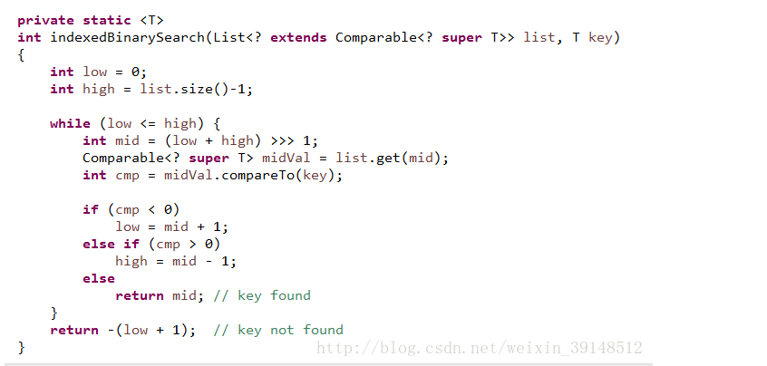
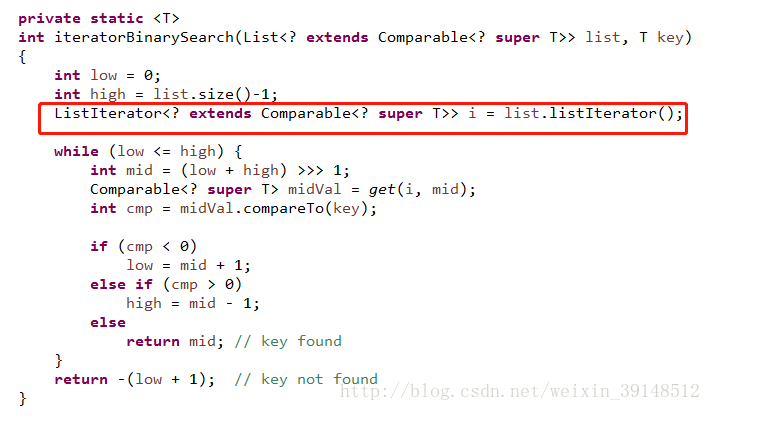

# RandomAccess 作用

​		在List集合中，经常会用到ArrayList以及LinkedList集合，但是通过查看源码，就会发现ArrayList实现RandomAccess接口，但是RandomAccess接口里面是空的！Linked并没有实现RandomAccess接口。

## 1-作用

RandomAccess接口是一个标志接口（Marker），只要List集合实现这个接口，就能支持快速随机访问。

通过查看Collections类中的binarySearch（）方法，源码如下：

由此可以看出，判断list是否实现RandomAccess接口来实行indexedBinarySerach(list,key)或iteratorBinarySerach(list,key)方法。

## 2-相关源码：

indexedBinarySerach(list,key)方法源码：

iteratorBinarySerach(list,key)方法源码：

通过查看源代码，发现实现RandomAccess接口的List集合采用一般的for循环遍历，而未实现这接口则采用迭代器。

## 3-总结

  RandomAccess和Cloneable、Serializable接口一样，本质上都是一种标志性接口，无具体实现，意在告知JVM此类(在恒定时间内)可支持快速随机访问。作用总结如下：

   （1）给List使用的标记型接口，目的是使其支持（在恒定时间内）的快速随机访问

   （2）推荐在遍历集合的时候检查该List是否实现了RandomAccess接口，以便让不同的集合使用更优的遍历算法（ArrayList用for循环遍历快一些，LinkedList用迭代器遍历快一些）

   （3）通常来说，如果一个List用for循环遍历比用迭代器遍历的速度快，那么推荐实现RandomAccess接口

