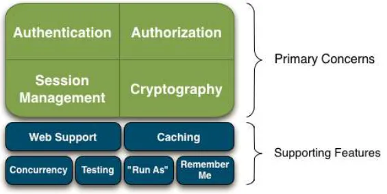
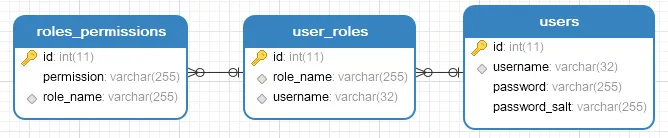

# Shiro 笔记

------

## 1.Shiro简介

Apache Shiro是一个开源安全框架，提供身份验证、授权、密码学和会话管理。Shiro框架具有直观、易用等特性，同时也能提供健壮的安全性。spring中有spring security (原名Acegi)，是一个权限框架，它和spring依赖过于紧密，没有shiro使用简单。 shiro不依赖于spring，shiro不仅可以实现 web应用的权限管理，还可以实现c/s系统，分布式系统权限管理，shiro属于轻量框架，越来越多企业项目开始使用shiro。

### 1.1 由来

Shiro的前身是JSecurity，2004年，Les Hazlewood和Jeremy Haile创办了Jsecurity。当时他们找不到适用于应用程序级别的合适Java安全框架，同时又对JAAS非常失望。2004年到2008年期间，JSecurity托管在SourceForge上，贡献者包括Peter Ledbrook、Alan Ditzel和Tim Veil。2008年，JSecurity项目贡献给了Apache软件基金会（ASF），并被接纳成为Apache Incubator项目，由导师管理，目标是成为一个顶级Apache项目。期间，Jsecurity曾短暂更名为Ki，随后因商标问题被社区更名为“Shiro”。随后项目持续在Apache Incubator中孵化，并增加了贡献者Kalle Korhonen。2010年7月，Shiro社区发布了1.0版，随后社区创建了其项目管理委员会，并选举Les Hazlewood为主席。2010年9月22日，Shrio成为Apache软件基金会的顶级项目（TLP）。

### 1.2 有哪些功能

Apache Shiro是一个强大而灵活的开源安全框架，它干净利落地处理身份认证，授权，企业会话管理和加密。Apache Shiro的首要目标是易于使用和理解。安全有时候是很复杂的，甚至是痛苦的，但它没有必要这样。框架应该尽可能掩盖复杂的地方，露出一个干净而直观的API，来简化开发人员在应用程序安全上所花费的时间。

以下是可以用Apache Shiro 所做的事情（核心功能就两个——身份认证+授权）：

1. 验证用户来核实他们的身份
2. 对用户执行访问控制，如：判断用户是否被分配了一个确定的安全角色；判断用户是否被允许做某事
3. 在任何环境下使用Session API，即使没有Web容器（shiro的一大特色）
4. 在身份验证，访问控制期间或在会话的生命周期，对事件作出反应
5. 聚集一个或多个用户安全数据的数据源，并作为一个单一的复合用户“视图”
6. 单点登录（SSO）功能
7. 为没有关联到登录的用户启用"Remember Me"服务

Apache Shiro是一个拥有许多功能的综合性的程序安全框架。下面的图表展示了Shiro的重点：



Shiro中有四大基石——身份验证，授权，会话管理和加密。

1. Authentication：有时也简称为“登录”，这是一个证明用户是谁的行为。
2. Authorization：访问控制的过程，也就是决定“谁”去访问“什么”。
3. Session Management：管理用户特定的会话，即使在非Web 或EJB 应用程序。
4. Cryptography：通过使用加密算法保持数据安全同时易于使用。

除此之外，Shiro也提供了额外的功能来解决在不同环境下所面临的安全问题，尤其是以下这些：

1. Web Support：Shiro的web支持的API能够轻松地帮助保护Web应用程序。
2. Caching：缓存是Apache Shiro中的第一层公民，来确保安全操作快速而又高效。
3. Concurrency：Apache Shiro利用它的并发特性来支持多线程应用程序。
4. Testing：测试支持的存在来帮助你编写单元测试和集成测试。
5. "Run As"：一个允许用户假设为另一个用户身份（如果允许）的功能，有时候在管理脚本很有用。
6. "Remember Me"：在会话中记住用户的身份，这样用户只需要在强制登录时候登录。

## 2.从一个简单的案例开始身份认证

### 2.1 shiro下载

要学习shiro，我们首先需求去shiro官网下载shiro，官网地址地址https://shiro.apache.org/，两个源码下载地址如下：

1.apache shiro2.github-shiro

### 2.2 创建演示工程

这里我们先不急着写代码，我们先打开刚刚下载到的源码，源码中有一个samples目录，如下：


这个samples目录是官方给我们的一些演示案例，其中有一个quickstart项目，这个项目是一个maven项目，参考这个quickstart，我们来创建一个自己的演示工程。

1.首先使用maven创建一个JavaSE工程 工程创建成功后在pom文件中添加如下依赖：

```
<dependency>
 <groupId>org.apache.shiro</groupId>
 <artifactId>shiro-all</artifactId>
 <version>RELEASE</version>
</dependency>
```

2.配置用户

参考quickstart项目中的shiro.ini文件，我们来配置一个用户，配置方式如下：首先在resources目录下创建一个shiro.ini文件，文件内容如下：

```
[users]
sang=123,admin
[roles]
admin=*
```

以上配置表示我们创建了一个名为sang的用户，该用户的密码是123，该用户的角色是admin，而admin具有操作所有资源的权限。

3.执行登录

OK，做完上面几步之后，我们就可以来看看如何实现一次简单的登录操作了。这个登录操作我们依然是参考quickstart项目中的类来实现，首先我们要通过shiro.ini创建一个SecurityManager，再将这个SecurityManager设置为单例模式，如下：

```
Factory<org.apache.shiro.mgt.SecurityManager> factory = new IniSecurityManagerFactory("classpath:shiro.ini");
org.apache.shiro.mgt.SecurityManager securityManager = factory.getInstance();
SecurityUtils.setSecurityManager(securityManager);
```

如此之后，我们就配置好了一个基本的Shiro环境，注意此时的用户和角色信息我们配置在shiro.ini这个配置文件中，接下来我们就可以获取一个Subject了，这个Subject就是我们当前的用户对象，获取方式如下：

```
Subject currentUser = SecurityUtils.getSubject();
```

拿到这个用户对象之后，接下来我们可以获取一个session了，这个session和我们web中的HttpSession的操作基本上是一致的，不同的是，这个session不依赖任何容器，可以随时随地获取，获取和操作方式如下：

```
//获取session
Session session = currentUser.getSession();
//给session设置属性值
session.setAttribute("someKey", "aValue");
//获取session中的属性值
String value = (String) session.getAttribute("someKey");
```

说了这么多，我们的用户到现在还没有登录呢，Subject中有一个isAuthenticated方法用来判断当前用户是否已经登录，如果isAuthenticated方法返回一个false，则表示当前用户未登录，那我们就可以执行登陆，登录方式如下：

```
if (!currentUser.isAuthenticated()) {
    UsernamePasswordToken token = new UsernamePasswordToken("sang", "123");
    try {
        currentUser.login(token);
    } catch (UnknownAccountException uae) {
        log.info("There is no user with username of " + token.getPrincipal());
    } catch (IncorrectCredentialsException ice) {
        log.info("Password for account " + token.getPrincipal() + " was incorrect!");
    } catch (LockedAccountException lae) {
        log.info("The account for username " + token.getPrincipal() + " is locked.  " +
                "Please contact your administrator to unlock it.");
    }
    catch (AuthenticationException ae) {
    }
}
```

首先构造UsernamePasswordToken，两个参数就是我们的用户名和密码，然后调用Subject中的login方法执行登录，当用户名输错，密码输错、或者账户锁定等问题出现时，系统会通过抛异常告知调用者这些问题。

当登录成功之后，我们可以通过如下方式获取当前登陆用户的用户名：

```
log.info("User [" + currentUser.getPrincipal() + "] logged in successfully.");
```

我们也可以通过调用Subject中的hasRole和isPermitted方法来判断当前用户是否具备某种角色或者某种权限，如下：

```
if (currentUser.hasRole("admin")) {
    log.info("May the Schwartz be with you!");
} else {
    log.info("Hello, mere mortal.");
}
if (currentUser.isPermitted("lightsaber:wield")) {
    log.info("You may use a lightsaber ring.  Use it wisely.");
} else {
    log.info("Sorry, lightsaber rings are for schwartz masters only.");
}
```

最后，我们可以通过logout方法注销本次登录，如下：

```
currentUser.logout();
```

OK，至此，我们通过官方案例给小伙伴们简单介绍了Shiro中的登录操作，完整案例大家可以参考官方的demo。

## 3. 聊一聊Shiro中的Realm

### 3.1 登录流程是什么样的

首先我们来看shiro官方文档中这样一张登录流程图：


参照此图，我们的登录一共要经过如下几个步骤：

1. 应用程序代码调用Subject.login方法，传递创建好的包含终端用户的Principals(身份)和Credentials(凭证)的AuthenticationToken实例(即上文例子中的UsernamePasswordToken)。
2. Subject实例，通常是DelegatingSubject（或子类）委托应用程序的SecurityManager通过调用securityManager.login(token)开始真正的验证工作(在DelegatingSubject类的login方法中打断点即可看到)。
3. SubjectManager作为一个基本的“保护伞”的组成部分，接收token以及简单地委托给内部的Authenticator实例通过调用authenticator.authenticate(token)。这通常是一个ModularRealmAuthenticator实例，支持在身份验证中协调一个或多个Realm实例。ModularRealmAuthenticator本质上为Apache Shiro 提供了PAM-style 范式（其中在PAM 术语中每个Realm 都是一个'module'）。
4. 如果应用程序中配置了一个以上的Realm，ModularRealmAuthenticator实例将利用配置好的AuthenticationStrategy来启动Multi-Realm认证尝试。在Realms 被身份验证调用之前，期间和以后，AuthenticationStrategy被调用使其能够对每个Realm的结果作出反应。如果只有一个单一的Realm 被配置，它将被直接调用，因为没有必要为一个单一Realm的应用使用AuthenticationStrategy。
5. 每个配置的Realm用来帮助看它是否支持提交的AuthenticationToken。如果支持，那么支持Realm的getAuthenticationInfo方法将会伴随着提交的token被调用。

OK，通过上面的介绍，相信小伙伴们对整个登录流程都有一定的理解了，小伙伴可以通过打断点来验证我们上文所说的五个步骤。那么在上面的五个步骤中，小伙伴们看到了有一个Realm承担了很重要的一部分工作，那么这个Realm到底是个什么东西，接下来我们就来仔细看一看。

### 3.2 什么是Realm

根据Realm文档上的解释，Realms担当Shiro和你的应用程序的安全数据之间的“桥梁”或“连接器”。当它实际上与安全相关的数据如用来执行身份验证（登录）及授权（访问控制）的用户帐户交互时，Shiro从一个或多个为应用程序配置的Realm 中寻找许多这样的东西。在这个意义上说，Realm 本质上是一个特定安全的DAO：它封装了数据源的连接详细信息，使Shiro 所需的相关的数据可用。当配置Shiro 时，你必须指定至少一个Realm 用来进行身份验证和/或授权。SecurityManager可能配置多个Realms，但至少有一个是必须的。Shiro 提供了立即可用的Realms 来连接一些安全数据源（即目录），如LDAP，关系数据库（JDBC），文本配置源，像INI 及属性文件，以及更多。你可以插入你自己的Realm 实现来代表自定义的数据源，如果默认地Realm不符合你的需求。

看了上面这一段解释，可能还有小伙伴云里雾里，那么接下来我们来通过一个简单的案例来看看Realm到底扮演了一个什么样的作用，注意，本文的案例在上文案例的基础上完成。首先自定义一个MyRealm，内容如下：

```
public class MyRealm implements Realm {
    public String getName() {
        return "MyRealm";
    }
    public boolean supports(AuthenticationToken token) {
        return token instanceof UsernamePasswordToken;
    }
    public AuthenticationInfo getAuthenticationInfo(AuthenticationToken token) throws AuthenticationException {
        String password = new String(((char[]) token.getCredentials()));
        String username = token.getPrincipal().toString();
        if (!"sang".equals(username)) {
            throw new UnknownAccountException("用户不存在");
        }
        if (!"123".equals(password)) {
            throw new IncorrectCredentialsException("密码不正确");
        }
        return new SimpleAuthenticationInfo(username, password, getName());
    }
}
```

自定义Realm实现Realm接口，该接口中有三个方法，第一个getName方法用来获取当前Realm的名字，第二个supports方法用来判断这个realm所支持的token，这里我假设值只支持UsernamePasswordToken类型的token，第三个getAuthenticationInfo方法则进行了登陆逻辑判断，从token中取出用户的用户名密码等，进行判断，当然，我这里省略掉了数据库操作，当登录验证出现问题时，抛异常即可，这里抛出的异常，将在执行登录那里捕获到（注意，由于我这里定义的MyRealm是实现了Realm接口，所以这里的用户名和密码都需要我手动判断是否正确，后面的文章我会介绍其他写法）。

OK，创建好了MyRealm之后还不够，我们还需要做一个简单配置，让MyRealm生效，将shiro.ini文件中的所有东西都注释掉，添加如下两行：

```
MyRealm= org.sang.MyRealm
securityManager.realms=$MyRealm
```

第一行表示定义了一个realm，第二行将这个定义好的交给securityManger，这里实际上会调用到RealmSecurityManager类的setRealms方法。OK，做好这些之后，小伙伴们可以在MyRealm类中的一些关键节点打上断点，再次执行main方法，看看整个的登录流程。

## 4. 再来聊一聊Shiro中的Realm

### 4.1 Realm的继承关系

通过查看类的继承关系，我们发现Realm的子类实际上有很多种，这里我们就来看看有代表性的几种：

1. IniRealm

可能我们并不知道，实际上这个类在我们第二篇文章中就已经用过了。这个类一开始就有如下两行定义：

```
public static final String USERS_SECTION_NAME = "users";
public static final String ROLES_SECTION_NAME = "roles";
```

这两行配置表示shiro.ini文件中，[users]下面的表示表用户名密码还有角色，[roles]下面的则是角色和权限的对应关系。

1. PropertiesRealm

PropertiesRealm则规定了另外一种用户、角色定义方式，如下：

user.user1=password,role1 role.role1=permission1

1. JdbcRealm

这个顾名思义，就是从数据库中查询用户的角色、权限等信息。打开JdbcRealm类，我们看到源码中有如下几行：

```
protected static final String DEFAULT_AUTHENTICATION_QUERY = "select password from users where username = ?";
protected static final String DEFAULT_SALTED_AUTHENTICATION_QUERY = "select password, password_salt from users where username = ?";
protected static final String DEFAULT_USER_ROLES_QUERY = "select role_name from user_roles where username = ?";
protected static final String DEFAULT_PERMISSIONS_QUERY = "select permission from roles_permissions where role_name = ?";
```

根据这几行预设的SQL我们就可以大致推断出数据库中表的名称以及字段了，当然，我们也可以自定义SQL。JdbcRealm实际上是AuthenticatingRealm的子类，关于AuthenticatingRealm我们在后面还会详细说到，这里先不展开。接下来我们就来详细说说这个JdbcRealm。

### 4.2 JdbcRealm

1. 准备工作

使用JdbcRealm，涉及到数据库操作，要用到数据库连接池，这里我使用Druid数据库连接池，因此首先添加如下依赖：

```
<dependency>
    <groupId>com.alibaba</groupId>
    <artifactId>druid</artifactId>
    <version>RELEASE</version>
</dependency>
<dependency>
    <groupId>mysql</groupId>
    <artifactId>mysql-connector-java</artifactId>
    <version>5.1.27</version>
</dependency>
```

1. 数据库创建

想要使用JdbcRealm，那我首先要创建数据库，根据JdbcRealm中预设的SQL，我定义的数据库表结构如下：



这里为了大家能够直观的看到表的关系，我使用了外键，实际工作中，视情况而定。然后向表中添加几条测试数据。数据库脚本小伙伴可以在github上下载到（https://github.com/lenve/shiroSamples/blob/v4/shiroDemo.sql）。

1. 配置文件处理

然后将shiro.ini中的所有配置注释掉，添加如下配置：

```
jdbcRealm=org.apache.shiro.realm.jdbc.JdbcRealm
dataSource=com.alibaba.druid.pool.DruidDataSource
dataSource.driverClassName=com.mysql.jdbc.Driver
dataSource.url=jdbc:mysql://localhost:3306/shiroDemo
dataSource.username=root
dataSource.password=123
jdbcRealm.dataSource=$dataSource
jdbcRealm.permissionsLookupEnabled=true
securityManager.realms=$jdbcRealm
```

这里的配置文件都很简单，不做过多赘述，小伙伴唯一需要注意的是permissionsLookupEnabled需要设置为true，否则一会JdbcRealm就不会去查询权限用户权限。

1. 测试

OK，做完上面几步就可以测试了，测试方式和第二篇文章中一样，我们可以测试下用户登录，用户角色和用户权限。

1. 自定义查询SQL

小伙伴们看懂了上文，对于自定义查询SQL就没什么问题了。我这里举一个简单的例子，比如我要自定义authenticationQuery对对应的SQL，查看JdbcRealm源码，我们发现authenticationQuery对应的SQL本来是`select password from users where username = ?`，如果需要修改的话，比如说我的表名不是users而是employee，那么在shiro.ini中添加如下配置即可：

```
jdbcRealm.authenticationQuery=select password from employee where username = ?
```

OK,这个小伙伴下来自己做尝试，我这里就不演示了。

## 5. Shiro中多Realm的认证策略问题

### 5.1 多Realm认证策略

不知道小伙伴们是否还记得这张登录流程图：


从这张图中我们可以清晰看到Realm是可以有多个的，不过到目前为止，我们所有的案例都还是单Realm，那么我们先来看一个简单的多Realm情况。

前面的文章我们自己创建了一个MyRealm，也用过JdbcRealm，但都是单独使用的，现在我想将两个一起使用，只需要修改shiro.ini配置即可，如下：

```
MyRealm= org.sang.MyRealm

jdbcRealm=org.apache.shiro.realm.jdbc.JdbcRealm
dataSource=com.alibaba.druid.pool.DruidDataSource
dataSource.driverClassName=com.mysql.jdbc.Driver
dataSource.url=jdbc:mysql://localhost:3306/shiroDemo
dataSource.username=root
dataSource.password=123
jdbcRealm.dataSource=$dataSource
jdbcRealm.permissionsLookupEnabled=true
securityManager.realms=$jdbcRealm,$MyRealm
```

但是此时我数据库中用户的信息是sang/123,MyRealm中配置的信息也是sang/123，我把MyRealm中的用户信息修改为`江南一点雨/456`，此时，我的MyRealm的getAuthenticationInfo方法如下：

```
public AuthenticationInfo getAuthenticationInfo(AuthenticationToken token) throws AuthenticationException {
    String password = new String(((char[]) token.getCredentials()));
    String username = token.getPrincipal().toString();
    if (!"江南一点雨".equals(username)) {
        throw new UnknownAccountException("用户不存在");
    }
    if (!"456".equals(password)) {
        throw new IncorrectCredentialsException("密码不正确");
    }
    return new SimpleAuthenticationInfo(username, password, getName());
}
```

这个时候我们就配置了两个Realm，还是使用我们一开始的测试代码进行登录测试，这个时候我们发现我既可以使用`江南一点雨/456`进行登录，也可以使用`sang/123`进行登录，用`sang/123`登录成功之后用户的角色信息和之前是一样的，而用`江南一点雨/456`登录成功之后用户没有角色，这个也很好理解，因为我们在MyRealm中没有给用户配置任何权限。总而言之，就是当我有了两个Realm之后，现在只需要这两个Realm中的任意一个认证成功，就算我当前用户认证成功。

### 5.2 原理追踪

好了，有了上面的问题后，接下来我们在Subject的login方法上打断点，跟随程序的执行步骤，我们来到了ModularRealmAuthenticator类的doMultiRealmAuthentication方法中，如下：

```
protected AuthenticationInfo doAuthenticate(AuthenticationToken authenticationToken) throws AuthenticationException {
    this.assertRealmsConfigured();
    Collection<Realm> realms = this.getRealms();
    return realms.size() == 1?this.doSingleRealmAuthentication((Realm)realms.iterator().next(), authenticationToken):this.doMultiRealmAuthentication(realms, authenticationToken);
}
```

在这个方法中，首先会获取当前一共有多少个realm，如果只有一个则执行doSingleRealmAuthentication方法进行处理，如果有多个realm，则执行doMultiRealmAuthentication方法进行处理。doSingleRealmAuthentication方法部分源码如下：

```
protected AuthenticationInfo doSingleRealmAuthentication(Realm realm, AuthenticationToken token) {
    ...
    ...
    AuthenticationInfo info = realm.getAuthenticationInfo(token);
    if(info == null) {
        String msg = "Realm [" + realm + "] was unable to find account data for the submitted AuthenticationToken [" + token + "].";
        throw new UnknownAccountException(msg);
    } else {
        return info;
    }
}
```

小伙伴们看到这里就明白了，这里调用了realm的getAuthenticationInfo方法，这个方法实际上就是我们自己实现的MyRealm中的getAuthenticationInfo方法。

那如果有多个Realm呢？我们来看看doMultiRealmAuthentication方法的实现，部分源码如下：

```
protected AuthenticationInfo doMultiRealmAuthentication(Collection<Realm> realms, AuthenticationToken token) {
    AuthenticationStrategy strategy = this.getAuthenticationStrategy();
    AuthenticationInfo aggregate = strategy.beforeAllAttempts(realms, token);
    Iterator var5 = realms.iterator();
    while(var5.hasNext()) {
        Realm realm = (Realm)var5.next();
        aggregate = strategy.beforeAttempt(realm, token, aggregate);
        if(realm.supports(token)) {
            AuthenticationInfo info = null;
            Throwable t = null;
            try {
                info = realm.getAuthenticationInfo(token);
            } catch (Throwable var11) {
            }
            aggregate = strategy.afterAttempt(realm, token, info, aggregate, t);
        } else {
            log.debug("Realm [{}] does not support token {}.  Skipping realm.", realm, token);
        }
    }
    aggregate = strategy.afterAllAttempts(token, aggregate);
    return aggregate;
}
```

我这里主要来说下这个方法的实现思路：

1. 首先获取多Realm认证策略
2. 构建一个AuthenticationInfo用来存放一会认证成功之后返回的信息
3. 遍历Realm，调用每个Realm中的getAuthenticationInfo方法，看是否能够认证成功
4. 每次获取到AuthenticationInfo之后，都调用afterAttempt方法进行结果合并
5. 遍历完所有的Realm之后，调用afterAllAttempts进行结果合并，这里主要判断下是否一个都没匹配上

### 5.3 自由配置认证策略

OK，经过上面的简单解析，小伙伴们对认证策略应该有一个大致的认识了，那么在Shiro中，一共支持三种不同的认证策略，如下：

1. AllSuccessfulStrategy，这个表示所有的Realm都认证成功才算认证成功
2. AtLeastOneSuccessfulStrategy，这个表示只要有一个Realm认证成功就算认证成功，默认即此策略
3. FirstSuccessfulStrategy，这个表示只要第一个Realm认证成功，就算认证成功

配置方式也很简单，在shiro.ini中进行配置，在上面配置的基础上，增加如下配置：

```
authenticator=org.apache.shiro.authc.pam.ModularRealmAuthenticator
securityManager.authenticator=$authenticator
allSuccessfulStrategy=org.apache.shiro.authc.pam.AllSuccessfulStrategy
securityManager.authenticator.authenticationStrategy=$allSuccessfulStrategy
```

此时，我们再进行登录测试，则会要求每个Realm都认证通过才算认证通过。

## 6. Shiro中密码加密

### 6.1 密码为什么要加密

2011年12月21日，有人在网络上公开了一个包含600万个CSDN用户资料的数据库，数据全部为明文储存，包含用户名、密码以及注册邮箱。事件发生后CSDN在微博、官方网站等渠道发出了声明，解释说此数据库系2009年备份所用，因不明原因泄露，已经向警方报案。后又在官网网站发出了公开道歉信。在接下来的十多天里，金山、网易、京东、当当、新浪等多家公司被卷入到这次事件中。整个事件中最触目惊心的莫过于CSDN把用户密码明文存储，由于很多用户是多个网站共用一个密码，因此一个网站密码泄露就会造成很大的安全隐患。由于有了这么多前车之鉴，我们现在做系统时，密码都要加密处理。

密码加密我们一般会用到散列函数，又称散列算法、哈希函数，是一种从任何一种数据中创建小的数字“指纹”的方法。散列函数把消息或数据压缩成摘要，使得数据量变小，将数据的格式固定下来。该函数将数据打乱混合，重新创建一个叫做散列值的指纹。散列值通常用一个短的随机字母和数字组成的字符串来代表。好的散列函数在输入域中很少出现散列冲突。在散列表和数据处理中，不抑制冲突来区别数据，会使得数据库记录更难找到。我们常用的散列函数有如下几种：

1. MD5消息摘要算法

MD5消息摘要算法是一种被广泛使用的密码散列函数，可以产生出一个128位（16字节）的散列值，用于确保信息传输完整一致。MD5由美国密码学家罗纳德·李维斯特设计，于1992年公开，用以取代MD4算法。这套算法的程序在 RFC 1321中被加以规范。将数据（如一段文字）运算变为另一固定长度值，是散列算法的基础原理。1996年后被证实存在弱点，可以被加以破解，对于需要高度安全性的数据，专家一般建议改用其他算法，如SHA-2。2004年，证实MD5算法无法防止碰撞，因此不适用于安全性认证，如SSL公开密钥认证或是数字签名等用途。

1. 安全散列算法

安全散列算法（Secure Hash Algorithm）是一个密码散列函数家族，是FIPS所认证的安全散列算法。能计算出一个数字消息所对应到的，长度固定的字符串（又称消息摘要）的算法。且若输入的消息不同，它们对应到不同字符串的机率很高。SHA家族的算法，由美国国家安全局所设计，并由美国国家标准与技术研究院发布，是美国的政府标准，其分别是：SHA-0：1993年发布，是SHA-1的前身；SHA-1：1995年发布，SHA-1在许多安全协议中广为使用，包括TLS和SSL、PGP、SSH、S/MIME和IPsec，曾被视为是MD5的后继者。但SHA-1的安全性在2000年以后已经不被大多数的加密场景所接受。2017年荷兰密码学研究小组CWI和Google正式宣布攻破了SHA-1；SHA-2：2001年发布，包括SHA-224、SHA-256、SHA-384、SHA-512、SHA-512/224、SHA-512/256。虽然至今尚未出现对SHA-2有效的攻击，它的算法跟SHA-1基本上仍然相似；因此有些人开始发展其他替代的散列算法；SHA-3：2015年正式发布，SHA-3并不是要取代SHA-2，因为SHA-2目前并没有出现明显的弱点。由于对MD5出现成功的破解，以及对SHA-0和SHA-1出现理论上破解的方法，NIST感觉需要一个与之前算法不同的，可替换的加密散列算法，也就是现在的SHA-3。

### 6.2 Shiro中如何加密

Shiro中对以上两种散列算法都提供了支持，对于MD5，Shiro中生成消息摘要的方式如下：

```
Md5Hash md5Hash = new Md5Hash("123", null, 1024);
```

第一个参数是要生成密码的明文，第二个参数密码的盐值，第三个参数是生成消息摘要的迭代次数。

Shiro中对于安全散列算法的支持如下(支持多种算法，这里我举一个例子)：

```
Sha512Hash sha512Hash = new Sha512Hash("123", null, 1024);
```

这里三个参数含义与上文基本一致，不再赘述。shiro中也提供了通用的算法，如下：

```
SimpleHash md5 = new SimpleHash("md5", "123", null, 1024);
SimpleHash sha512 = new SimpleHash("sha-512", "123", null, 1024);
```

当用户注册时，我们可以通过上面的方式对密码进行加密，将加密后的字符串存入数据库中。我这里为了简单，就不写注册功能了，就把昨天数据库中用户的密码123改成sha512所对应的字符串，如下：

```
cb5143cfcf5791478e057be9689d2360005b3aac951f947af1e6e71e3661bf95a7d14183dadfb0967bd6338eb4eb2689e9c227761e1640e6a033b8725fabc783
```

同时，为了避免其他Realm的干扰，数据库中我只配置一个JdbcRealm。

此时如果我不做其他修改的话，登录必然会失败，原因很简单：我登录时输入的密码是123，但是数据库中的密码是一个很长的字符串，所以登录肯定不会成功。通过打断点，我们发现最终的密码比对是在SimpleCredentialsMatcher类中的doCredentialsMatch方法中进行密码比对的，比对的方式也很简单，直接使用了对用户输入的密码和数据库中的密码生成byte数组然后进行比较，最终的比较在MessageDigest类的isEqual方法中。部分逻辑如下：

```
protected boolean equals(Object tokenCredentials, Object accountCredentials) {
        ...
        ...
        //获取用户输入密码的byte数组
        byte[] tokenBytes = this.toBytes(tokenCredentials);
        //获取数据库中密码的byte数组
        byte[] accountBytes = this.toBytes(accountCredentials);
        return MessageDigest.isEqual(tokenBytes, accountBytes);
        ...
}
```

MessageDigest的isEqual方法如下：

```
public static boolean isEqual(byte[] digesta, byte[] digestb) {
    if (digesta == digestb) return true;
    if (digesta == null || digestb == null) {
        return false;
    }
    if (digesta.length != digestb.length) {
        return false;
    }

    int result = 0;
    // time-constant comparison
    for (int i = 0; i < digesta.length; i++) {
        result |= digesta[i] ^ digestb[i];
    }
    return result == 0;
}
```

都是很容易理解的比较代码，这里不赘述。我们现在之所以登录失败是因为没有对用户输入的密码进行加密，通过对源代码的分析，我们发现是因为在AuthenticatingRealm类的assertCredentialsMatch方法中获取了一个名为SimpleCredentialsMatcher的密码比对器，这个密码比对器中比对的方法就是简单的比较，因此如果我们能够将这个密码比对器换掉就好了。我们来看一下CredentialsMatcher的继承关系：


我们发现这个刚好有一个Sha512CredentialsMatcher比对器，这个比对器的doCredentialsMatch方法在它的父类HashedCredentialsMatcher，方法内容如下：

```
public boolean doCredentialsMatch(AuthenticationToken token, AuthenticationInfo info) {
    Object tokenHashedCredentials = hashProvidedCredentials(token, info);
    Object accountCredentials = getCredentials(info);
    return equals(tokenHashedCredentials, accountCredentials);
}
```

这时我们发现获取tokenHashedCredentials的方式不像以前那样简单粗暴了，而是调用了hashProvidedCredentials方法，而hashProvidedCredentials方法最终会来到下面这个重载方法中：

```
protected Hash hashProvidedCredentials(Object credentials, Object salt, int hashIterations) {
    String hashAlgorithmName = assertHashAlgorithmName();
    return new SimpleHash(hashAlgorithmName, credentials, salt, hashIterations);
}
```

这几行代码似曾相识，很明显，是系统帮我们对用户输入的密码进行了转换。了解了这些之后，那我只需要将shiro.ini修改成如下样子即可实现登录了：

```
sha512=org.apache.shiro.authc.credential.Sha512CredentialsMatcher
# 迭代次数
sha512.hashIterations=1024
jdbcRealm=org.apache.shiro.realm.jdbc.JdbcRealm
dataSource=com.alibaba.druid.pool.DruidDataSource
dataSource.driverClassName=com.mysql.jdbc.Driver
dataSource.url=jdbc:mysql://localhost:3306/shiroDemo
dataSource.username=root
dataSource.password=123
jdbcRealm.dataSource=$dataSource
jdbcRealm.permissionsLookupEnabled=true
# 修改JdbcRealm中的credentialsMatcher属性
jdbcRealm.credentialsMatcher=$sha512
securityManager.realms=$jdbcRealm
```

如此之后，我们再进行登录测试，就可以登录成功了。

本小节案例下载：https://github.com/lenve/shiroSamples/archive/refs/tags/v6.zip

## 7. Shiro中密码加盐

### 7.1 密码为什么要加盐

不管是消息摘要算法还是安全散列算法，如果原文一样，生成密文也是一样的，这样的话，如果两个用户的密码原文一样，存到数据库中密文也就一样了，还是不安全，我们需要做进一步处理，常见解决方案就是加盐。盐从那里来呢？我们可以使用用户id（因为一般情况下，用户id是唯一的），也可以使用一个随机字符，我这里采用第一种方案。

### 7.2 Shiro中如何实现加盐

shiro中加盐的方式很简单，在用户注册时生成密码密文时，就要加入盐，如下几种方式：

```
Md5Hash md5Hash = new Md5Hash("123", "sang", 1024);
Sha512Hash sha512Hash = new Sha512Hash("123", "sang", 1024);
SimpleHash md5 = new SimpleHash("md5", "123", "sang", 1024);
SimpleHash sha512 = new SimpleHash("sha-512", "123", "sang", 1024)
```

然后我们首先将sha512生成的字符串放入数据库中，接下来我要配置一下我的jdbcRealm，因为我要指定我的盐是什么。在这里我的盐就是我的用户名，每个用户的用户名是不一样的，因此这里没法写死，在JdbcRealm中，系统提供了四种不同的SaltStyle，如下：

| SaltStyle | 含义                                                         |
| :-------- | :----------------------------------------------------------- |
| NO_SALT   | 默认，密码不加盐                                             |
| CRYPT     | 密码是以Unix加密方式储存的                                   |
| COLUMN    | salt是单独的一列储存在数据库中                               |
| EXTERNAL  | salt没有储存在数据库中，需要通过JdbcRealm.getSaltForUser(String)函数获取 |

四种不同的SaltStyle对应了四种不同的密码处理方式，部分源码如下：

```
switch (saltStyle) {
case NO_SALT:
    password = getPasswordForUser(conn, username)[0];
    break;
case CRYPT:
    // TODO: separate password and hash from getPasswordForUser[0]
    throw new ConfigurationException("Not implemented yet");
    //break;
case COLUMN:
    String[] queryResults = getPasswordForUser(conn, username);
    password = queryResults[0];
    salt = queryResults[1];
    break;
case EXTERNAL:
    password = getPasswordForUser(conn, username)[0];
    salt = getSaltForUser(username);
}
```

在COLUMN这种情况下，SQL查询结果应该包含两列，第一列是密码，第二列是盐，这里默认执行的SQL在JdbcRealm一开头就定义好了，如下：

```
protected static final String DEFAULT_SALTED_AUTHENTICATION_QUERY = "select password, password_salt from users where username = ?";
```

即系统默认的盐是数据表中的password_salt提供的，但是我这里是username字段提供的，所以这里我一会要自定义这条SQL。自定义方式很简单，修改shiro.ini文件，添加如下两行：

```
jdbcRealm.saltStyle=COLUMN
jdbcRealm.authenticationQuery=select password,username from users where username=?
```

首先设置saltStyle为COLUMN，然后重新定义authenticationQuery对应的SQL。注意返回列的顺序很重要，不能随意调整。如此之后，系统就会自动把username字段作为盐了。

不过，由于ini文件中不支持枚举，saltStyle的值实际上是一个枚举类型，所以我们在测试的时候，需要增加一个枚举转换器在我们的main方法中，如下：

```
BeanUtilsBean.getInstance().getConvertUtils().register(new AbstractConverter() {
    @Override
    protected String convertToString(Object value) throws Throwable {
        return ((Enum) value).name();
    }

    @Override
    protected Object convertToType(Class type, Object value) throws Throwable {
        return Enum.valueOf(type, value.toString());
    }

    @Override
    protected Class getDefaultType() {
        return null;
    }
}, JdbcRealm.SaltStyle.class);
```

当然，以后当我们将shiro和web项目整合之后，就不需要这个转换器了。

如此之后，我们就可以再次进行登录测试了，会发现没什么问题了。

### 7.3 非JdbcRealm如何配置盐

OK，刚刚是在JdbcRealm中配置了盐，如果没用JdbcRealm，而是自己定义的普通Realm，要怎么解决配置盐的问题？

首先要说明一点是，我们前面的文章在自定义Realm时都是通过实现Realm接口实现的，这种方式有一个缺陷，就是密码比对需要我们自己完成，一般在项目中，我们自定义Realm都是通过继承AuthenticatingRealm或者AuthorizingRealm，因为这两个方法中都重写了getAuthenticationInfo方法，而在getAuthenticationInfo方法中，调用doGetAuthenticationInfo方法获取登录用户，获取到之后，会调用assertCredentialsMatch方法进行密码比对，而我们直接实现Realm接口则没有这一步，部分源码如下：

```
public final AuthenticationInfo getAuthenticationInfo(AuthenticationToken token) throws AuthenticationException {
    AuthenticationInfo info = getCachedAuthenticationInfo(token);
    if (info == null) {
        //调用doGetAuthenticationInfo获取info，这个doGetAuthenticationInfo是我们在自定义Realm中自己实现的
        info = doGetAuthenticationInfo(token);
        log.debug("Looked up AuthenticationInfo [{}] from doGetAuthenticationInfo", info);
        if (token != null && info != null) {
            cacheAuthenticationInfoIfPossible(token, info);
        }
    } else {
        log.debug("Using cached authentication info [{}] to perform credentials matching.", info);
    }
    if (info != null) {
        //获取到info之后，进行密码比对
        assertCredentialsMatch(token, info);
    } else {
        log.debug("No AuthenticationInfo found for submitted AuthenticationToken [{}].  Returning null.", token);
    }

    return info;
}
```

基于上面所述的原因，这里我先继承AuthenticatingRealm，如下：

```
public class MyRealm extends AuthenticatingRealm {
    public String getName() {
        return "MyRealm";
    }
    public boolean supports(AuthenticationToken token) {
        return token instanceof UsernamePasswordToken;
    }
    protected AuthenticationInfo doGetAuthenticationInfo(AuthenticationToken token) throws AuthenticationException {
        String username = token.getPrincipal().toString();
        if (!"sang".equals(username)) {
            throw new UnknownAccountException("用户不存在");
        }
        String dbPassword = "a593ccad1351a26cf6d91d5f0f24234c6a4da5cb63208fae56fda809732dcd519129acd74046a1f9c5992db8903f50ebf3c1091b3aaf67a05c82b7ee470d9e58";
        return new SimpleAuthenticationInfo(username, dbPassword, ByteSource.Util.bytes(username), getName());
    }
}
```

关于这个类，我说如下几点：

1. 用户名我这里还是手动判断了下，实际上这个地方要从数据库查询用户信息，如果查不到用户信息，则直接抛UnknownAccountException
2. 返回的SimpleAuthenticationInfo中，第二个参数是密码，正常情况下，这个密码是从数据库中查询出来的，我这里直接写死了
3. 第三个参数是盐值，这样构造好SimpleAuthenticationInfo之后返回，shiro会去判断用户输入的密码是否正确

上面的核心步骤是第三步，系统去自动比较密码输入是否正确，在比对的过程中，需要首先对用户输入的密码进行加盐加密，既然加盐加密，就会涉及到credentialsMatcher，这里我们要用的credentialsMatcher实际上和在JdbcRealm中用的credentialsMatcher一样，只需要在配置文件中增加如下一行即可：

```
MyRealm.credentialsMatcher=$sha512
```

sha512和我们上文定义的一致，这里就不再重复说了。

本小节案例下载：https://github.com/lenve/shiroSamples/archive/refs/tags/v7.zip

## 8. Shiro中自定义带角色和权限的Realm

密码加密加盐小伙伴们应该没有问题了，但是前面几篇文章又给我们带来了一个新的问题：我们前面IniRealm、JdbcRealm以及自定义的MyRealm，其中前两个我们都能实现用户认证以及授权，即既能管理用户登录，又能管理用户角色，而我们自定义的MyRealm，目前还只能实现登录，不能实现授权，本文我们就来看看自定义Realm如何实现授权。

### 8.1 问题追踪

上篇文章我们没有实现自定义Realm的授权操作，但是这个并不影响我们调用hasRole方法去获取用户的权限，我在上文测试代码上的currentUser.hasRole上面打断点，通过层层追踪，我们发现最终来到了ModularRealmAuthorizer类的hasRole方法中，部分源码如下：

```
public boolean hasRole(PrincipalCollection principals, String roleIdentifier) {
    assertRealmsConfigured();
    for (Realm realm : getRealms()) {
        if (!(realm instanceof Authorizer)) continue;
        if (((Authorizer) realm).hasRole(principals, roleIdentifier)) {
            return true;
        }
    }
    return false;
}
```

我们看到在这里会遍历所有的realm，如果这个realm是Authorizer的实例，则会进行进一步的授权操作，如果不是Authorizer的实例，则直接跳过，而我们只有一个自定义的MyRealm继承自AuthenticatingRealm，很明显不是Authorizer的实例，所以这里必然返回false，授权失败，所以要解决授权问题，第一步，得先让我们的MyRealm成为Authorizer的实例。

### 8.2 解决方案

如下图是Authorizer的继承关系：


小伙伴们看到，在Authorizer的实现类中有一个AuthorizingRealm，打开这个类，我们发现它的继承关系如下：

```
public abstract class AuthorizingRealm extends AuthenticatingRealm
        implements Authorizer, Initializable, PermissionResolverAware, RolePermissionResolverAware {
            ...
        }
```

我们发现，这个AuthorizingRealm不仅是Authorizer的实现类，同时也是我们上文所用的AuthenticatingRealm的实现类，既然AuthorizingRealm同时是这两个类的实现类，那么我把MyRealm的继承关系由AuthenticatingRealm改为AuthorizingRealm，肯定不会影响我上文的功能，修改之后的MyRealm如下(部分关键代码)：

```
public class MyRealm extends AuthorizingRealm {
    protected AuthenticationInfo doGetAuthenticationInfo(AuthenticationToken token) throws AuthenticationException {
        String username = token.getPrincipal().toString();
        if (!"sang".equals(username)) {
            throw new UnknownAccountException("用户不存在");
        }
        String dbPassword = "a593ccad1351a26cf6d91d5f0f24234c6a4da5cb63208fae56fda809732dcd519129acd74046a1f9c5992db8903f50ebf3c1091b3aaf67a05c82b7ee470d9e58";
        return new SimpleAuthenticationInfo(username, dbPassword, ByteSource.Util.bytes(username), getName());
    }

    protected AuthorizationInfo doGetAuthorizationInfo(PrincipalCollection principals) {
        Set<String> roles = new HashSet<String>();
        if ("sang".equals(principals.getPrimaryPrincipal().toString())) {
            roles.add("普通用户");
        }
        return new SimpleAuthorizationInfo(roles);
    }
}
```

继承了AuthorizingRealm之后，需要我们实现doGetAuthorizationInfo方法。在这个方法中，我们配置用户的权限。这里我为了方便，直接添加了普通用户这个权限，实际上，这里应该根据用户名去数据库里查询权限，查询方式不赘述。

通过源码追踪，我们发现最终授权会来到AuthorizingRealm类的如下两个方法中：

```
public boolean hasRole(PrincipalCollection principal, String roleIdentifier) {
    AuthorizationInfo info = getAuthorizationInfo(principal);
    return hasRole(roleIdentifier, info);
}

protected boolean hasRole(String roleIdentifier, AuthorizationInfo info) {
    return info != null && info.getRoles() != null && info.getRoles().contains(roleIdentifier);
}
```

这两个方法的逻辑很简单，第一个方法中调用的getAuthorizationInfo方法会最终调用到我们自定义的doGetAuthorizationInfo方法，第二个hasRole方法接收的两个参数，第一个是用户申请的角色，第二个是用户具备的角色集，一个简单的contains函数就判断出用户是否具备某个角色了。

但是这个时候，用户只有角色，没有权限，我们可以对doGetAuthorizationInfo方法做进一步的完善，如下：

```
protected AuthorizationInfo doGetAuthorizationInfo(PrincipalCollection principals) {
    Set<String> roles = new HashSet<String>();
    Set<String> permiss = new HashSet<String>();
    if ("sang".equals(principals.getPrimaryPrincipal().toString())) {
        roles.add("普通用户");
        permiss.add("book:update");
    }
    SimpleAuthorizationInfo info = new SimpleAuthorizationInfo(roles);
    info.setStringPermissions(permiss);
    return info;
}
```

当然，正常情况下，权限也应当是从数据库中查询得到的，我这里简化下。

那么这个角色是怎么验证的呢？追踪源码我们来到了AuthorizingRealm类的如下两个方法中：

```
public boolean isPermitted(PrincipalCollection principals, Permission permission) {
    AuthorizationInfo info = getAuthorizationInfo(principals);
    return isPermitted(permission, info);
}

//visibility changed from private to protected per SHIRO-332
protected boolean isPermitted(Permission permission, AuthorizationInfo info) {
    Collection<Permission> perms = getPermissions(info);
    if (perms != null && !perms.isEmpty()) {
        for (Permission perm : perms) {
            if (perm.implies(permission)) {
                return true;
            }
        }
    }
    return false;
}
```

第一个isPermitted方法中调用了getAuthorizationInfo方法，而getAuthorizationInfo方法最终会调用到我们自己定义的doGetAuthorizationInfo方法，即获取到用户的角色权限信息，然后在第二个方法中进行遍历判断，查看是否具备相应的权限，第二个isPermitted方法的第一个参数就是用户要申请的权限。

本小节案例下载：https://github.com/lenve/shiroSamples/archive/refs/tags/v8.zip

## 9. Shiro整合Spring

### 9.1 Spring&SpringMVC环境搭建

Spring和SpringMVC环境的搭建，整体上来说，还是比较容易的，因为这个不是本文的重点，因此这里我不做详细介绍，小伙伴可以在文末下载源码查看Spring+SpringMVC环境的搭建。同时，由于MyBatis的整合相对要容易很多，这里为了降低项目复杂度，我也就先不引入MyBatis。

对于项目依赖，除了Spring、SpringMVC、Shiro相关的依赖，还需要加入Shiro和Spring整合的jar，如下：

```
<dependency>
    <groupId>org.apache.shiro</groupId>
    <artifactId>shiro-spring</artifactId>
    <version>RELEASE</version>
</dependency>
```

### 9.2 整合Shiro

搭建好Spring+SpringMVC环境之后，整合Shiro我们主要配置两个地方：

1. web.xml中配置代理过滤器，如下：

```
<filter>
    <filter-name>shiroFilter</filter-name>
    <filter-class>org.springframework.web.filter.DelegatingFilterProxy</filter-class>
    <init-param>
        <param-name>targetFilterLifecycle</param-name>
        <param-value>true</param-value>
    </init-param>
</filter>
<filter-mapping>
    <filter-name>shiroFilter</filter-name>
    <url-pattern>/*</url-pattern>
</filter-mapping>
```

这样之后，当DelegatingFilterProxy拦截到所有请求之后，都会委托给shiroFilter来处理，shiroFilter是我们第二步在Spring容器中配置的一个实例。

1. 配置Spring容器

在Spring容器中至少有两个Bean需要我们配置，一个就是第一步中的shiroFilter，还有一个就是SecurityManager，完整配置如下：

```
<bean class="org.apache.shiro.web.mgt.DefaultWebSecurityManager" id="securityManager">
</bean>
<bean class="org.apache.shiro.spring.web.ShiroFilterFactoryBean" id="shiroFilter">
    <property name="securityManager" ref="securityManager"/>
    <property name="loginUrl" value="/login.jsp"></property>
    <property name="successUrl" value="/success.jsp"/>
    <property name="unauthorizedUrl" value="/unauthorized.jsp"/>
    <property name="filterChainDefinitions">
        <value>
            /**=authc
        </value>
    </property>
</bean>
```

这是一个非常简单的配置，我们在以后的文章中还会继续完善它，关于这个配置我说如下几点：

1. 首先我们需要配置一个securityManager，到时候我们的realm要配置在这里。
2. 还要配置一个名为shiroFilter的bean，这个名字要和web.xml中代理过滤器的名字一致。
3. shiroFilter中，loginUrl表示登录页面地址。
4. successUrl表示登录成功地址。
5. unauthorizedUrl表示授权失败地址。
6. filterChainDefinitions中配置的`/**=authc`表示所有的页面都需要认证(登录)之后才能访问。
7. authc实际上是一个过滤器，这个我们在后文还会再详细说到。
8. 匹配符遵循Ant风格路径表达式,这里可以配置多个，匹配顺序从上往下匹配到了就不再匹配了。比如下面这个写法：

```
/a/b/*=anon
/a/**=authc
```

假设我的路径是/a/b/c那么就会匹配到第一个过滤器anon，而不会匹配到authc，所以这里的顺序很重要。

OK，这些配置写完后，在webpap目录下创建对应的jsp文件，如下：


此时，启动项目去浏览器中访问，无论我们访问什么地址，最后都会回到login.jsp页面，因为所有的页面（即使不存在的地址）都需要认证后才可以访问。

本小节案例：https://github.com/lenve/shiroSamples/archive/refs/tags/v9.zip

## 10. Shiro处理登录的三种方式

### 10.1 准备工作

很明显，不管是那种登录，都离不开数据库，这里数据库我采用我们前面的数据库，这里不做赘述(文末可以下载数据库脚本)，但是我这里需要首先配置JdbcRealm，在applicationContext.xml中首先配置数据源，如下：

```
<context:property-placeholder location="classpath:db.properties"/>
<bean class="com.alibaba.druid.pool.DruidDataSource" id="dataSource">
    <property name="username" value="${db.username}"/>
    <property name="password" value="${db.password}"/>
    <property name="url" value="${db.url}"/>
</bean>
```

有了数据源之后，接下来配置JdbcRealm，如下：

```
<bean class="org.apache.shiro.realm.jdbc.JdbcRealm" id="jdbcRealm">
    <property name="dataSource" ref="dataSource"/>
    <property name="credentialsMatcher">
        <bean class="org.apache.shiro.authc.credential.HashedCredentialsMatcher">
            <property name="hashAlgorithmName" value="sha-512"/>
            <property name="hashIterations" value="1024"/>
        </bean>
    </property>
    <property name="saltStyle" value="COLUMN"/>
    <property name="authenticationQuery" value="select password, username from users where username = ?"/>
</bean>
```

JdbcRealm中这几个属性和我们本系列第七篇文章基本是一致的，首先我们配置了密码比对器为HashedCredentialsMatcher，相应的算法为sha512，密码加密迭代次数为1024次，然后我们配置了密码的盐从数据表的列中来，username列就是我们的盐，这些配置和前文都是一致的，不清楚的小伙伴可以参考我们本系列第七篇文章。

### 10.2 自定义登录逻辑

自定义登录逻辑比较简单，首先我们把login.jsp页面进行简单改造：

```
<form action="/login" method="post">
    <table>
        <tr>
            <td>用户名：</td>
            <td><input type="text" name="username"></td>
        </tr>
        <tr>
            <td>密码：</td>
            <td><input type="password" name="password"></td>
        </tr>
        <tr>
            <td colspan="2"><input type="submit" value="登录"></td>
        </tr>
    </table>
</form>
```

然后创建我们的登录处理Controller，如下：

```
@PostMapping("/login")
public String login(String username, String password) {
    Subject currentUser = SecurityUtils.getSubject();
    UsernamePasswordToken token = new UsernamePasswordToken(username, password);
    try {
        currentUser.login(token);
        return "success";
    } catch (AuthenticationException e) {
    }
    return "login";
}
```

登录成功我们就去success页面，登录失败就回到登录页面。做完这两步之后，我们还要修改shiroFilter中的filterChainDefinitions属性，要设置`/login`接口可以匿名访问，如下：

```
<bean class="org.apache.shiro.spring.web.ShiroFilterFactoryBean" id="shiroFilter">
    <property name="securityManager" ref="securityManager"/>
    <property name="loginUrl" value="/login.jsp"></property>
    <property name="successUrl" value="/success.jsp"/>
    <property name="unauthorizedUrl" value="/unauthorized.jsp"/>
    <property name="filterChainDefinitions">
        <value>
            /login=anon
            /**=authc
        </value>
    </property>
</bean>
```

做完这些之后，就可以去login.jsp页面测试登录了。

上面中方式是我们自己写登录逻辑，shiro也给我们提供了两种不用自己写登录逻辑的登录方式，请继续往下看。

### 10.3 基于HTTP的认证

shiro中也提供了基于http协议的认证，当然，这种认证也得有数据库的辅助，数据配置和前文一样，我们只需要修改一个配置即可，如下：

```
<bean class="org.apache.shiro.spring.web.ShiroFilterFactoryBean" id="shiroFilter">
    <property name="securityManager" ref="securityManager"/>
    <property name="filterChainDefinitions">
        <value>
            /**=authcBasic
        </value>
    </property>
</bean>
```

这个表示所有的页面都要经过基于http的认证。此时我们打开任意一个页面，认证方式如下：


### 10.4 表单登录

表单登录和基于HTTP的登录类似，都是不需要我们自己写登录逻辑的登录，但是出错的逻辑还是要稍微处理下，首先修改shiroFilter：

```
<bean class="org.apache.shiro.spring.web.ShiroFilterFactoryBean" id="shiroFilter">
    <property name="securityManager" ref="securityManager"/>
    <property name="loginUrl" value="/login"/>
    <property name="successUrl" value="/success.jsp"/>
    <property name="filterChainDefinitions">
        <value>
            /**=authc
        </value>
    </property>
</bean>
```

配置登录页面，也配置登录成功后的跳转页面，同时设置所有页面都要登录后才能访问。

配置登录页面请求，如下：

```
@RequestMapping("/login")
public String login(HttpServletRequest req, Model model) {
    String shiroLoginFailure = (String) req.getAttribute("shiroLoginFailure");
    if (UnknownAccountException.class.getName().equals(shiroLoginFailure)) {
        model.addAttribute("error", "账户不存在!");
    }
    if (IncorrectCredentialsException.class.getName().equals(shiroLoginFailure)) {
        model.addAttribute("error", "密码不正确!");
    }
    return "login";
}
```

如果登录失败，那么在request中会有一个shiroLoginFailure的属性中保存了登录失败的异常类名，通过判断这个类名，我们就可以知道是什么原因导致了登录失败。

OK，配置好这两步之后，就可以去登录页面测试了。

### 10.5 注销登录

注销登录比较简单，就一个过滤器，按如下方式配置：

```
<property name="filterChainDefinitions">
    <value>
        /logout=logout
        /**=authc
    </value>
</property>
```

通过get请求访问`/logout`即可注销登录。

本小节有三个案例，下载地址如下：

- https://github.com/lenve/shiroSamples/archive/refs/tags/v10.1.zip
- https://github.com/lenve/shiroSamples/archive/refs/tags/v10.2.zip
- https://github.com/lenve/shiroSamples/archive/refs/tags/v10.3.zip

## 11. Shiro中的授权问题

### 11.1 配置角色

本文的案例在上文的基础上完成，因此Realm这一块我依然采用JdbcRealm，相关的授权就不必配置了。但是这里的数据库脚本有更新，小伙伴需要下载重新执行（https://github.com/lenve/shiroSamples/blob/v11/shiroDemo.sql）。

先来介绍下目前数据库中用户的情况，数据库中有两个用户，sang具有admin的角色，同时具有`book:*`和`author:create`两个权限，lisi具有user的角色，同时具有`user:info`和`user:delete`两个权限。修改shiroFilter，如下：

```
<bean class="org.apache.shiro.spring.web.ShiroFilterFactoryBean" id="shiroFilter">
    <property name="securityManager" ref="securityManager"/>
    <property name="loginUrl" value="/login"/>
    <property name="successUrl" value="/success.jsp"/>
    <property name="unauthorizedUrl" value="/unauthorized.jsp"/>
    <property name="filterChainDefinitions">
        <value>
            /admin.jsp=authc,roles[admin]
            /user.jsp=authc,roles[user]
            /logout=logout
            /**=authc
        </value>
    </property>
</bean>
```

关于这里的配置，我说如下几点：

1. unauthorizedUrl表示授权失败时展示的页面
2. filterChainDefinitions中我们配置了admin.jsp页面必须登录后才能访问，同时登录的用户必须具有admin角色，user.jsp也是必须登录后才能访问，同时登录的用户必须具有user角色

### 11.2 测试

测试时我们分别用sang/123和lisi/123进行登录，登录成功后分别访问user.jsp和admin.jsp就能看到效果。

### 11.3 配置权限

上面的方式是配置角色，但是还没有配置权限，要配置权限，首先要在jdbcRealm中添加允许权限信息的查询：

```
<property name="permissionsLookupEnabled" value="true"/>
```

然后配置下shiroFilter：

```
<property name="filterChainDefinitions">
    <value>
        /admin.jsp=authc,roles[admin]
        /user.jsp=authc,roles[user]
        /userinfo.jsp=authc,perms[user:info]
        /bookinfo.jsp=authc,perms[book:info]
        /logout=logout
        /**=authc
    </value>
</property>
```

这里假设访问userinfo.jsp需要user:info权限，访问bookinfo.jsp需要book:info权限。

OK，做完这些之后就可以测试了，分别用sang/123和lisi/123进行登录，登录成功后分别访问bookinfo.jsp和userinfo.jsp就可以看到不同效果了。

本小节案例下载：https://github.com/lenve/shiroSamples/archive/refs/tags/v11.zip

## 12. Shiro中的JSP标签

### 12.1 缘起

上篇文章中，我们在success.jsp中写了很多像下面这种超链接：

```
<h1>登录成功！</h1>
<h3><a href="/logout">注销</a></h3>
<h3><a href="/admin.jsp">admin.jsp</a></h3>
<h3><a href="/user.jsp">user.jsp</a></h3>
<h3><a href="/bookinfo.jsp">bookinfo.jsp</a></h3>
<h3><a href="/userinfo.jsp">userinfo.jsp</a></h3>
```

但是对于不同身份的用户，并不是每一个链接都是有效的，点击无效的链接会进入到未授权的页面，这样用户体验并不好，最好能够把不可达的链接自动隐藏起来，同时，我也希望能够方便获取当前登录用户的信息等，考虑到这些需求，我们来聊聊shiro中的jsp标签。

### 12.2 标签介绍

shiro中的标签并不多，主要有如下几种：

1. shiro:guest

shiro:guest标签只有在当前未登录时显示里边的内容，如下：

```
<shiro:guest>
    欢迎【游客】访问!
</shiro:guest>
```

1. shiro:user

shiro:user是在用户登录之后显示该标签中的内容，无论是通过正常的登录还是通过Remember Me登录，如下：

```
<shiro:user>
    欢迎【<shiro:principal/>】访问!
</shiro:user>
```

1. shiro:principal

shiro:principal用来获取当前登录用户的信息，显示效果如下：


4.shiro:authenticated

和shiro:user相比，shiro:authenticated的范围变小，当用户认证成功且不是通过Remember Me认证成功，这个标签中的内容才会显示出来：

```
<shiro:authenticated>
    用户【<shiro:principal/>】身份认证通过，不是通过Remember Me认证!
</shiro:authenticated>
```

1. shiro:notAuthenticated

shiro:notAuthenticated也是在用户未认证的情况下显示内容，和shiro:guest不同的是，对于通过Remember Me方式进行的认证，shiro:guest不会显示内容，而shiro:notAuthenticated会显示内容(因为此时并不是游客，但是又确实未认证)，如下：

```
<shiro:notAuthenticated>
    用户未进行身份认证
</shiro:notAuthenticated>
```

1. shiro:lacksRole

当用户不具备某个角色时候，显示内容，如下：

```
<shiro:lacksRole name="admin">
    用户不具备admin角色
</shiro:lacksRole>
```

1. shiro:lacksPermission

当用户不具备某个权限时显示内容：

```
<shiro:lacksPermission name="book:info">
    用户不具备book:info权限
</shiro:lacksPermission>
```

1. shiro:hasRole

当用户具备某个角色时显示的内容：

```
<shiro:hasRole name="admin">
    <h3><a href="/admin.jsp">admin.jsp</a></h3>
</shiro:hasRole>
```

1. shiro:hasAnyRoles

当用户具备多个角色中的某一个时显示的内容：

```
<shiro:hasAnyRoles name="user,aaa">
    <h3><a href="/user.jsp">user.jsp</a></h3>
</shiro:hasAnyRoles>
```

1. shiro:hasPermission

当用户具备某一个权限时显示的内容：

```
<shiro:hasPermission name="book:info">
    <h3><a href="/bookinfo.jsp">bookinfo.jsp</a></h3>
</shiro:hasPermission>
```

本小节案例下载：https://github.com/lenve/shiroSamples/archive/refs/tags/v12.zip

## 13.Shiro 中的缓存机制

### 13.1 添加依赖

使用缓存，首先需要添加相关依赖，如下：

```
<dependency>
    <groupId>org.apache.shiro</groupId>
    <artifactId>shiro-ehcache</artifactId>
    <version>1.4.0</version>
</dependency>
```

### 13.2 添加配置文件

ehcache的配置文件主要参考官方的配置，在resources目录下创建ehcache.xml文件，内容如下：

```
<ehcache>
    <diskStore path="java.io.tmpdir/shiro-spring-sample"/>
    <defaultCache
            maxElementsInMemory="10000"
            eternal="false"
            timeToIdleSeconds="120"
            timeToLiveSeconds="120"
            overflowToDisk="false"
            diskPersistent="false"
            diskExpiryThreadIntervalSeconds="120"
    />
    <cache name="shiro-activeSessionCache"
           maxElementsInMemory="10000"
           eternal="true"
           overflowToDisk="true"
           diskPersistent="true"
           diskExpiryThreadIntervalSeconds="600"/>
    <cache name="org.apache.shiro.realm.SimpleAccountRealm.authorization"
           maxElementsInMemory="100"
           eternal="false"
           timeToLiveSeconds="600"
           overflowToDisk="false"/>
</ehcache>
```

这些都是ehcache缓存中常规的配置，含义我就不一一解释了，文末下载源码有注释。

### 13.3 缓存配置

接下来我们只需要在applicationContext中简单配置下缓存即可，配置方式如下：

```
<bean class="org.apache.shiro.cache.ehcache.EhCacheManager" id="cacheManager">
    <property name="cacheManagerConfigFile" value="classpath:ehcache.xml"/>
</bean>
<bean class="org.apache.shiro.web.mgt.DefaultWebSecurityManager" id="securityManager">
    <property name="realm" ref="jdbcRealm"/>
    <property name="cacheManager" ref="cacheManager"/>
</bean>
```

首先配置EhCacheManager类，指定缓存位置，然后在DefaultWebSecurityManager中引入cacheManager即可，如此之后，我们的缓存就应用上了。

### 13.4 测试

由于我这里使用了JdbcRealm，如果使用了自定义Realm那么可以通过打日志看是否使用了缓存，使用了JdbcRealm之后，我们可以通过打断点来查看是否应用了缓存，比如我执行如下代码：

```
subject.checkRole("admin");
subject.checkPermission("book:info");
```

通过断点跟踪，发现最终会来到AuthorizingRealm的getAuthorizationInfo方法中，在该方法中，首先会去缓存中检查数据，如果缓存中有数据，则不会执行doGetAuthorizationInfo方法（数据库操作就在doGetAuthorizationInfo方法中进行），如果缓存中没有数据，则会执行doGetAuthorizationInfo方法，并且在执行成功后将数据保存到缓存中（前提是配置了缓存，cache不为null），此时我们通过断点，发现执行了缓存而没有查询数据库中的数据，部分源码如下：

```
protected AuthorizationInfo getAuthorizationInfo(PrincipalCollection principals) {
    AuthorizationInfo info = null;
    Cache<Object, AuthorizationInfo> cache = getAvailableAuthorizationCache();
    if (cache != null) {
        Object key = getAuthorizationCacheKey(principals);
        info = cache.get(key);
    }
    if (info == null) {
        info = doGetAuthorizationInfo(principals);
        if (info != null && cache != null) {
            Object key = getAuthorizationCacheKey(principals);
            cache.put(key, info);
        }
    }
    return info;
}
```

OK，整体来说shiro中的缓存配置还是非常简单的。

That's all.

本小节案例下载地址：https://github.com/lenve/shiroSamples/archive/v13.zip

待续。。。


