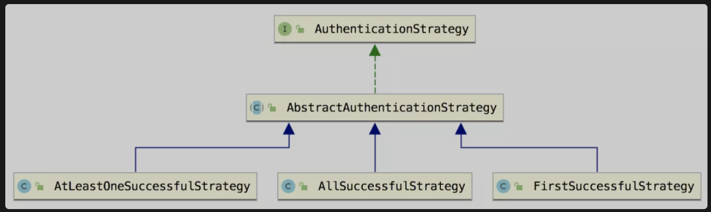
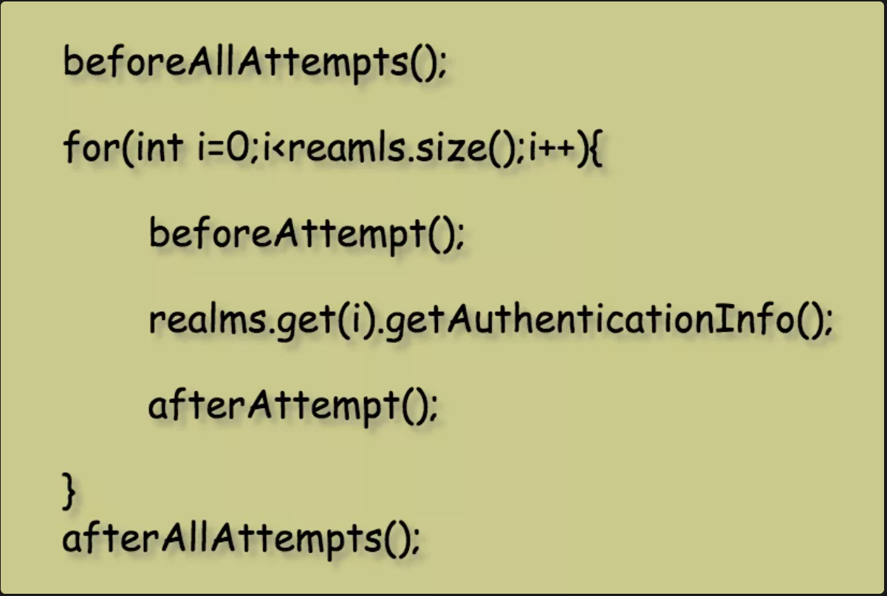

# 多 Realm 认证

转载自：江南一点雨

在项目中，如果我们想手机验证码登录、第三方 QQ 登录、邮箱登录等多种登录方式共存，那么就可以考虑通过 Shiro 中的多 Realm 来实现，具体操作中，一个 Realm 刚好就对应一种登录方式。

## 1. ModularRealmAuthenticator

### 1.1 Realm 去哪了？

我们配置的 Realm，可以直接配置给 SecurityManager，也可以配置给 SecurityManager 中的 ModularRealmAuthenticator。

如果我们是直接配置给 SecurityManager，那么在完成 Realm 的配置后，会自动调用 afterRealmsSet 方法，在该方法的中，会将我们配置的所有 Realm 最终配置给 ModularRealmAuthenticator。

相关源码如下：

RealmSecurityManager#setRealm（RealmSecurityManager 是 DefaultWebSecurityManager 的父类）

```
public void setRealm(Realm realm) {
    if (realm == null) {
        throw new IllegalArgumentException("Realm argument cannot be null");
    }
    Collection<Realm> realms = new ArrayList<Realm>(1);
    realms.add(realm);
    setRealms(realms);
}
public void setRealms(Collection<Realm> realms) {
    if (realms == null) {
        throw new IllegalArgumentException("Realms collection argument cannot be null.");
    }
    if (realms.isEmpty()) {
        throw new IllegalArgumentException("Realms collection argument cannot be empty.");
    }
    this.realms = realms;
    afterRealmsSet();
}
```

可以看到，无论是设置单个 Realm 还是设置多个 Realm，最终都会调用到 afterRealmsSet 方法，该方法在 AuthorizingSecurityManager#afterRealmsSet 类中被重写，内容如下：

```
protected void afterRealmsSet() {
    super.afterRealmsSet();
    if (this.authorizer instanceof ModularRealmAuthorizer) {
        ((ModularRealmAuthorizer) this.authorizer).setRealms(getRealms());
    }
}
```

可以看到，所有的 Realm 最终都被设置给 ModularRealmAuthenticator 了。

**所以说，无论是单个 Realm 还是多个 Realm，最终都是由 ModularRealmAuthenticator 统一管理统一调用的。**

### 1.2 ModularRealmAuthenticator 怎么玩

ModularRealmAuthenticator 中核心的方法就是 doAuthenticate，如下：

```
protected AuthenticationInfo doAuthenticate(AuthenticationToken authenticationToken) throws AuthenticationException {
    assertRealmsConfigured();
    Collection<Realm> realms = getRealms();
    if (realms.size() == 1) {
        return doSingleRealmAuthentication(realms.iterator().next(), authenticationToken);
    } else {
        return doMultiRealmAuthentication(realms, authenticationToken);
    }
}
```

这个方法的逻辑很简单：

1. 首先调用 assertRealmsConfigured 方法判断一下开发者有没有配置 Realm，要是没有配置就直接抛异常了。
2. 判断开发者配置了几个 Realm，要是配置了一个，就调用 doSingleRealmAuthentication 方法进行处理，要是配置了多个 Realm 则调用 doMultiRealmAuthentication 方法进行处理。

配置一个 Realm 的情况比较简单，不在本文的讨论范围内，本文主要是想和大家讨论多个 Realm 的情况。

当存在多个 Realm 的时候，必然又会带来另一个问题：**认证策略**，即怎么样就算认证成功？一个 Realm 认证成功就算成功还是所有 Realm 认证成功才算成功？还是怎么样。

接下来我们来详细聊一聊这个话题。

## 2. AuthenticationStrategy

先来整体上看下，负责认证策略的类是 AuthenticationStrategy，这是一个接口，有三个实现类：



单从字面上来看，三个实现类都好理解：

- AtLeastOneSuccessfulStrategy：至少有一个 Realm 认证成功。
- AllSuccessfulStrategy：所有 Realm 都要认证成功。
- FirstSuccessfulStrategy：这个从字面上理解不太准确，**它是只返回第一个认证成功的用户数据**。

第二种其实很好理解，问题在于第 1 个和第 3 个，这两个单独理解也好理解，放在一起的话，那有人不禁要问，这俩有啥区别？

老实说，在 1.3.2 之前的版本还真没啥大的区别，不过现在最新版本还是有些区别，且听松哥来分析。

首先这里一共涉及到四个方法：

- beforeAllAttempts：在所有 Realm 验证之前的做准备。
- beforeAttempt：在单个 Realm 之前验证做准备。
- afterAttempt：处理单个 Realm 验证之后的后续事宜。
- afterAllAttempts：处理所有 Realm 验证之后的后续事宜。

第一个和第四个方法在每次认证流程中只调用一次，而中间两个方法则在每个 Realm 调用前后都会被调用到，伪代码就类似下面这样：



上面这四个方法，在 AuthenticationStrategy 的四个实现类中有不同的实现，我整理了下面一张表格，方便大家理解：


大家注意这里多了一个 merge 方法，这个方法是在 AbstractAuthenticationStrategy 类中定义的，当存在多个 Realm 时，合并多个 Realm 中的认证数据使用的。接下来我们就按照这张表的顺序，来挨个分析这里的几个方法。

### 2.1 AbstractAuthenticationStrategy

#### 2.1.1 beforeAllAttempts

直接来看代码吧：

```
public AuthenticationInfo beforeAllAttempts(Collection<? extends Realm> realms, AuthenticationToken token) throws AuthenticationException {
    return new SimpleAuthenticationInfo();
}
```

这里啥都没干，就创建了一个空的 SimpleAuthenticationInfo 对象。

#### 2.1.2 beforeAttempt

```
public AuthenticationInfo beforeAttempt(Realm realm, AuthenticationToken token, AuthenticationInfo aggregate) throws AuthenticationException {
    return aggregate;
}
```

这个方法的逻辑也很简单，传入的 aggregate 参数是指多个 Realm 认证后聚合的结果，这里啥都没做，直接把结果原封不动返回。

#### 2.1.3 afterAttempt

```
public AuthenticationInfo afterAttempt(Realm realm, AuthenticationToken token, AuthenticationInfo singleRealmInfo, AuthenticationInfo aggregateInfo, Throwable t) throws AuthenticationException {
    AuthenticationInfo info;
    if (singleRealmInfo == null) {
        info = aggregateInfo;
    } else {
        if (aggregateInfo == null) {
            info = singleRealmInfo;
        } else {
            info = merge(singleRealmInfo, aggregateInfo);
        }
    }
    return info;
}
```

这是每个 Realm 认证完成后要做的事情，参数 singleRealmInfo 表示单个 Realm 认证的结果，aggregateInfo 表示多个 Realm 认证结果的聚合，具体逻辑如下：

1. 如果当前 Realm 认证结果为 null，则把聚合结果赋值给 info 并返回。
2. 如果当前 Realm 认证结果不为 null，并且聚合结果为 null，那么就把当前 Realm 的认证结果赋值给 info 并返回。
3. 如果当前 Realm 认证结果不为 null，并且聚合结果也不为 null，则将两者合并之后返回。

#### 2.1.4 afterAllAttempts

```
public AuthenticationInfo afterAllAttempts(AuthenticationToken token, AuthenticationInfo aggregate) throws AuthenticationException {
    return aggregate;
}
```

这里直接把聚合结果返回，没啥好说的。

#### 2.1.5 merge

```
protected AuthenticationInfo merge(AuthenticationInfo info, AuthenticationInfo aggregate) {
    if( aggregate instanceof MergableAuthenticationInfo ) {
        ((MergableAuthenticationInfo)aggregate).merge(info);
        return aggregate;
    } else {
        throw new IllegalArgumentException( "Attempt to merge authentication info from multiple realms, but aggregate " +
                  "AuthenticationInfo is not of type MergableAuthenticationInfo." );
    }
}
```

merge 其实就是调用 aggregate 的 merge 方法进行合并，正常情况下我们使用的 SimpleAuthenticationInfo 就是 MergableAuthenticationInfo 的子类，所以这里合并没问题。

### 2.2 AtLeastOneSuccessfulStrategy

#### 2.2.1 beforeAllAttempts

同 2.1.1 小节。

#### 2.2.2 beforeAttempt

同 2.1.2 小节。

#### 2.2.3 afterAttempt

同 2.1.3 小节。

#### 2.2.4 afterAllAttempts

```
public AuthenticationInfo afterAllAttempts(AuthenticationToken token, AuthenticationInfo aggregate) throws AuthenticationException {
    //we know if one or more were able to successfully authenticate if the aggregated account object does not
    //contain null or empty data:
    if (aggregate == null || isEmpty(aggregate.getPrincipals())) {
        throw new AuthenticationException("Authentication token of type [" + token.getClass() + "] " +
                "could not be authenticated by any configured realms.  Please ensure that at least one realm can " +
                "authenticate these tokens.");
    }
    return aggregate;
}
```

这里的逻辑很明确，就是当聚合结果为空就直接抛出异常。

#### 2.2.5 merge

同 2.1.5 小节。

#### 2.2.6 小结

结合 2.1 小节的内容，我们来梳理一下 AtLeastOneSuccessfulStrategy 的功能。

1. 首先，系统调用 beforeAllAttempts 方法会获取一个空的 SimpleAuthenticationInfo 对象作为聚合结果 aggregate。
2. 接下来遍历所有的 Realm，在每个 Realm 调用之前先调用 beforeAttempt 方法，该方法只会原封不动的返回聚合结果 aggregate。
3. 调用每个 Realm 的 getAuthenticationInfo 方法进行认证。
4. 调用 afterAttempt 方法对认证结果进行聚合处理。如果当前 Realm 认证返回 null，就把聚合结果返回；如果当前 Realm 认证不返回 null，就把 当前的 Realm 的认证结果和 aggregate 进行合并（aggregate 不会为 null，因为 beforeAllAttempts 方法中固定返回空对象）。

这就是 AtLeastOneSuccessfulStrategy 的认证策略。可以看到：**如果只有一个 Realm 认证成功，那么正常返回，如果有多个 Realm 认证成功，那么返回的用户信息中将包含多个认证用户信息。**

可以通过如下方式获取返回的多个用户信息：

```
Subject subject = SecurityUtils.getSubject();
subject.login(token);
PrincipalCollection principals = subject.getPrincipals();
List list = principals.asList();
for (Object o : list) {
    System.out.println("o = " + o);
}
```

subject.getPrincipals() 方法可以获取多个认证成功的凭证。

### 2.3 AllSuccessfulStrategy

#### 2.3.1 beforeAllAttempts

同 2.1.1 小节。

#### 2.3.2 beforeAttempt

```
public AuthenticationInfo beforeAttempt(Realm realm, AuthenticationToken token, AuthenticationInfo info) throws AuthenticationException {
    if (!realm.supports(token)) {
        String msg = "Realm [" + realm + "] of type [" + realm.getClass().getName() + "] does not support " +
                " the submitted AuthenticationToken [" + token + "].  The [" + getClass().getName() +
                "] implementation requires all configured realm(s) to support and be able to process the submitted " +
                "AuthenticationToken.";
        throw new UnsupportedTokenException(msg);
    }
    return info;
}
```

可以看到，这里就是去检查了下 Realm 是否支持当前 token。

**这块的代码我觉得略奇怪，为啥其他认证策略都不检查，只有这里检查？感觉像是一个 BUG。有懂行的小伙伴可以留言讨论下这个问题。**

#### 2.3.3 afterAttempt

```
public AuthenticationInfo afterAttempt(Realm realm, AuthenticationToken token, AuthenticationInfo info, AuthenticationInfo aggregate, Throwable t)
        throws AuthenticationException {
    if (t != null) {
        if (t instanceof AuthenticationException) {
            throw ((AuthenticationException) t);
        } else {
            String msg = "Unable to acquire account data from realm [" + realm + "].  The [" +
                    getClass().getName() + " implementation requires all configured realm(s) to operate successfully " +
                    "for a successful authentication.";
            throw new AuthenticationException(msg, t);
        }
    }
    if (info == null) {
        String msg = "Realm [" + realm + "] could not find any associated account data for the submitted " +
                "AuthenticationToken [" + token + "].  The [" + getClass().getName() + "] implementation requires " +
                "all configured realm(s) to acquire valid account data for a submitted token during the " +
                "log-in process.";
        throw new UnknownAccountException(msg);
    }
    merge(info, aggregate);
    return aggregate;
}
```

如果当前认证出错了，或者认证结果为 null，就直接抛出异常（因为这里要求每个 Realm 都认证成功，但凡有一个认证失败了，后面的就没有必要认证了）。

如果一切都 OK，就会结果合并然后返回。

#### 2.3.4 afterAllAttempts

同 2.1.4 小节。

#### 2.3.5 merge

同 2.1.5 小节。

#### 2.3.6 小结

这种策略比较简单，应该不用多做解释吧。如果有多个 Realm 认证成功，这里也是会返回多个 Realm 的认证信息的，获取多个 Realm 的认证信息同上一小节。

### 2.4 FirstSuccessfulStrategy

#### 2.4.1 beforeAllAttempts

```
public AuthenticationInfo beforeAllAttempts(Collection<? extends Realm> realms, AuthenticationToken token) throws AuthenticationException {
    return null;
}
```

不同于前面，这里直接返回了 null。

#### 2.4.2 beforeAttempt

```
public AuthenticationInfo beforeAttempt(Realm realm, AuthenticationToken token, AuthenticationInfo aggregate) throws AuthenticationException {
    if (getStopAfterFirstSuccess() && aggregate != null && !isEmpty(aggregate.getPrincipals())) {
        throw new ShortCircuitIterationException();
    }
    return aggregate;
}
```

这里的逻辑是这样，如果 getStopAfterFirstSuccess() 方法返回 true，并且当前认证结果的聚合不为空，那么就直接抛出异常，一旦抛出异常，就会跳出当前循环，也就是不会调用当前 Realm 进行认证操作了。这个思路和 FirstSuccessfulStrategy 名字基本上是契合的。

不过这里有一个方法 getStopAfterFirstSuccess()，看名字就知道是否在第一次成功后停止认证，默认情况下，该变量为 false，即即使第一次认证成功后，也还是会继续后面 Realm 的认证。

如果我们希望当第一次认证成功后，后面的 Realm 就不认证了，那么记得配置该属性为 true。

#### 2.4.3 afterAttempt

同 2.1.3 小节。

#### 2.4.4 afterAllAttempts

同 2.1.4 小节。

#### 2.4.5 merge

不知道小伙伴们是否还记得 merge 方法是在哪里调用的，回顾 2.1.3 小节，如果当前 Realm 的认证和聚合结果都不为 null，就需要对结果进行合并，原本的合并是真正的去合并，这里重写了该方法，就没有去执行合并了：

```
protected AuthenticationInfo merge(AuthenticationInfo info, AuthenticationInfo aggregate) {
    if (aggregate != null && !isEmpty(aggregate.getPrincipals())) {
        return aggregate;
    }
    return info != null ? info : aggregate;
}
```

这是三个策略中，唯一重写 merge 方法的。

这里的 merge 并没有真正的 merge，而是：

1. 如果聚合结果不为空，就直接返回聚合结果。
2. 否则，如果当前认证结果不为空，就返回当前认证结果。
3. 否则返回空。

可以看到，这里的 merge 其实就是挑选一个认证的 info 返回。如果前面有认证成功的 Realm，后面 Realm 认证成功后返回的 info 是不会被使用的。

#### 2.4.6 小结

好啦，现在小伙伴们可以总结出 FirstSuccessfulStrategy 和 AtLeastOneSuccessfulStrategy 的区别了：

1. AtLeastOneSuccessfulStrategy：当存在多个 Realm 的时候，即使已经有一个 Realm 认证成功了，后面的 Realm 也还是会去认证，并且如果后面的 Realm 也认证成功了，那么会将多个 Realm 认证成功的结果进行合并。
2. FirstSuccessfulStrategy：当存在多个 Realm 的时候，默认情况下，即使已经有一个 Realm 认证成功了，后面的 Realm 也还是会去认证，但是如果后面的 Realm 也认证成功了，却并不会使用后面认证成功的 Realm 返回的结果。如果我们希望当一个 Realm 认证成功后，后面的 Realm 就不再认证了，那么可以配置 stopAfterFirstSuccess 属性的值，配置方式如下：

```
<bean class="org.apache.shiro.web.mgt.DefaultWebSecurityManager" id="securityManager">
    <property name="authenticator">
        <bean class="org.apache.shiro.authc.pam.ModularRealmAuthenticator">
            <property name="authenticationStrategy">
                <bean class="org.apache.shiro.authc.pam.FirstSuccessfulStrategy">
                    <property name="stopAfterFirstSuccess" value="true"/>
                </bean>
            </property>
            <property name="realms">
                <list>
                    <ref bean="myRealm01"/>
                    <ref bean="myRealm02"/>
                </list>
            </property>
        </bean>
    </property>
</bean>
```