# Docker简介

## 1.Docker 为什么会出现

### 1.1需求

软件开发一般大致分为两个环节，第一是本地开发， 第二是服务器部署。如果一个项目本地开发好了，那么放到服务器上，有时候安装环境会非常复杂，也正是因为其复杂性，大公司才会有专门负责项目发布的运维人员。为了解决这个问题，docker技术应运而生。

### 1.2技术特点

>环境隔离:Docker是一种虚拟化技术，一大特点就是环境隔离。我们知道既然是虚拟化技术，环境隔离必然是其一大特点，比如我们之前使用过的虚拟机virtualBox，可以通过该软件安装很多个系统镜像，然后做到系统与系统之间的隔离。
>
>镜像小：Docker中的环境配置，每个小块都是一个容器，有自己的一套环境，而且，内核采用的也是简化版内核。能够做到非常小的体积
>
>满足更快速的交付和部署：在敏捷开发的当下，快速开发应用是非常重要的。传统的方式是开发要写一堆文档供运维人员使用，然后运维按照文档配置好环境并讲开发好的jar包跑进入。那么现在有了docker，开发人员只需要将jar+环境打包好，丢给运维，让运维运行起来就可以了。而且，比如应用需要升级，那么环境又要变更，这个过程非常麻烦且痛苦，那么使用docker以后，就可以将新内容打包一并发送给运维再次执行便可以。

## 2.Docker的历史

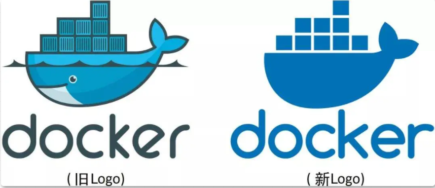

如同 Docker 的 Logo 一样，Docker 的思想来源于集装箱。集装箱解决了什么问题？在一艘大船上，可以把货物规整的摆放起来，并且各种各样的货物被集装箱标准化，集装箱与集装箱之间互不影响。那么就不需要专门运送水果的船和专门运送化学用品的船了。只要这些货物封装在不同的集装箱里，就可以用一艘大船把它们都运走。

Docker 技术诞生之后，并没有引起行业的关注。而 dotCloud 公司，作为一家小型创业企业，在激烈的竞争之下，也步履维艰。正当他们快要坚持不下去的时候，脑子里蹦出了“开源”的想法。2013 年 3 月，dotCloud 公司的创始人之一，Docker 之父，28 岁的 **「Solomon Hykes」** 正式决定，将 Docker 项目开源。


不开则已，一开惊人。越来越多的 IT 工程师发现了 Docker 的优点，然后蜂拥而至，加入 Docker 开源社区。Docker 的人气迅速攀升，速度之快，令人瞠目结舌。开源当月， Docker 0.1 版本发布。此后的每一个月， Docker 都会发布一个版本。到 2014 年 6 月 9 日， Docker 1.0 版本正式发布。

此时的 Docker，已经成为行业里人气最火爆的开源技术，没有之一。甚至像 Google、微软、Amazon、 VMware 这样的巨头们都对它青睐有加，表示将全力支持。Docker 火了之后， dotCloud 公司干脆把公司名字也改成了 Docker Inc。

## 3.Docker的优点

### **「更高效的利用系统资源」**

由于容器不需要进行硬件虚拟以及运行完整操作系统等额外开销，Docker 对系统资源的利用率更高。无论是应用执行速度、内存损耗或者文件存储速度，都要比传统虚拟机技术更高效。因此，相比虚拟机技术，一个相同配置的主机，往往可以运行更多数量的应用。

### **「更快速的启动时间」**

传统的虚拟机技术启动应用服务往往需要数分钟，而 Docker 容器应用，由于直接运行于宿主内核，无需启动完整的操作系统，因此可以做到秒级、甚至毫秒级的启动时间。大大的节约了开发、测试、部署的时间。

### **「一致的运行环境」**

开发过程中一个常见的问题是环境一致性问题。由于开发环境、测试环境、生产环境不一致，导致有些 bug 并未在开发过程中被发现。而 Docker 的镜像提供了除内核外完整的运行时环境，确保了应用运行环境一致性，从而不会再出现「这段代码在我机器上没问题啊」 这类问题。

### **「持续交付和部署」**

对开发和运维（DevOps）人员来说，最希望的就是一次创建或配置，可以在任意地方正常运行。使用 Docker 可以通过定制应用镜像来实现持续集成、持续交付、部署。开发人员可以通过 Dockerfile 来进行镜像构建，并结合持续集成（Continuous Integration）系统进行集成测试，而运维人员则可以直接在生产环境中快速部署该镜像，甚至结合持续部署（Continuous Delivery/Deployment）系统进行自动部署。而且使用 Dockerfile 使镜像构建透明化，不仅仅开发团队可以理解应用运行环境，也方便运维团队理解应用运行所需条件，帮助更好的在生产环境中部署该镜像。

### **「更轻松的迁移」**

由于 Docker 确保了执行环境的一致性，使得应用的迁移更加容易。Docker 可以在很多平台上运行，无论是物理机、虚拟机、公有云、私有云，甚至是笔记本，其运行结果是一致的。因此用户可以很轻易的将在一个平台上运行的应用，迁移到另一个平台上，而不用担心运行环境的变化导致应用无法正常运行的情况。

### **「更轻松的维护和扩展」**

Docker 使用的分层存储以及镜像的技术，使得应用重复部分的复用更为容易，也使得应用的维护更新更加简单，基于基础镜像进一步扩展镜像也变得非常简单。此外，Docker 团队同各个开源项目团队一起维护了一大批高质量的 官方镜像，既可以直接在生产环境使用，又可以作为基础进一步定制，大大的降低了应用服务的镜像制作成本。

## 4.容器与虚拟机的比较

下面的图片比较了 Docker 和传统虚拟化方式的不同之处，可见容器是在操作系统层面上实现虚拟化，直接复用本地主机的操作系统，而传统方式则是在硬件层面实现。


与传统的虚拟机相比，Docker 优势体现为启动速度快、占用体积小。传统虚拟机， 虚拟出一条硬件，运行一个完整的操作系统，然后在这个系统上安装和运行软件，容器内的应用直接运行在宿主机的内部，容器是没有自己的内核的，也没有虚拟硬件，所以轻便。


# Docker入门

## 1.Docker安装

在官网的指引下进行安装——https://docs.docker.com/engine/install/centos/  （以centos7环境下安装为例）

安装 yum-utils 包(它提供 yum-config-manager 实用工具)并设置稳定存储库。

```
$ sudo yum install -y yum-utils

$ sudo yum-config-manager \
    --add-repo \
    https://download.docker.com/linux/centos/docker-ce.repo
```

安装最新版本的 Docker Engine 和 containerd

```
$ sudo yum install docker-ce docker-ce-cli containerd.io
```

启动 Docker。

```
$ sudo systemctl start docker
```

通过运行 hello-world 映像来验证 Docker Engine 安装是否正确。

```
docker run hello-world
```


如上图所示即表示安装成功,在docker run执行时流程如下图所示：

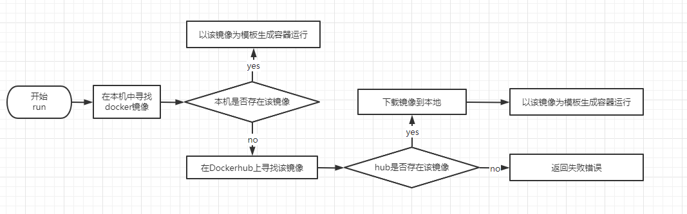

## 2.Docker基本命令

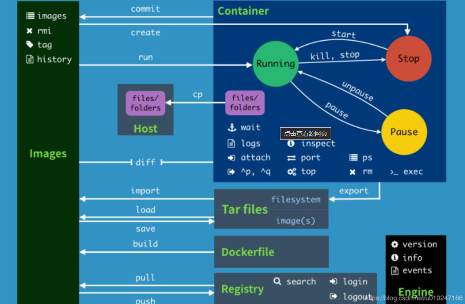

### 2.1帮助命令

```java
docker version  # docker版本信息
docker info     # 系统级别的信息，包括镜像和容器的数量
docker 命令 --help 
```

https://docs.docker.com/engine/reference/commandline/docker/     ——官方帮助文档

### 2.2镜像命令

docker images   ——查看所有本地主机上的镜像

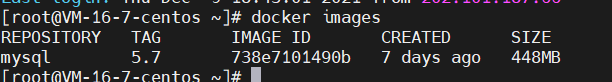

>1. REPOSITORY      *# 镜像的仓库*
>2. TAG                      *# 镜像的标签*
>3. IMAGE ID             *# 镜像的ID*
>4. CREATED            *# 镜像的创建时间*
>5. SIZE                    *# 镜像的大小*

#### docker pull 下拉镜像

```perl
docker pull 镜像名[:tag]
```

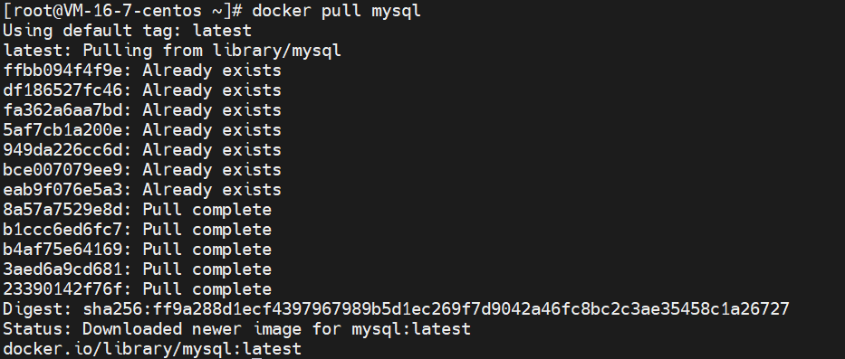

#### docker rmi 删除镜像

```ruby
# docker rmi -f IMAGE ID                        # 删除指定镜像
# docker rmi -f IMAGE ID1 IMAGE ID2 IMAGE ID3   # 删除多个镜像
#  docker rmi -f $(docker images -aq)           # 删除所有镜像
```

### 2.3容器命令

容器的创建实在拥有镜像的基础上创建的，需要先拥有一个镜像，才可以将他启动为一个容器，以centos为例，先拉取镜像

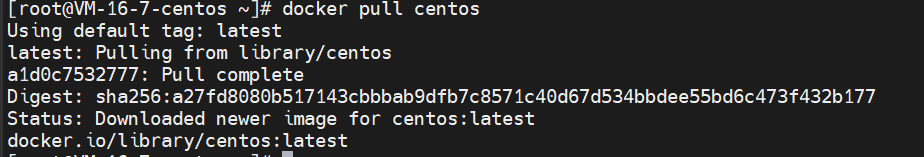

#### 新建容器并启动

```ruby
docker run [可选参数] image
 
# 参数说明
--name=“Name”   容器名字    tomcat01    tomcat02    用来区分容器
-d      后台方式运行
-it     使用交互方式运行，进入容器查看内容
-p      指定容器的端口     -p 8080:8080
    -p  ip:主机端口：容器端口
    -p  主机端口：容器端口（常用）
    -p  容器端口
    容器端口
-p      随机指定端口
 
 
# 测试，启动并进入容器
[root@iZ2zeg4ytp0whqtmxbsqiiZ ~]# docker run -it centos /bin/bash
[root@74e82b7980e7 /]# ls   # 查看容器内的centos，基础版本，很多命令是不完善的
bin  etc   lib    lost+found  mnt  proc  run   srv  tmp  var
dev  home  lib64  media       opt  root  sbin  sys  usr
 
# 从容器中退回主机
[root@77969f5dcbf9 /]# exit
exit
[root@iZ2zeg4ytp0whqtmxbsqiiZ /]# ls
bin   dev  fanfan  lib    lost+found  mnt  proc  run   srv  tmp  var
boot  etc  home    lib64  media       opt  root  sbin  sys  usr
```

#### 列出所有的运行的容器

```ruby
# docker ps 命令
        # 列出当前正在运行的容器
-a      # 列出正在运行的容器包括历史容器
-n=?    # 显示最近创建的容器
-q      # 只显示当前容器的编号
 
[root@iZ2zeg4ytp0whqtmxbsqiiZ /]# docker ps
CONTAINER ID        IMAGE               COMMAND             CREATED             STATUS              PORTS               NAMES
[root@iZ2zeg4ytp0whqtmxbsqiiZ /]# docker ps -a
CONTAINER ID        IMAGE               COMMAND             CREATED             STATUS                     PORTS               NAMES
77969f5dcbf9        centos              "/bin/bash"         5 minutes ago       Exited (0) 5 minutes ago                       xenodochial_bose
74e82b7980e7        centos              "/bin/bash"         16 minutes ago      Exited (0) 6 minutes ago                       silly_cori
a57250395804        bf756fb1ae65        "/hello"            7 hours ago         Exited (0) 7 hours ago                         elated_nash
392d674f4f18        bf756fb1ae65        "/hello"            8 hours ago         Exited (0) 8 hours ago                         distracted_mcnulty
571d1bc0e8e8        bf756fb1ae65        "/hello"            23 hours ago        Exited (0) 23 hours ago                        magical_burnell
 
[root@iZ2zeg4ytp0whqtmxbsqiiZ /]# docker ps -qa
77969f5dcbf9
74e82b7980e7
a57250395804
392d674f4f18
571d1bc0e8e8
```

#### 删除容器

```bash
docker rm -f 容器id                       # 删除指定容器
docker rm -f $(docker ps -aq)       # 删除所有容器
docker ps -a -q|xargs docker rm -f  # 删除所有的容器
```

#### 启动和停止容器的操作

```bash
docker start 容器id           # 启动容器
docker restart 容器id         # 重启容器
docker stop 容器id            # 停止当前正在运行的容器
docker kill 容器id            # 强制停止当前的容器
```

### 2.4常用的其他命令

#### 后台启动容器

```ruby
命令 docker run -d 镜像名
```

但是 docker ps后发现centos停止了——需要注意的是， docker 容器使用后台运行， 就必须要有一个前台进程，docker发现没有应用，就会自动停止

#### 查看日志

```ruby
docker logs -tf --tail number 容器id
 
[root@iZ2zeg4ytp0whqtmxbsqiiZ /]# docker logs -tf --tail 1 8d1621e09bff
2020-08-11T10:53:15.987702897Z [root@8d1621e09bff /]# exit      # 日志输出 
 
# 显示日志
-tf                 # 显示日志
--tail number       # 显示日志条数
```

#### 查看镜像的元数据

```csharp
docker inspect 容器id
```

#### 进入当前正在运行的容器

```python
# 命令
docker exec -it 容器id /bin/bash

# 测试
#方式一
[root@iZ2zeg4ytp0whqtmxbsqiiZ /]# docker exec -it df358bc06b17 /bin/bash
[root@df358bc06b17 /]# ls       
bin  etc   lib    lost+found  mnt  proc  run   srv  tmp  var
dev  home  lib64  media       opt  root  sbin  sys  usr
[root@df358bc06b17 /]# ps -ef
UID        PID  PPID  C STIME TTY          TIME CMD
root         1     0  0 Aug11 pts/0    00:00:00 /bin/bash
root        29     0  0 01:06 pts/1    00:00:00 /bin/bash
root        43    29  0 01:06 pts/1    00:00:00 ps -ef
# 方式二
docker attach 容器id
# 区别
# docker exec       # 进入容器后开启一个新的终端，可以在里面操作
# docker attach     # 进入容器正在执行的终端，不会启动新的进程
```

# Docker部署

## 1.以部署nginx为例

### 1.1-Docker安装Nginx

```ruby
# 1. 搜索镜像 search 建议去docker hub搜索，可以看到帮助文档
# 2. 下载镜像 pull
# 3. 运行测试
[root@iZ2zeg4ytp0whqtmxbsqiiZ home]# docker images
REPOSITORY          TAG                 IMAGE ID            CREATED             SIZE
centos              latest              0d120b6ccaa8        32 hours ago        215MB
nginx               latest              08393e824c32        7 days ago          132MB
 
# -d 后台运行
# -name 给容器命名
# -p 宿主机端口：容器内部端口
[root@iZ2zeg4ytp0whqtmxbsqiiZ home]# docker run -d --name nginx01 -p 3344:80 nginx  # 后台方式启动启动镜像
fe9dc33a83294b1b240b1ebb0db9cb16bda880737db2c8a5c0a512fc819850e0
[root@iZ2zeg4ytp0whqtmxbsqiiZ home]# docker ps
CONTAINER ID        IMAGE               COMMAND                  CREATED             STATUS              PORTS                  NAMES
fe9dc33a8329        nginx               "/docker-entrypoint.…"   4 seconds ago       Up 4 seconds        0.0.0.0:3344->80/tcp   nginx01
[root@iZ2zeg4ytp0whqtmxbsqiiZ home]# curl localhost:3344    # 本地访问测试
 
# 进入容器
[root@iZ2zeg4ytp0whqtmxbsqiiZ home]# docker exec -it nginx01 /bin/bash
root@fe9dc33a8329:/# whereis nginx
nginx: /usr/sbin/nginx /usr/lib/nginx /etc/nginx /usr/share/nginx
root@fe9dc33a8329:/# cd /etc/nginx/
root@fe9dc33a8329:/etc/nginx# ls
conf.d      koi-utf  mime.types  nginx.conf   uwsgi_params
fastcgi_params  koi-win  modules     scgi_params  win-utf

```

### 1.2**端口暴露概念**

在上述docker安装nginx以后运行容器时通过-p命令将本机的3344端口映射到了容器内的80端口（nginx默认是80端口），就好像建立了一条连接，通过访问本机的3344端口就相当于访问了容器内的80端口，但是需要打开安全组和防火墙的端口将端口暴露（如果防火墙开启的情况下），不同的服务商提供的服务器都有对应的控制台，可以在控制台上找到关于服务器防火墙的配置，服务器本身也有防火墙（此防火墙可以开启也可以关闭，开启时也需要暴露端口），只有将端口都暴露出来才可以访问到。

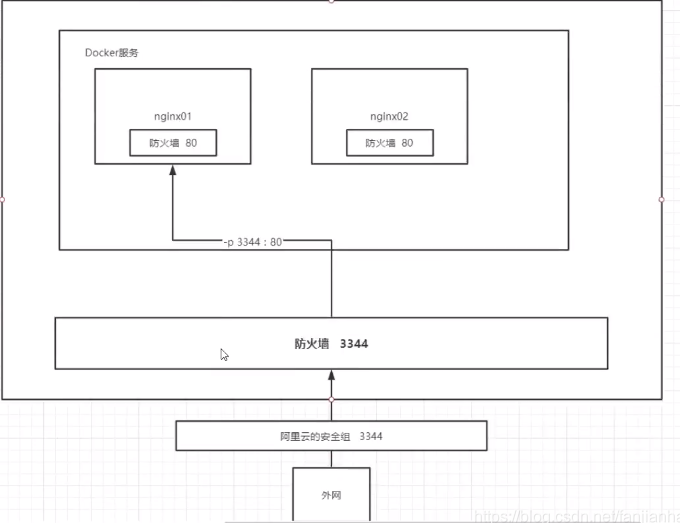

## 2. 容器数据卷

容器之间可以有一个数据共享技术！Docker容器中产生的数据，同步到本地——这就是卷技术，目录的挂载，将容器内的目录挂载到linux目录上面，防止容器因为意外导致数据丢失，即使容器损坏了本地依旧存有容器中挂载目录的数据

**总结： **容器的持久化和同步操作，容器间数据也是可以共享的！

### 2.1. 使用数据卷

方式一：直接使用命令来挂载 -v

```ruby
docker run -it -v 主机目录：容器目录
[root@iZ2zeg4ytp0whqtmxbsqiiZ home]# docker run -it -v /home/ceshi:/home centos /bin/bash
```

挂在以后本地和容器的数据就是同步的了，即使停止容器以后本地修改了文件再次启动容器依旧可以同步。可以在容器元数据中查看挂载的信息

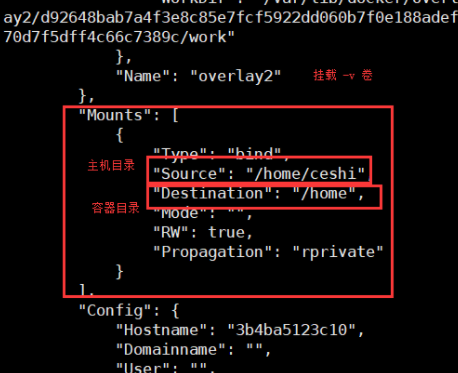

方式二：匿名和具名挂载

```ruby
# 匿名挂载
-v 容器内路径
docker run -d -P --name nginx01 -v /etc/nginx nginx     # -P 随机指定端口
 
# 查看所有volume的情况
[root@iZ2zeg4ytp0whqtmxbsqiiZ ~]# docker volume ls
DRIVER              VOLUME NAME
local               561b81a03506f31d45ada3f9fb7bd8d7c9b5e0f826c877221a17e45d4c80e096
local               36083fb6ca083005094cbd49572a0bffeec6daadfbc5ce772909bb00be760882
 
# 这种情况就是匿名挂载，我们在-v 后面只写了容器内的路径，没有写容器外的路径！
 
# 具名挂载
[root@iZ2zeg4ytp0whqtmxbsqiiZ ~]# docker run -d -P --name nginx02 -v juming-nginx:/etc/nginx nginx
26da1ec7d4994c76e80134d24d82403a254a4e1d84ec65d5f286000105c3da17
[root@iZ2zeg4ytp0whqtmxbsqiiZ ~]# docker ps
CONTAINER ID        IMAGE               COMMAND                  CREATED             STATUS              PORTS                   NAMES
26da1ec7d499        nginx               "/docker-entrypoint.…"   3 seconds ago       Up 2 seconds        0.0.0.0:32769->80/tcp   nginx02
486de1da03cb        nginx               "/docker-entrypoint.…"   3 minutes ago       Up 3 minutes        0.0.0.0:32768->80/tcp   nginx01
[root@iZ2zeg4ytp0whqtmxbsqiiZ ~]# docker volume ls
DRIVER              VOLUME NAME
local               561b81a03506f31d45ada3f9fb7bd8d7c9b5e0f826c877221a17e45d4c80e096
local               36083fb6ca083005094cbd49572a0bffeec6daadfbc5ce772909bb00be760882
local               juming-nginx
 
# 通过-v 卷名：容器内的路径
# 查看一下这个卷
# docker volume inspect juming-nginx
 
[root@iZ2zeg4ytp0whqtmxbsqiiZ ~]# docker volume inspect juming-nginx
[
  {
      "CreatedAt": "2020-08-12T18:15:21+08:00",
      "Driver": "local",
      "Labels": null,
      "Mountpoint": "/var/lib/docker/volumes/juming-nginx/_data",
      "Name": "juming-nginx",
      "Options": null,
      "Scope": "local"
  }
]
```

**所有docker容器内的卷，没有指定目录的情况下都是在**`/var/lib/docker/volumes/xxxxx/_data`

ps：

```ruby
# 通过 -v 容器内容路径 ro rw 改变读写权限
ro  readonly    # 只读
rw  readwrite   # 可读可写
 
docker run -d -P --name nginx02 -v juming-nginx:/etc/nginx:ro nginx
docker run -d -P --name nginx02 -v juming-nginx:/etc/nginx:rw nginx
 
# ro 只要看到ro就说明这个路径只能通过宿主机来操作，容器内容无法操作
```

## 3.容器commit

docker镜像都是只读的，当容器启动时， 一个新的可写层被加载到镜像的顶部！这一层就是我们通常说的容器层， 容器之下的都叫做镜像层

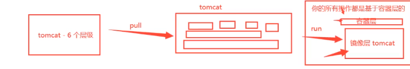

docker commit操作可以将当前的容器重新转化为一个镜像，不过他会带上你对这个容器所进行的操作变成一个全新的镜像，所以当你再次将这个镜像运行成容器时他会在原有的基础上重新生成一个容器层供你操作。

commit操作：

```ruby
docker commit 提交容器成为一个新的版本
 
# 命令和git 原理类似
docker commit -m="提交的描述信息" -a="作者" 容器id 目标镜像名：[TAG]
 
docker commit -a="ytKing" -m="test commit" d798a5946c1f tomcat007:1.0
```

# Dockerfile构建docker镜像

## 1.dockerfile概念

Dockerfile是一个文本文件，文件里是命令的集合。

一般情况下创建一个目录或者是git上的一个资源库，放置Dockerfile文件和build过程所需要的资源，如果Dockerfile的文件名就是Dockerfile并且就在此目录下，build时不需要指定dockerfile位置，否则需要-f 指定文件位置和文件名

```
Warning！
警告
不要使用根目录/作为构建上下文的 PATH，因为它会导致构建将硬盘驱动器的全部内容传输到 Docker 守护进程。
```

创建一个文件夹

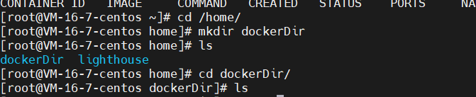

创建dockerfile

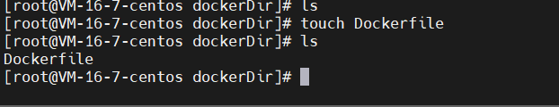


```java
build 命令：docker build -t 映像名：tag .  //最后的点表示资源在当前目录下，不可以省略
```

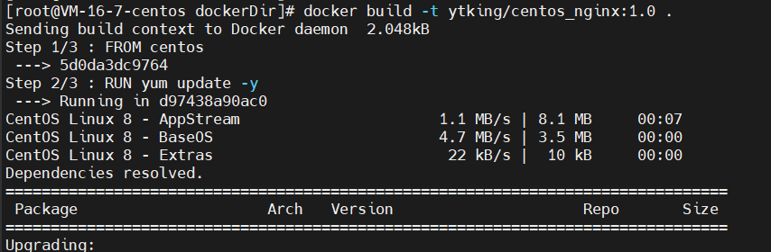

验证当前映像：理想情况是，启动容器，进行端口映射后就可以使用

进入容器后启动nginx—— ./usr/sbin/nginx      nginx生效

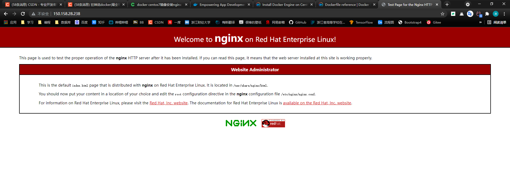

修改dockerfile

```
FROM centos
RUN yum update -y
RUN yum install -y nginx
RUN ./usr/sbin/nginx
```

创建容器后依然无法直行nginx，因为没有前台任务

再次修改即可运行

```
FROM centos
RUN yum update -y
RUN yum install -y nginx
CMD nginx -g "daemon off;"
```


## 2.Dockerfile构成

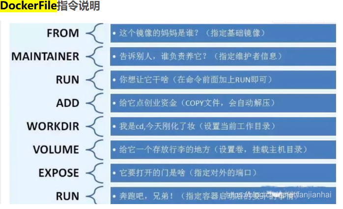

```
1）FROM
//说明当前构建的image以哪个image为基础
2）RUN
//创建映像时要执行的命令，不是在容器中执行的命令
3）CMD
CMD 指令有三种形式:

CMD ["executable","param1","param2"] (exec 执行官 form, this is the preferred form) 表格，这是首选的表格)
CMD ["param1","param2"] (as (作为default parameters to ENTRYPOINT ENTRYPOINT 的缺省参数)
CMD command param1 param2 (shell 贝壳 form) 表格)
```

## 3.使用Dockerfile部署后台jar包

数据库mysql和redis单独在用另外的docker容器部署

### 3.1-mysql容器化

拉去官方镜像

```sql
docker pull mysql:5.7
```

在本地创建mysql的映射目录

```sql
mkdir -p /root/mysql/data /root/mysql/logs /root/mysql/conf
```

在/root/mysql/conf中创建 *.cnf 文件

```sql
touch my.cnf
```

创建容器,将数据,日志,配置文件映射到本机

```sql
docker run -p 3306:3306 --name mysql -v /root/mysql/conf:/etc/mysql/conf.d -v /root/mysql/logs:/logs -v /root/mysql/data:/var/lib/mysql -e MYSQL_ROOT_PASSWORD=root -d mysql:5.7
```

>**-d:** 后台运行容器
>
>**-p** 将容器的端口映射到本机的端口
>
>**-v** 将主机目录挂载到容器的目录
>
>**-e** 设置参数

启动mysql容器

```sql
docker start mysql
```

### 3.2-项目打包

将后端的项目打成jar包，放到服务器上，在服务器新建 dockerfiledemo 文件夹存放jar包和dockerfile

```java
mkdir dockerfiledemo
```

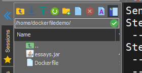

编写Dockerfile文件：

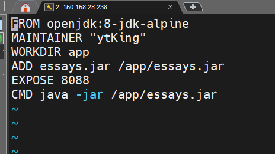

### 3.3-Dockerfile命令说明

>FROM：指定基础镜像，必须为第一个命令
>
>MAINTAINER: 维护者信息
>
>LABEL：用于为镜像添加元数据
>
>ADD：将本地文件添加到容器中，tar类型文件会自动解压(网络压缩资源不会被解压)，可以访问网络资源，类似wget
>
>COPY：功能类似ADD，但是是不会自动解压文件，也不能访问网络资源
>
>WORKDIR：工作目录，类似于cd命令
>
>RUN：构建镜像时执行的命令
>
>CMD：构建容器后调用，也就是在容器启动时才进行调用。
>
>ENTRYPOINT：配置容器，使其可执行化。配合CMD可省去"application"，只使用参数。
>
>ENV：设置环境变量
>
>EXPOSE：指定于外界交互的端口
>
>VOLUME：用于指定持久化目录
>
>ARG：用于指定传递给构建运行时的变量
>
>USER:指定运行容器时的用户名或 UID，后续的 RUN 也会使用指定用户。使用USER指定用户时，可以使用用户名、UID或GID，或是两者的组合。当服务不需要管理员权限时，可以通过该命令指定运行用户。并且可以在之前创建所需要的用户
>
>ONBUILD：用于设置镜像触发器

### 3.4-编译Dockerfile文件生成Docker镜像（镜像名 不能有大写）

```java
docker build -t ytking-essays .
```

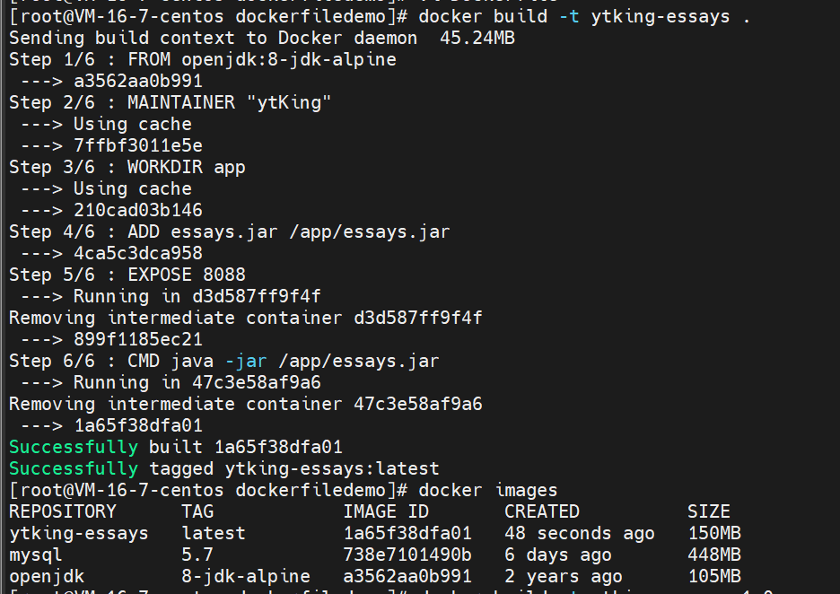

### 3.5-运行构建的镜像

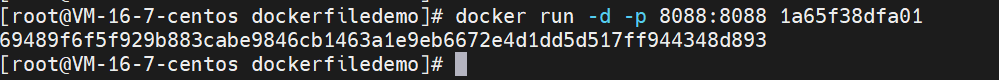

开放8088端口，与项目的配置文件中的端口一致，再将服务器的安全组和服务器的防火墙开放8088端口，就可以通过api访问接口

### 3.6-测试

通过postman测试接口成功

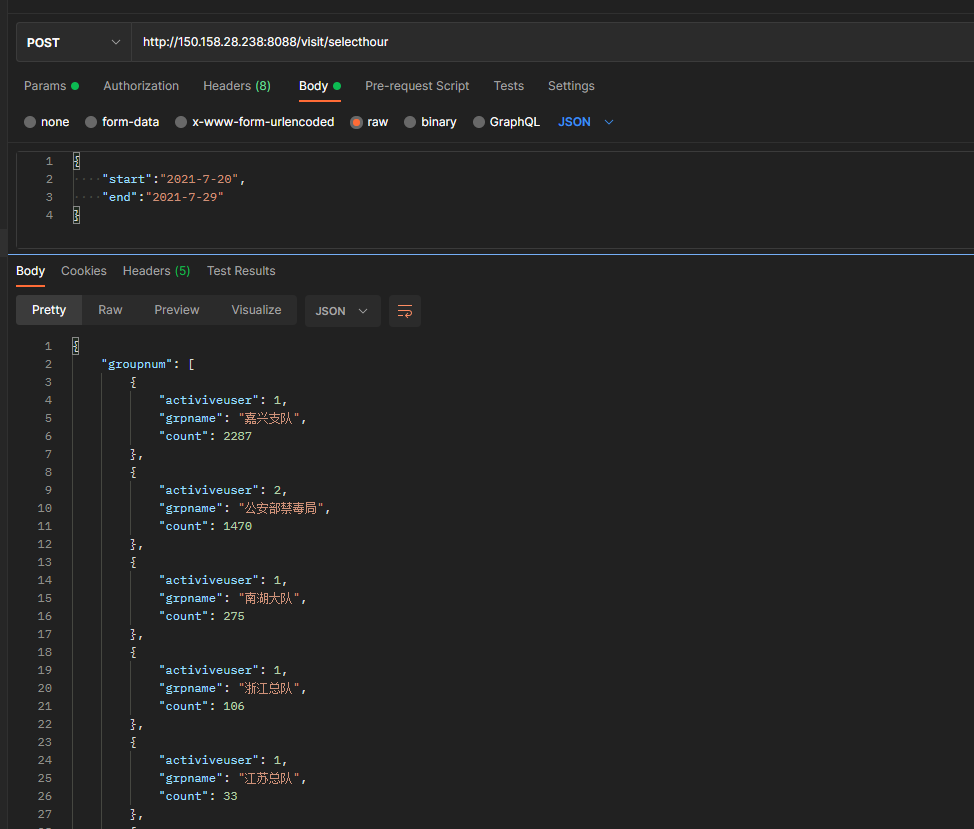

查看容器运行的输出日志

```java
docker logs -f 容器ID
```

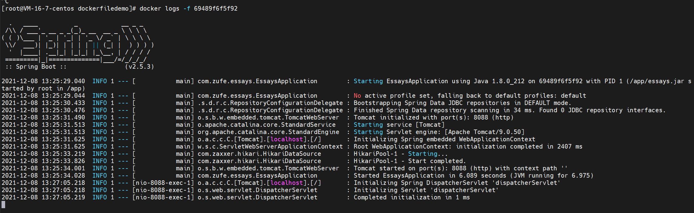

# Docker Hub操作

https://hub.docker.com/ ——dockerhub网址

在dockerhub上创建一个用户你就可以将你制作的镜像上传的dockerhub上去当作开源的镜像供他人使用（类似于github）

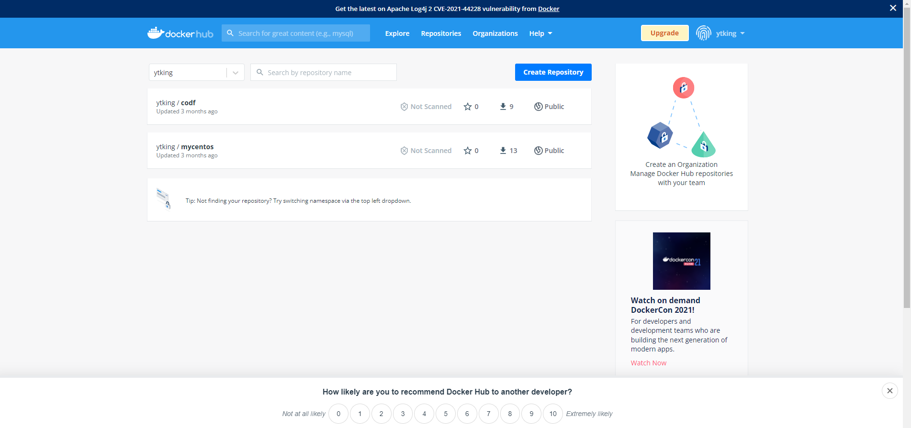

在服务器上登录自己的dockerhub账号就可以上传自己的镜像

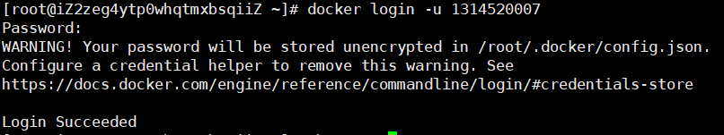

```ruby
# push到我们的服务器上
[root@iZ2zeg4ytp0whqtmxbsqiiZ ~]# docker push diytomcat
The push refers to repository [docker.io/library/diytomcat]
2eaca873a720: Preparing 
1b38cc4085a8: Preparing 
088ebb58d264: Preparing 
c06785a2723d: Preparing 
291f6e44771a: Preparing 
denied: requested access to the resource is denied  # 拒绝
```

直接将自己命名的镜像通过push上传dockerhub是会被拒绝的，要在镜像名前加上自己dockerhub的用户名并带上版本号才可以，如：

```ruby
docker push ytking/diytomcat:1.0
```

ytking是我自己的用户名，1.0时版本号，这样就可以成功上传镜像，拉去也是如此只要将push改为pull即可。
