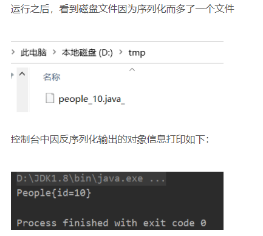
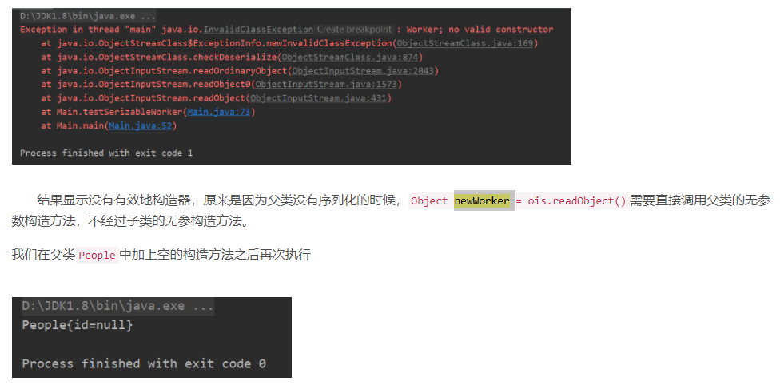
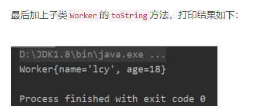
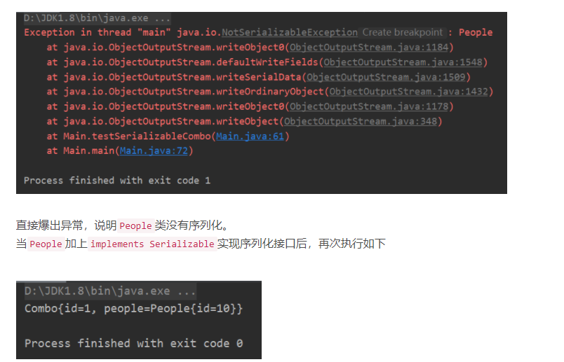
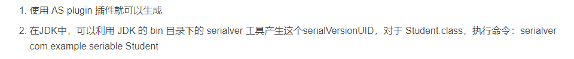
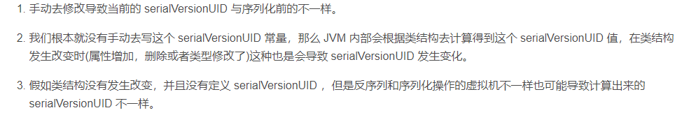
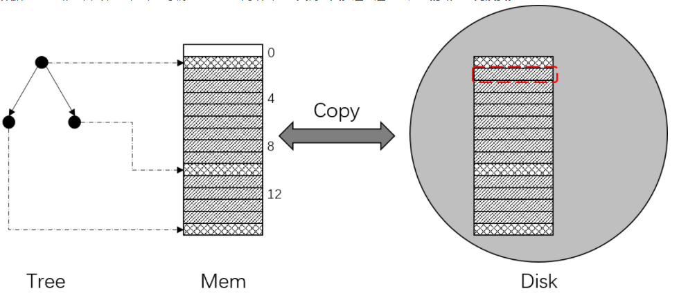
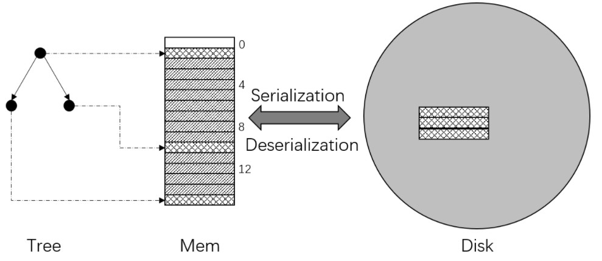

# **Serializable接口的理解**

## 1.序列化介绍

​		查看 [官方文档](http://docs.oracle.com/javase/8/docs/api/java/io/Serializable.html) 就会发现 Serializable接口中一个成员函数或者成员变量也没有。那么这个接口的作用是什么呢。网上找了一些博客看过之后，知道这个接口的作用是实现序列化。

```
序列化：对象的寿命通常随着生成该对象的程序的终止而终止，有时候需要把在内存中的各种对象的状态（也就是实例变量，不是方法）保存下来，并且可以在需要时再将对象恢复。虽然你可以用你自己的各种各样的方法来保存对象的状态，但是Java给你提供一种应该比你自己的好的保存对象状态的机制，那就是序列化。
[格式的转变] 转变前的格式是对象状态信息，转变后的格式是“可以存储或传输的形式”
[转变的目的] 转变成字节流后的目的主要有两个：1. 存储到磁盘； 2. 通过网络进行传输
```

**总结：Java 序列化技术可以使你将一个对象的状态写入一个Byte 流里（序列化），并且可以从其它地方把该Byte 流里的数据读出来（反序列化）。`Serializable`接口是一个**标记接口**，不用实现任何方法，标记当前类对象是可以序列化的，是给`JVM`看的。**

序列化的作用又可以简单理解为：**把内存中的数据存储到磁盘中的过程**。

序列化机制允许将这些实现序列化接口的对象转化为字节序列，这些字节序列可以保证在磁盘上或者网络传输后恢复成原来的对象。序列化就是把对象存储在`JVM`以外的地方，序列化机制可以让对象脱离程序的运行而独立存在。

```java
例子：people
public class People {
    private Long id;
    public People(Long id) {
        this.id = id;
    }
    public Long getId() {
        return id;
    }
    public void setId(Long id) {
        this.id = id;
    }
    @Override
    public String toString() {
        return "People{" +
                "id=" + id +
                '}';
    }
}
```

```java
  /**
     * <h1>序列化和反序列化 People 对象</h1>
     */
    private static void testSerializablePeople() throws Exception {

        // 序列化的步骤

        // 用于存储序列化的文件，这里的java_下划线仅仅为了说明是java序列化对象，没有任何其他含义
        File file = new File("/tmp/people_10.java_");
        if (!file.exists()) {
            // 1，先得到文件的上级目录，并创建上级目录
            file.getParentFile().mkdirs();
            try {
                // 2，再创建文件
                file.createNewFile();
            } catch (IOException e) {
                e.printStackTrace();
            }
        }
        People p = new People(10L);

        // 创建一个输出流
        ObjectOutputStream oos = new ObjectOutputStream(
                new FileOutputStream(file)
        );
        // 输出可序列化对象
        oos.writeObject(p);
        // 关闭输出流
        oos.close();

        // 反序列化的步骤

        // 创建一个输入流
        ObjectInputStream ois = new ObjectInputStream(
                new FileInputStream(file)
        );
        // 得到反序列化的对象，这里可以强转为People类型
        Object newPerson = ois.readObject();
        // 关闭输入流
        ois.close();

        System.out.println(newPerson);
    }
```



***tips：***

*1.静态成员变量是不能被序列化的——序列化是针对对象属性的，而静态成员变量是属于类的。*

*2.当一个父类实现序列化，子类就会自动实现序列化，不需要显式实现Serializable接口。*

*3.当一个对象的实例变量引用其他对象，序列化该对象时也把引用对象进行序列化。*

应用场景：当需要将一个对象存储起来，如数据库，文档，或在网络中传输。那么需要序列化，这样再次读取 的时候能够直接获取为对象，而不是字符串。

- Java的JavaBeans：Bean的状态信息通常是在设计时配置的，Bean的状态信息必须被存起来，以便当程序运行时能恢复这些状态信息，这需要将对象的状态保存到文件中，而后能够通过读入对象状态来重新构造对象，恢复程序状态。例如Java.io包有两个序列化对象的类。ObjectOutputStream负责将对象写入字节流，ObjectInputStream从字节流重构对象。

```java
//指定ID很重要，当ID变了，就不能反序列化，不指定id，java就会根据类的信息自动生成一个，因此当类变化时ID也变了，导致不能反序列化旧对象。
//但是对象新曾属性也能反序列化之前的属性
private static final long serialVersionUID = 1L;
```


## 2.继承问题

测试：去掉父类`People`的`implements Serializable`，让父类不实现序列化接口，子类`Worker`实现序列化接口

```java
public class Worker extends People implements Serializable {

    private String name;
    private Integer age;

    public Worker(Long id, String name, Integer age) {
        super(id);
        this.name = name;
        this.age = age;
    }
}
```

```java
/**
     * <h2>子类实现序列化, 父类不实现序列化</h2>
     * */
    private static void testSerizableWorker() throws Exception {

        File file = new File("/tmp/worker_10.java_");
        if (!file.exists()) {
            // 1，先得到文件的上级目录，并创建上级目录
            file.getParentFile().mkdirs();
            try {
                // 2，再创建文件
                file.createNewFile();
            } catch (IOException e) {
                e.printStackTrace();
            }
        }
        Worker p = new Worker(10L, "lcy", 18);

        // 创建一个输出流
        ObjectOutputStream oos = new ObjectOutputStream(
                new FileOutputStream(file)
        );
        // 输出可序列化对象
        oos.writeObject(p);
        // 关闭输出流
        oos.close();

        ObjectInputStream ois = new ObjectInputStream(new FileInputStream(file));
        Object newWorker = ois.readObject(); // 父类没有序列化的时候，需要调用父类的无参数构造方法
        ois.close();
        System.out.println(newWorker);
```

测试运行：



结果却发现打印的不是`Worker`，而是父类`People`，因为子类没有实现`toString`而调用父类的`toString`，所以打印了`People`对象，至于父类成员变量`id`为什么是`null`，原因如下：

```
一个子类实现了 Serializable 接口，它的父类都没有实现 Serializable接口，序列化该子类对象。要想反序列化后输出父类定义的某变量的数值，就需要让父类也实现Serializable接口或者父类有默认的无参的构造函数。

  在父类没有实现Serializable 接口时，虚拟机是不会序列化父对象的，而一个 Java对象的构造必须先有父对象，才有子对象，反序列化也不例外。所以反序列化时，为了构造父对象，只能调用父类的无参构造函数作为默认的父对象。因此当我们取父对象的变量值时，它的值是调用父类无参构造函数后的值，如果在父类无参构造函数中没有对变量赋值，那么父类成员变量值都是默认值，如这里的Long型就是null。

  根据以上特性，我们可以将不需要被序列化的字段抽取出来放到父类中，子类实现 Serializable接口，父类不实现Serializable接口但提供一个空构造方法，则父类的字段数据将不被序列化。
```



**总结：**
**子类实现`Serializable`接口，父类没有实现，子类可以序列化！！**
**这种情况父类一定要提供空构造方法，不要忘了子类的`toString`方法！**

## 3.类中存在引用对象的情况

类中存在引用对象，这个类对象在什么情况下可以实现序列化？

```java
//引用people对象，people没有实现序列化接口
public class Combo implements Serializable {

    private int id;
    private People people;

    public Combo(int id, People people) {
        this.id = id;
        this.people = people;
    }

    public int getId() {
        return id;
    }

    public void setId(int id) {
        this.id = id;
    }

    public People getPeople() {
        return people;
    }

    public void setPeople(People people) {
        this.people = people;
    }
    
    @Override
    public String toString() {
        return "Combo{" +
                "id=" + id +
                ", people=" + people +
                '}';
    }
}
```

```java
File file = new File("/tmp/combo_10.java_");
        if (!file.exists()) {
            // 1，先得到文件的上级目录，并创建上级目录
            file.getParentFile().mkdirs();
            try {
                // 2，再创建文件
                file.createNewFile();
            } catch (IOException e) {
                e.printStackTrace();
            }
        }
        Combo p = new Combo(1, new People(10L));

        // 创建一个输出流
        ObjectOutputStream oos = new ObjectOutputStream(
                new FileOutputStream(file)
        );
        // 输出可序列化对象
        oos.writeObject(p);
        // 关闭输出流
        oos.close();

        ObjectInputStream ois = new ObjectInputStream(new FileInputStream(file));
        Object newCombo = ois.readObject();
        ois.close();
        System.out.println(newCombo);
    }
```

运行结果：



总结：
  一个类里面所有的属性必须是可序列化的，这个类才能顺利的序列化。比如，类中存在引用对象，那么这个引用对象必须是可序列化的，这个类才能序列化。

## 4.同一个对象多次序列化之间有属性更新，前后的序列化有什么区别？

结论：当对象第一次序列化成功后，后续这个对象属性即使有修改，也不会对后面的序列化造成成影响。

原因：是序列化算法的原因，所有要序列化的对象都有一个序列化的编码号，当试图序列化一个对象，会检查这个对象是否已经序列化过，若从未序列化过，才会序列化为字节序列去输出。若已经序列化过，则会输出一个编码符号，不会重复序列化一个对象。如下


## 5.Serializable 在序列化和反序列化过程中大量使用了反射，因此其过程会产生的大量的内存碎片

## 6.serialVersionUID与兼容性问题

serialVersionUID作用：这个值是用于确保类序列化与反序列化的兼容性问题的，如果序列化和反序列化过程中这两个值不一样，那么将导致序列化失败，标识serialVersionUID，是为了反序列化时能正确标识。

生成：

兼容性问题：在反序列化阶段，检测到 serialVersionUID 不一致导致

`serialVersionUID` 发生改变有三种情况：



```
！！！JVM 规范强烈建议我们手动声明一个版本号，这个数字可以是随机的，只要固定不变就可以。同时最好是 private 和 final 的，尽量保证不变。
```

## 7.自定义序列化——Externalizable 接口

Serializable 接口内部序列化是 JVM 自动实现的，如果我们想自定义序列化过程，就可以使用以上这个接口来实现，它内部提供两个接口方法：

```java
public interface Externalizable extends Serializable {
  	//将要序列化的对象属性通过 var1.wrietXxx() 写入到序列化流中
    void writeExternal(ObjectOutput var1) throws IOException;
		//将要反序列化的对象属性通过 var1.readXxx() 读出来
    void readExternal(ObjectInput var1) throws IOException, ClassNotFoundException;
}
```

- Externalizable 的使用：

  ```java
  public class Person implements Externalizable {
  
      private static final long serialVersionUID = -7424420983806112577L;
      private String name;
      private int age;
      /*
      实现了Externalizable这个接口需要提供无参构造，在反序列化时会检测
       */
      public Person() {
          System.out.println("Person: empty");
      }
  
      public Person(String name, int age) {
          this.name = name;
          this.age = age;
      }
  
      @Override
      public void writeExternal(ObjectOutput out) throws IOException {
          System.out.println("person writeExternal...");
          out.writeObject(name);
          out.writeInt(age);
      }
  
      @Override
      public void readExternal(ObjectInput in) throws ClassNotFoundException, IOException {
          System.out.println("person readExternal...");
  
          name = (String) in.readObject();
          age = in.readInt();
      }
  
      @Override
      public String toString() {
          return "Person{" +
                  "name='" + name + '\'' +
                  ", age=" + age +
                  '}';
      }
  }
  ```

### 7.1 防止序列化关键字

对于不想进行序列化的变量，使用**transient**关键字修饰。

**transient关键字的作用是：阻止实例中那些用此关键字修饰的的变量序列化；当对象被反序列化时，被transient修饰的变量值不会被持久化和恢复。transient只能修饰变量，不能修饰类和方法。**

## 8.Java 的序列化步骤与数据结构分析

一般操作：

- 将对象实例相关的类元数据输出。

- 递归地输出类的超类描述直到不再有超类。

- 类元数据完了以后，开始从最顶层的超类开始输出对象实例的实际数据值。

- 从上至下递归输出实例的数据

  writeObejct 的过程就是上面的4个步骤

### 8.1readObject/writeObject原理分析

writeObject 原理分析：

```java
//ObjectOutputStream 构造函数:
public ObjectOutputStream(OutputStream out) throws IOException {
    verifySubclass();
    bout = new BlockDataOutputStream(out);//①1
    handles = new HandleTable(10, (float) 3.00);
    subs = new ReplaceTable(10, (float) 3.00);
    enableOverride = false;//②2
    writeStreamHeader();//③3
    bout.setBlockDataMode(true);
    if (extendedDebugInfo) {
        debugInfoStack = new DebugTraceInfoStack();
    } else {
        debugInfoStack = null;
    }
}
```

①bout：用于写入一些类元数据还有对象中基本数据类型的值，在下面会分析。

②enableOverride ：false 表示不支持重写序列化过程，如果为 true ，那么需要重写 writeObjectOverride 方法。这个一般不用管它。

③writeStreamHeader() 写入头信息 ↓

```java
protected void writeStreamHeader() throws IOException {
    bout.writeShort(STREAM_MAGIC);//①声明使用了序列化协议，bout 就是一个流，将对应的头数据写入该流中
    bout.writeShort(STREAM_VERSION);//② 指定序列化协议版本
}
```

writeObject :

```java
public final void writeObject(Object obj) throws IOException {
    if (enableOverride) {//一般不会走这里，因为在 ObjectOutputStream 构造设置为 false 了
        writeObjectOverride(obj);
        return;
    }
    try {//代码会执行这里
        writeObject0(obj, false);
    } catch (IOException ex) {
        ...
    }
}
```

writeObject0:

```java
private void writeObject0(Object obj, boolean unshared)
    throws IOException
{
    ...
    try {
     
        Object orig = obj;
        Class<?> cl = obj.getClass();
        ObjectStreamClass desc;
       
      /** 1. lookup 函数用于查找当前类的 ObjectStreamClass ，它是用于描述一个类的结构信息的，通过它就可以获取对象及其对象属性的相关信息，并且它内部持有该对象的父类的 ObjectStreamClass 实例。其内部大量使用了反射。**/
        desc = ObjectStreamClass.lookup(cl, true);
        ...
        //②2 根据 obj 的类型去执行序列化操作，如果不符合序列化要求，那么会③位置抛出 NotSerializableException 异常。(如果一个需要序列化的对象的某个属性没有实现序列化接口，那么就会此处抛出异常)
        if (obj instanceof Class) {
            writeClass((Class) obj, unshared);
        } else if (obj instanceof ObjectStreamClass) {
            writeClassDesc((ObjectStreamClass) obj, unshared);
        // END Android-changed:  Make Class and ObjectStreamClass replaceable.
        } else if (obj instanceof String) {
            writeString((String) obj, unshared);
        } else if (cl.isArray()) {
            writeArray(obj, desc, unshared);
        } else if (obj instanceof Enum) {
            writeEnum((Enum<?>) obj, desc, unshared);
        } else if (obj instanceof Serializable) {
            writeOrdinaryObject(obj, desc, unshared);
        } else {
        		//③3
            if (extendedDebugInfo) {
                throw new NotSerializableException(
                    cl.getName() + "\n" + debugInfoStack.toString());
            } else {
                throw new NotSerializableException(cl.getName());
            }
        }
    } 
    ...
}
```

writeOrdinaryObject:

```java
private void writeOrdinaryObject(Object obj,
                                 ObjectStreamClass desc,
                                 boolean unshared)
    throws IOException
{
    ...
    try {
        desc.checkSerialize();
        //①写入类的元数据，TC_OBJECT. 声明这是一个新的对象，如果写入的是一个 String 类型的数据，那么就需要 TC_STRING 这个标识。
        bout.writeByte(TC_OBJECT);
        //②writeClassDesc 方法主要作用就是自上而下(从父类写到子类，注意只会遍历那些实现了序列化接口的类)写入描述信息。该方法内部会不断的递归调用,从这里可以知道，序列化过程需要额外的写入很多数据，例如描述信息，类数据等，因此序列化后占用的空间肯定会更大。
        writeClassDesc(desc, false);
        handles.assign(unshared ? null : obj);
        //③desc.isExternalizable() 判断需要序列化的对象是否实现了 Externalizable 接口，这个在上面已经演示过怎么使用的，在序列化过程就是在这个地方进行判断的。如果有，那么序列化的过程就会由程序员自己控制了哦，writeExternalData 方法会回调，在这里就可以编写需要序列化的数据。
        if (desc.isExternalizable() && !desc.isProxy()) {
            writeExternalData((Externalizable) obj);
        } else {
        		//④writeSerialData 在没有实现 Externalizable 接口时，就执行这个方法
            writeSerialData(obj, desc);
        }
    } finally {
        if (extendedDebugInfo) {
            debugInfoStack.pop();
        }
    }
}
```

writeSerialData:

```java
private void writeSerialData(Object obj, ObjectStreamClass desc)
    throws IOException
{
		//①  desc.getClassDataLayout 会返回 ObjectStreamClass.ClassDataSlot[] ，我们来看看 ClassDataSlot 类，可以看到它是封装了 ObjectStreamClass 而已，所以我们就简单的认为 ① 这一步就是用于返回序列化对象及其父类的 ClassDataSlot[] 数组，我们可以从 ClassDataSlot 中获取对应 ObjectStreamClass 描述信息。
    ObjectStreamClass.ClassDataSlot[] slots = desc.getClassDataLayout();
    for (int i = 0; i < slots.length; i++) {
    
        ObjectStreamClass slotDesc = slots[i].desc;
        
        if (slotDesc.hasWriteObjectMethod()) {
    //②开始遍历返回的数组，slotDesc 这个我们就简单将其看成对一个对象的描述吧。hasWriteObjectMethod 表示的是什么呢？这个其实就是你要序列化这个对象是否有 writeObject 这个 private 方法，注意这个方法并不是任何接口的方法，而是我们手动写的，--可以参考 ArrayList 代码，它内部就有这个方法。作用是自定义序列化过程
            PutFieldImpl oldPut = curPut;
            curPut = null;
            SerialCallbackContext oldContext = curContext;
            if (extendedDebugInfo) {
                debugInfoStack.push(
                    "custom writeObject data (class \"" +
                    slotDesc.getName() + "\")");
            }
            try {
                curContext = new SerialCallbackContext(obj, slotDesc);
                bout.setBlockDataMode(true);
                slotDesc.invokeWriteObject(obj, this);
                bout.setBlockDataMode(false);
                bout.writeByte(TC_ENDBLOCKDATA);
            } finally {
                curContext.setUsed();
                curContext = oldContext;
                if (extendedDebugInfo) {
                    debugInfoStack.pop();
                }
            }
            curPut = oldPut;
        } else {
            defaultWriteFields(obj, slotDesc);//③defaultWriteFields 这个方法就是 JVM 自动帮我们序列化了，
        }
    }
}
```

writeObject：**不像实现 Externalizable 接口那样，自己完全去自定义序列化数据。**

```java
private void writeObject(java.io.ObjectOutputStream s)
        throws java.io.IOException {
    //执行 JVM 默认的序列化操作
    s.defaultWriteObject();
    //手动序列化 arr  前面30个元素
    for (int i = 0; i < 30; i++) {
        s.writeObject(arr[i]);
    }
}
```

defaultWriteFields： 

```java
private void defaultWriteFields(Object obj, ObjectStreamClass desc)
    throws IOException
{
    Class<?> cl = desc.forClass();

    desc.checkDefaultSerialize();
    int primDataSize = desc.getPrimDataSize();
    if (primVals == null || primVals.length < primDataSize) {
        primVals = new byte[primDataSize];
    }
    desc.getPrimFieldValues(obj, primVals);
    //①1① 写入基本数据类型的数据
    bout.write(primVals, 0, primDataSize, false);
    ObjectStreamField[] fields = desc.getFields(false);
    Object[] objVals = new Object[desc.getNumObjFields()];
    int numPrimFields = fields.length - objVals.length;
    desc.getObjFieldValues(obj, objVals);
    
    //②2②写入引用数据类型的数据，这里最终又调用到了 writeObject0() 方法
    for (int i = 0; i < objVals.length; i++) {
        if (extendedDebugInfo) {
            debugInfoStack.push(
                "field (class \"" + desc.getName() + "\", name: \"" +
                fields[numPrimFields + i].getName() + "\", type: \"" +
                fields[numPrimFields + i].getType() + "\")");
        }
        try {
            writeObject0(objVals[i],
                         fields[numPrimFields + i].isUnshared());
        } finally {
            if (extendedDebugInfo) {
                debugInfoStack.pop();
            }
        }
    }
}
```

## 9.作用及意义

为什么要进行序列化？↓

### 9.1 一些不够完整的解释

- 跨语言：某种编程语言（Java）在磁盘上存储的数据，有可能被别的编程语言（C++）读取
- 跨平台：这个问题在网络传输时更为突出，在A机器上可能为小端序，在B机器上则为大端序

### 9.2 完整的解释

​	序列化其实主要是进行了数据格式的转换，即从内存格式转换为磁盘格式。进行该转换还有两个很重要的原因：去地址和节省空间。

去地址：

```
对于一些包含地址或引用的数据结构（如二叉树），对象第一次在内存中的地址，和数据落盘后重新加载到内存中的地址，极有可能是不同的。
因此，需要对这种数据结构的对象，进行一些“去地址”的操作。该操作往往便是通过“序列化”来完成。

可能有人会想到在将对象落盘时，同时记录下对象中的内存地址。第二次加载对象时，按照之前记录的地址进行内存分配。
但内存一般是由多个应用共享的，第二次加载对象时，之前地址对应的内存空间可能已经被占用了。
```

节省空间：（直接将内存中的数据复制到硬盘和序列化的区别）

```
复制操作对于一些简单的数据结构（尤其是内存连续的数据结构）是可行的，比如说一个byte。在不考虑字节顺序（大/小端序）的前提下，一个int也是可行的。实际上，序列化操作对于这些简单数据结构也是这么复制处理的。
但对于二叉树这种复杂的数据结构，复制操作便不可行了。

现代操作系统的内存管理往往了采用了“内存分页”、“逻辑空间”的机制。逻辑空间连续的页面在物理空间中往往是分散的。
对于二叉树这种复杂的数据结构，树中不同的节点可能存储在不同的内存页面中，这些页面分散在内存的不同地方。
如下图所示，一棵二叉树的三个节点分别对应内存中编号为1，10，15的三块内存空间。如果进行简单复制，需要将1~15编号的整块内存数据复制到磁盘中，即使2，3，4等编号的内存空间跟当前二叉树无关。这便造成了严重的磁盘空间浪费。
```



```
采用“序列化”的方法的目的之一，也是为了解决“磁盘空间浪费”的问题。与磁盘层面的管理不同，“序列化”相当于在应用层面进行了管理，将数据更紧密地存储在一起，如下图所示：
```



### 9.3总结——序列化的主要目的

- 实现数据的跨语言使用
- 实现数据的跨平台使用
- 数据去内存地址
- 降低磁盘存储空间

## 10.为什么Java类需要实现Serializable接口？

例子： 比如在SSM或者SpringBoot开发的项目中，几乎都是基于Restful风格，HTTP+JSON格式进行数据传输，在Controller层返回数据响应到浏览器之前，会将数据转换为JSON字符串，那么你思考过为何要这么做吗，很简单，因为String字符串底层也实现了序列化，因为后端的数据想要响应给浏览器，就必须进行网络传输，也就意味着需要序列化操作。


### 	10.1 **什么时候**Java类**需要实现序列化？**

- 对象序列化可以实现分布式对象。主要应用例如：RMI(即远程调用Remote Method Invocation)要利用对象序列化运行远程主机上的服务，就像在本地机上运行对象时一样。
- java对象序列化不仅保留一个对象的数据，而且递归保存对象引用的每个对象的数据。可以将整个对象层次写入字节流中，可以保存在文件中或在网络连接上传递。利用对象序列化可以进行对象的"深复制"，即复制对象本身及引用的对象本身。序列化一个对象可能得到整个对象序列。
- 序列化可以将内存中的类写入文件或数据库中。比如将某个类序列化后存为文件，下次读取时只需将文件中的数据反序列化就可以将原先的类还原到内存中。也可以将类序列化为流数据进行传输。总的来说就是将一个已经实例化的类转成文件存储，下次需要实例化的时候只要反序列化即可将类实例化到内存中并保留序列化时类中的所有变量和状态。
- 对象、文件、数据，有许多不同的格式，很难统一传输和保存

