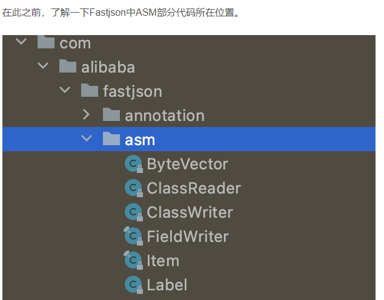
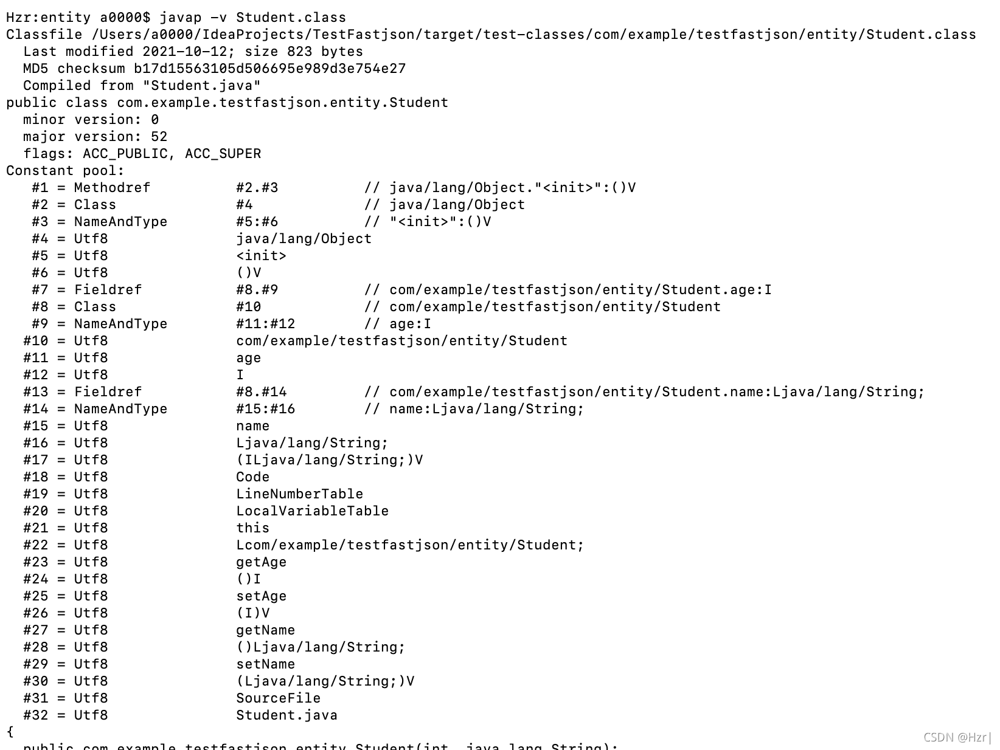
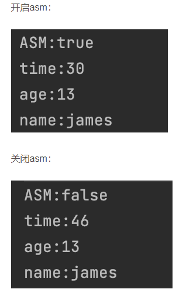

# Fastjson——反序列化

# 1.Token的定义和解析

## 1.1token定义

Token是Fastjson中定义的json字符串的同类型字段，即"{"、"["、数字、字符串等，用于分隔json字符串不同字段。
例如，{“姓名”：“张三”,“年龄”:“20”}是一个json字符串，在反序列化之前，需要先将其解析为
`{` 、 `姓名`、 `：`、 `张三`、 `,`、 `年龄`、 `：`、 `20`、 `}`这些字段的Token流，随后再根据class反序列化为响应的对象。
在进行Token解析之前，json字符串对程序而言只是一个无意义的字符串。需要将json字符串解析为一个个的Token，并以Token为单位解读json数据。

```java
public class JSONToken {
    //
    public final static int ERROR                = 1;
    //
    public final static int LITERAL_INT          = 2;
    //
    public final static int LITERAL_FLOAT        = 3;
    //
    public final static int LITERAL_STRING       = 4;
    //
    public final static int LITERAL_ISO8601_DATE = 5;

    public final static int TRUE                 = 6;
    //
    public final static int FALSE                = 7;
    //
    public final static int NULL                 = 8;
    //
    public final static int NEW                  = 9;
    //
    public final static int LPAREN               = 10; // ("("),
    //
    public final static int RPAREN               = 11; // (")"),
    //
    public final static int LBRACE               = 12; // ("{"),
    //
    public final static int RBRACE               = 13; // ("}"),
    //
    public final static int LBRACKET             = 14; // ("["),
    //
    public final static int RBRACKET             = 15; // ("]"),
    //
    public final static int COMMA                = 16; // (","),
    //
    public final static int COLON                = 17; // (":"),
    //
    public final static int IDENTIFIER           = 18;
    //
    public final static int FIELD_NAME           = 19;

    public final static int EOF                  = 20;

    public final static int SET                  = 21;
    public final static int TREE_SET             = 22;
    
    public final static int UNDEFINED            = 23; // undefined

    public final static int SEMI                 = 24;
    public final static int DOT                  = 25;
    public final static int HEX                  = 26;

    public static String name(int value) {
        switch (value) {
            case ERROR:
                return "error";
            case LITERAL_INT:
                return "int";
            case LITERAL_FLOAT:
                return "float";
            case LITERAL_STRING:
                return "string";
            case LITERAL_ISO8601_DATE:
                return "iso8601";
            case TRUE:
                return "true";
            case FALSE:
                return "false";
            case NULL:
                return "null";
            case NEW:
                return "new";
            case LPAREN:
                return "(";
            case RPAREN:
                return ")";
            case LBRACE:
                return "{";
            case RBRACE:
                return "}";
            case LBRACKET:
                return "[";
            case RBRACKET:
                return "]";
            case COMMA:
                return ",";
            case COLON:
                return ":";
            case SEMI:
                return ";";
            case DOT:
                return ".";
            case IDENTIFIER:
                return "ident";
            case FIELD_NAME:
                return "fieldName";
            case EOF:
                return "EOF";
            case SET:
                return "Set";
            case TREE_SET:
                return "TreeSet";
            case UNDEFINED:
                return "undefined";
            case HEX:
                return "hex";
            default:
                return "Unknown";
        }
    }
}
```

## 1.2 JSONLexerBase

JSONLexerBase类实现了JSONLexer接口，是一个json分词器，用于分析Token类型，提取Token数据，进行反序列化的前期准备工作。

### 1.2.1JSONLexerBase的成员变量：

```java
protected int                            token; //当前token类型，用int表示，各个值代表的含义已经在上文中给出定义。
protected int                            pos; //当前扫描到的字符的位置
protected int                            features;

protected char                           ch; //当前扫描到的字符
protected int                            bp; //获得json字符串中当前的位置，每次读取字符会递增

protected int                            eofPos;

/**
 * A character buffer for literals.
 */
protected char[]                         sbuf; //字符缓冲区
protected int                            sp;  //字符缓冲区的索引，指向下一个可写字符的位置，也代表字符缓冲区字符数量

/**
 * number start position
 */
protected int                            np; //token首字符的位置，每次找到新的token时更新

protected boolean                        hasSpecial;

protected Calendar                       calendar           = null;
protected TimeZone                       timeZone           = JSON.defaultTimeZone;
protected Locale                         locale             = JSON.defaultLocale;

public int                               matchStat          = UNKNOWN;

private final static ThreadLocal<char[]> SBUF_LOCAL         = new ThreadLocal<char[]>();

protected String                         stringDefaultValue = null;
protected int                            nanos              = 0;
```

### 1.2.2  JSONLexerBase解析方法

JSONLexerBase类有大量的方法用于判断Token类型、扫描Token、获取Token名称以及定位Token等等。其中有大量的重复代码或者实现起来非常相似的代码，这里挑选几个关键性的方法来分析判断Token、提取Token的逻辑。
nextToken()方法用于推断当前Token类型，例如字符串、{、数字等。

```java
public final void nextToken() {
        sp = 0;

        for (;;) {
            pos = bp;

            if (ch == '/') {
                skipComment();
                continue;
            }

            if (ch == '"') {
                scanString();
                return;
            }

            if (ch == ',') {
                next();
                token = COMMA;
                return;
            }

            if (ch >= '0' && ch <= '9') {
                scanNumber();
                return;
            }

            if (ch == '-') {
                scanNumber();
                return;
            }

            switch (ch) {
                case '\'':
                    if (!isEnabled(Feature.AllowSingleQuotes)) {
                        throw new JSONException("Feature.AllowSingleQuotes is false");
                    }
                    scanStringSingleQuote();
                    return;
                case ' ':
                case '\t':
                case '\b':
                case '\f':
                case '\n':
                case '\r':
                    next();
                    break;
                case 't': // true
                    scanTrue();
                    return;
                case 'f': // false
                    scanFalse();
                    return;
                case 'n': // new,null
                    scanNullOrNew();
                    return;
                case 'T':
                case 'N': // NULL
                case 'S':
                case 'u': // undefined
                    scanIdent();
                    return;
                case '(':
                    next();
                    token = LPAREN;
                    return;
                case ')':
                    next();
                    token = RPAREN;
                    return;
                case '[':
                    next();
                    token = LBRACKET;
                    return;
                case ']':
                    next();
                    token = RBRACKET;
                    return;
                case '{':
                    next();
                    token = LBRACE;
                    return;
                case '}':
                    next();
                    token = RBRACE;
                    return;
                case ':':
                    next();
                    token = COLON;
                    return;
                case ';':
                    next();
                    token = SEMI;
                    return;
                case '.':
                    next();
                    token = DOT;
                    return;
                case '+':
                    next();
                    scanNumber();
                    return;
                case 'x':
                    scanHex();
                    return;
                default:
                    if (isEOF()) { // JLS
                        if (token == EOF) {
                            throw new JSONException("EOF error");
                        }

                        token = EOF;
                        eofPos = pos = bp;
                    } else {
                        if (ch <= 31 || ch == 127) {
                            next();
                            break;
                        }

                        lexError("illegal.char", String.valueOf((int) ch));
                        next();
                    }

                    return;
            }
        }

    }
```

可以看到，根据json字符串Token的多样性，该方法分了很多种情况来对不同类型的Token做出不同的响应。这段代码理解起来非常容易，纯粹的分类讨论，采用机械化的方法将所有情况归纳整合。这个方法是该类其他提取Token的方法的前提，每次提取Token之前，需要改方法判断Token类型。
下面挑选几个经典情况，说明该方法的执行流程：

1. /：注释文本，调用skipComment()跳过
2. "：字符串，调用scanString()扫描
3. ,：逗号分隔符，调用next()方法跳过，判断下一个Token
4. ch >= ‘0’ && ch <= ‘9’：数字，调用scanNumber扫描该数字串
5. -：负号，判断接下来的内容为数字，仍调用scanNumber扫描数字串
6. {、[、(…等各种左右括号，将token改为对应的数值，然后调用next()方法跳过
7. 其他情况…

可以明确的是，字符串、数字等为有效信息，其余的大部分Token仅做分隔之用，所以都调用了next()方法跳过。

# 2.Feature的功能和实现

当我们对json字符串进行反序列化时，有时并不想完全按照json字符串默认的规则生成相应的Java对象，而有时我们手中的字符串亦不符合json字符串的格式，无法按照原有的规则进行解析。这时，我们需要修改反序列化的默认解析规则，而Fastjson恰好提供了这一功能。
使用Fastjson进行反序列化的时候，有一个可选的参数features，用于对反序列化的过程和结果进行定制化。

## 2.1 Feature的取值表示

重载方法1：

```java
public static Object parse(String text, ParserConfig config, Feature... features) {
        int featureValues = DEFAULT_PARSER_FEATURE;
        for (Feature feature : features) {
            featureValues = Feature.config(featureValues, feature, true);
        }

        return parse(text, config, featureValues);
    }
```

重载方法2：

```java
public static Object parse(String text, ParserConfig config, int features) {
        if (text == null) {
            return null;
            
        }
        DefaultJSONParser parser = new DefaultJSONParser(text, config, features);
        Object value = parser.parse();

        parser.handleResovleTask(value);

        parser.close();

        return value;
    }
```

可以看到，这两个方法唯一的区别在于参数列表的不同，第一个方法允许传入多个features参数，而第二个方法只允许传入一个features。第一个方法调用了第二个方法，且只通过一个int类型的features就代表了多个参数，接着跟进Feature.config()方法，看看它是如何把多个参数合并成一个int类型的变量来进行表示的。

```java
    public static int config(int features, Feature feature, boolean state) {
        if (state) {
            features |= feature.mask;
        } else {
            features &= ~feature.mask;
        }
        return features;
    }
```

该方法通过一个状态位state来对枚举类Feature的所有取值进行标识，例如，如果传入参数包含Feature.AllowComment，则对其标识为true，并将features和该数值进行二进制或操作，否则进行与操作。最后，features这个int型的数值已经与所有取值进行运算，得到的是一个二进制数，能够表示Feature的所有枚举情况。

**可以参照序列化时SerializerFeature所进行的位运算操作。**

## 2.2Feature的功能

列举出枚举类Feature的一些对象，一一陈述其功能

```
AutoCloseSource：这个特性，决定了解析器是否将自动关闭那些不属于parser自己的输入源

AllowComment：该特性决定parser将是否允许解析使用Java/C++ 样式的注释

AllowUnQuotedFieldNames：这个特性决定parser是否将允许使用非双引号属性名字。JavaScript中允许单引号作为属性名，但是json标准中不允许这样

AllowSingleQuotes：该特性决定parser是否允许单引号来包住属性名称和字符串值。默认关闭

InternFieldNames：该特性决定JSON对象属性名称是否可以被String#intern 规范化表示。

AllowISO8601DateFormat：这个设置为true则遇到字符串符合ISO8601格式的日期时，会直接转换成日期类。

AllowArbitraryCommas：允许多重逗号,如果设为true,则遇到多个逗号会直接跳过

UseBigDecimal：这个设置为true则用BigDecimal类来装载数字，否则用的是double

SupportArrayToBean：支持数组to对象

DisableASM：DisableASM

UseObjectArray：使用对象数组
```

## 2.3 Feature的实现

DefaultJSONParser类里面有一个

```java
public final Object parseObject(Map object, Object fieldName)
```

方法。这个方法里面有这么几行代码：

```java
if (!lexer.isEnabled(Feature.AllowSingleQuotes)) {
                                throw new JSONException("syntax error");
                            }
```

这里很好的解释了AllowSingleQuotes这个对象起作用的方式。如果设置其为true，那么Fastjson会按照原有的解析方式解析字符串并声称对象。（上一节讲token的时候说明了Fastjson如何进行词法分析，且其实现时原本就支持单引号作为变量名）。如果设置其为false，一旦json字符串出现单引号作为变量名的情况，就会抛出语法错误的异常。

可以明确的是这些配置信息都在DefaultJSONParser类里面起作用。它们的通用逻辑是一旦使用了某些Feature，会在lexer类里面用一个二进制的int变量表示所有标明了的Feature，随后在解析类里面讲这些Feature用布尔类型表示，通过if语句控制解析是是否抛出异常或者是否调用某些专用的解析类。

## 2.4总结

Feature是Fastjson提供的一个非常重要的功能。适当地对Feature进行调整，可以定制用户反序列化的细节，比如是否允许使用单引号表示变量名和是否要用BigDecimal类对double类型的数字进行装填。

# 3.ASM的作用和实现

## 3.1ASM的作用和实现

```
定义：ASM 是一个 Java 字节码操控框架。它能被用来动态生成类或者增强既有类的功能。ASM 可以直接产生二进制 class文件，也可以在类被加载入 Java 虚拟机之前动态改变类行为。Java class 被存储在严格格式定义的 .class 文件里，这些类文件拥有足够的元数据来解析类中的所有元素：类名称、方法、属性以及 Java 字节码（指令）。ASM从类文件中读入信息后，能够改变类行为，分析类信息，甚至能够根据用户要求生成新类。
```

概括地说，ASM是一个能够不通过.java文件而直接修改.class文件的字节码操控框架。
Fastjson之所以速度快，原因之一是它使用了ASM。**按照通常思路，反序列化应该是反射调用set方法进行属性设置**。 这种方法是最简单的，但也是**最低效**的。而Fastjson使用ASM自己编写字节码，然后通过ClassLoader将字节码加载成类，**避免了反射开销，大大增强了性能**。

## 3.2字节码格式

com.alibaba.fastjson.asm包中就是asm的全部代码。

要了解ASM的工作方式，先得了解字节码文件内部的格式。

```
Class文件是一组以8位字节为基础单位的二进制流，各个数据项目严格按照顺序紧凑地排列在Class文件之中，中间没有添加任何分隔符，Class文件中存储的内容几乎全部是程序运行的必要数据，没有空隙存在。当遇到需要占用8位字节以上空间的数据项时，就按照高位在前的方式分割成若干个8位字节进行存储。
Class文件格式采用类似于C语言结构体的伪结构来存储数据，这种伪结构只有两种数据类型：无符号数和表。
```

使用hexdump -C指令查看class文件的二进制代码



这里我们重点关注三个部分：魔数、版本号和常量池

### 3.2.1 魔数

class文件前8字节为魔数magic number，可以看到文件的前8位为cafe babe，正表示这是一个class类型的文件。

### 3.2.2 版本号

接下来的8字节是该文件的版本号，其中前4字节是次版本号minor version（00 00），后4字节是主版本号major version（00 34）。

### 3.2.3常量池

接下来是常量池的入口，前4字节表示常量池容量，这里是00 21，表示十进制的33，由于常量池计数从1开始，所以实际上常量的数量为32个。
常量池主要存储了字面量以及符号引用，其中字面量主要包括字符串，final常量的值或者某个属性的初始值等，而符号引用主要存储类和接口的全限定名称，字段的名称以及描述符，方法的名称以及描述符。

### 3.2.4访问标志及其他

常量池之下是访问标志、字段表等class文件的其他信息。

## 3.3ASM如何生成class文件

ASM使用访问者模式，动态对Java类进行修改。
在 ASM 中，提供了一个 ClassReader类，这个类可以直接由字节数组或由 class 文件间接的获得字节码数据，它能正确的分析字节码，构建出抽象的树在内存中表示字节码。它会调用 accept方法，这个方法接受一个实现了 ClassVisitor接口的对象实例作为参数，然后依次调用 ClassVisitor接口的各个方法。

```java
 public void accept(TypeCollector classVisitor) {
        char[] c = new char[this.maxStringLength];
        int anns = false;
        int ianns = false;
        int u = this.header;
        int v = this.items[this.readUnsignedShort(u + 4)];
        int len = this.readUnsignedShort(u + 6);
        int w = false;
        u += 8;
        int i;
        for(i = 0; i < len; ++i) {
            u += 2;
        }
        i = this.readUnsignedShort(u);
        int j;
        for(v = u + 2; i > 0; --i) {
            j = this.readUnsignedShort(v + 6);

            for(v += 8; j > 0; --j) {
                v += 6 + this.readInt(v + 2);
            }
        }

        i = this.readUnsignedShort(v);

        for(v += 2; i > 0; --i) {
            j = this.readUnsignedShort(v + 6);

            for(v += 8; j > 0; --j) {
                v += 6 + this.readInt(v + 2);
            }
        }

        i = this.readUnsignedShort(v);

        for(v += 2; i > 0; --i) {
            v += 6 + this.readInt(v + 2);
        }

        i = this.readUnsignedShort(u);

        for(u += 2; i > 0; --i) {
            j = this.readUnsignedShort(u + 6);

            for(u += 8; j > 0; --j) {
                u += 6 + this.readInt(u + 2);
            }
        }

        i = this.readUnsignedShort(u);
		//依次调用class Visitor的各个方法
        for(u += 2; i > 0; --i) {
            u = this.readMethod(classVisitor, c, u);
        }

    }
```

ClassReader知道如何对visitor的方法进行调用，而这个过程中用户无法干预。各个 ClassVisitor通过职责链模式，可以非常简单的封装对字节码的各种修改，而无须关注字节码的字节偏移，因为这些实现细节对于用户都被隐藏了，用户要做的只是重写相应的 visit 函数。
标准版的ASM包里面会有ClassAdaptor类，实现了Class Visitor的所有方法。但是Fastjson使用的是阉割版的ASM，只保留了必要的内容，降低了程序大小。Fastjson的ASM包里面只有一千余行代码。

ASM中另一个关键的类是ClassWriter，负责写字节码文件，以字节数组的形式输出。

ASM处理字节码的流程如下：

1. 创建ClassReader对象，将.class文件的内容读入到字节数组中
2. 创建ClassWriter对象，将处理后的字节数组回写入.class文件
3. 使用时间过滤器ClassVisitor，对相应的方法修改并返回

## 3.4ASM在Fastjson中的开启/关闭

ParserConfig.getGlobalInstance().setAsmEnable()方法来设置ASM的开启和关闭。
我们分别测试一下ASM开启和关闭时的性能，测试代码如下：

```java
public void test02(){
        String str="{\"age\":13,\"name\":\"james\"}";
        boolean flag;
        flag=true;
        ParserConfig config=ParserConfig.getGlobalInstance();
        config.setAsmEnable(flag);
        long t1=System.currentTimeMillis();
        Student student=JSON.parseObject(str,Student.class, Feature.AllowSingleQuotes);
        long t2=System.currentTimeMillis();
        System.out.println("ASM:"+flag);
        System.out.println("time:"+(t2-t1));
        System.out.println("age:"+student.getAge());
        System.out.println("name:"+student.getName());
    }
```



可以看到，是否开启asm并不影响程序的结果，但是会影响程序的执行时间。开启asm下，程序执行时间明显比不开要短。这只是一个非常简单的json字符串的测试结果，在长json字符串的解析中，这一加速效果会更加明显。

Fastjson默认开启asm用来代替Java反射，提高了程序的整体性能。使用Java Bean测试发现开启asm情况下解析速度明显比不开要快。

## 3.5 ASM关键类的分析

### 3.5.1  ClassReader

ClassReader的作用是接受一个实现了visitor接口的对象作为参数，调用其中的visit方法实现对字节码的修改。


构造方法用于一个输入流（class文件），分析字节码并用于生成表示字节码的树，便于accept方法调用其中的方法。
剩下的5个成员方法都是用来接受实现了visitor的类的class文件，分析其中的变量和方法。这几个方法都用于给accept方法调用

### 3.5.2  ClassWriter

ASM 的最终的目的是生成可以被正常装载的 class 文件，因此其框架结构为客户提供了一个生成字节码的工具类 —— ClassWriter。它实现了 ClassVisitor接口，而且含有一个 toByteArray()函数，返回生成的字节码的字节流，将字节流写回文件即可生产调整后的 class 文件。一般它都作为职责链的终点，把所有 visit 事件的先后调用（时间上的先后），最终转换成字节码的位置的调整（空间上的前后）

这里关键查看其toByteArray方法，探究如何生成class文件

```java
//该方法生成了一个FieldWriter对象fb用于写变量，MethodWriter对象mb用于写方法，还生成了一个ByteVector向量out用于储存待生成的class文件的相关信息。紧接着fb和mb分别对out对象执行put方法，将out对象保存在自身的数据结构中。最后，返回out对像的data字段，作为class文件的二进制代码。    
public byte[] toByteArray() {
        int size = 24 + 2 * this.interfaceCount;
        int nbFields = 0;

        FieldWriter fb;
        for(fb = this.firstField; fb != null; fb = fb.next) {
            ++nbFields;
            size += fb.getSize();
        }

        int nbMethods = 0;

        MethodWriter mb;
        for(mb = this.firstMethod; mb != null; mb = mb.next) {
            ++nbMethods;
            size += mb.getSize();
        }

        int attributeCount = 0;
        size += this.pool.length;
        ByteVector out = new ByteVector(size);
        out.putInt(-889275714).putInt(this.version);
        out.putShort(this.index).putByteArray(this.pool.data, 0, this.pool.length);
        int mask = 393216;
        out.putShort(this.access & ~mask).putShort(this.name).putShort(this.superName);
        out.putShort(this.interfaceCount);

        for(int i = 0; i < this.interfaceCount; ++i) {
            out.putShort(this.interfaces[i]);
        }

        out.putShort(nbFields);

        for(fb = this.firstField; fb != null; fb = fb.next) {
            fb.put(out);
        }

        out.putShort(nbMethods);

        for(mb = this.firstMethod; mb != null; mb = mb.next) {
            mb.put(out);
        }

        out.putShort(attributeCount);
        return out.data;
    }
```

### 3.5.3 visit方法

```java
public void visit(int version, int access, String name, String superName, String[] interfaces) {
  	    //signature：表示当前类的泛型信息。当前接口无泛型信息，所以值为null
        this.version = version; //表示当前类的版本信息。若Java版本是8，该变量取值为Opcodes.V1_8
        this.access = access;  //表示访问标识信息
        this.name = this.newClassItem(name).index; //表示当前类的名字，格式是Internal Name的形式
        this.thisName = name; 
        this.superName = superName == null ? 0 : this.newClassItem(superName).index; //superName：父类名称，Internal Name形式
        if (interfaces != null && interfaces.length > 0) { //interfaces:表示当前类实现了哪些接口
            this.interfaceCount = interfaces.length;
            this.interfaces = new int[this.interfaceCount];

            for(int i = 0; i < this.interfaceCount; ++i) {
                this.interfaces[i] = this.newClassItem(interfaces[i]).index;
            }
        }
    }
```

Internal Name：在java文件，我们使用Java语言编写代码，类名的形式是Fully Qualified Class Name，例如java.lang.String；然而在class文件中，类名的形式称之为Internal Name，例如java/lang/String。这种转换实际上就是把`.`字符改成`/`字符。

## 3.6 总结

1.ClassReader 读取字节码到内存中，生成用于表示该字节码的内部表示的树，ClassReader 对应于访问者模式中的元素
2.组装 ClassVisitor 责任链，这一系列 ClassVisitor 完成了对字节码一系列不同的字节码修改工作，对应于访问者模式中的访问者 Visitor
3.然后调用 ClassReader#accept() 方法，传入 ClassVisitor 对象，此 ClassVisitor 是责任链的头结点，经过责任链中每一个 ClassVisitor 的对已加载进内存的字节码的树结构上的每个节点的访问和修改
4.最后，在责任链的末端，调用 ClassWriter 这个 visitor 进行修改后的字节码的输出工作

