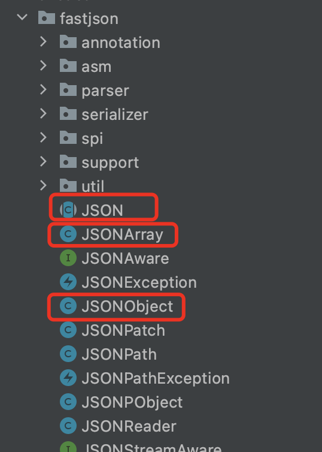

# FastJson剖析——序列化

什么是json：

`JSON`(`JavaScript Object Notation`, JS 对象简谱) 是一种**轻量级的数据交换格式**。它基于 ECMAScript (欧洲计算机协会制定的js规范)的一个子集，采用完全**独立于编程语言的文本格式来存储和表示数据**。**简洁**和**清晰的层次结构**使得JSON 成为理想的数据交换语言。 **易于人阅读和编写，同时也易于机器解析和生成，并有效地提升网络传输效率**。

# 1.和序列化相关

## 1.1为什么会有序列化

客户端向服务器端发送请求后，服务器端怎么才能把用户需要的数据返回给客户端呢。这时我们就需要用一个指定的格式将数据，按照指定格式返回客户端。也就是说先把对象Object序列化，然后客户端根据接收到的字符串再反序列化（也就是将字符串还原为对象）解析出相应的对象。

序列化主要就是为了传输方便，将要传输的对象序列化为二进制的数据流，效率极高，接收时通过反序列化转化成对象，从而达到一个传输的效果。

**这时就有了两种数据传输的方式（XML和Json）**，在普通的网络应用中，不管是服务器端还是客户端解析XML代码会非常麻烦，所以这时的JSON就更加满足数据传输解析的要求。采用的的JSON格式的方式进行数据的传输，不仅方便传输解析，还特别易于人阅读和编写。

## 1.2序列化JSON.stringify()

语法（前端）：

```javascript
JSON.stringify(value[, replacer][, space])
```

## 1.3反序列化JSON.parse()

语法（前端）：

```
JSON.stringify(text[, reviver])
```

# 2.对比其他json处理器

```
阿里巴巴的FastJson
Fastjson是一个Java语言编写的高性能的JSON处理器,由阿里巴巴公司开发。
无依赖，不需要例外额外的jar，能够直接跑在JDK上。
FastJson在复杂类型的Bean转换Json上会出现一些问题，可能会出现引用的类型，导致Json转换出错，需要制定引用。
FastJson采用独创的算法，将parse的速度提升到极致，超过所有json库。
```

## 2.1**开源的Jackson**

```
相比json-lib框架，Jackson所依赖的jar包较少，简单易用并且性能也要相对高些。
而且Jackson社区相对比较活跃，更新速度也比较快。
Jackson对于复杂类型的json转换bean会出现问题，一些集合Map，List的转换出现问题。
Jackson对于复杂类型的bean转换Json，转换的json格式不是标准的Json格式
```

## 2.2**Google的Gson**

```
Gson是目前功能最全的Json解析神器，Gson当初是为因应Google公司内部需求而由Google自行研发而来，
但自从在2008年五月公开发布第一版后已被许多公司或用户应用。
Gson的应用主要为toJson与fromJson两个转换函数，无依赖，不需要例外额外的jar，能够直接跑在JDK上。
而在使用这种对象转换之前需先创建好对象的类型以及其成员才能成功的将JSON字符串成功转换成相对应的对象。
类里面只要有get和set方法，Gson完全可以将复杂类型的json到bean或bean到json的转换，是JSON解析的神器。
Gson在功能上面无可挑剔，但是性能上面比FastJson有所差距。
```

## 2.3**json-lib**

```
json-lib最开始的也是应用最广泛的json解析工具，json-lib 不好的地方确实是依赖于很多第三方包，
包括commons-beanutils.jar，commons-collections-3.2.jar，commons-lang-2.6.jar，commons-logging-1.1.1.jar，ezmorph-1.0.6.jar，
对于复杂类型的转换，json-lib对于json转换成bean还有缺陷，比如一个类里面会出现另一个类的list或者map集合，json-lib从json到bean的转换就会出现问题。
json-lib在功能和性能上面都不能满足现在互联网化的需求。
```


# 3.源码分析

关键源码：

Fastjson的关键源代码所在位置由图所示。其中，以JSON、JSONArray和JSONObject三个类最为关键，而JSON类又为整个项目的入口类。

下面简要分析各个包的功能。

- annotation：定义了项目的注解。
- asm：增强既有的解析json字符串或生成Java对象的类的功能
- parser：json字符串解析器，用于将json字符串解析成Java对象
- serialiser：将Java对象序列化成json字符串
- spi：服务提供者接口
- support：提供支持，例如项目的配置
- util：工具包，提供类加载器等工具

## 组内分工

根据Fastjson入口类的功能，我们将任务分成了四个部分：

1. json字符串解析为Java Object或JSONObject
2. json字符串解析为JSONArray
3. Java对象序列化为json字符串
4. Java对象序列化并以流的形式输出

四个功能模块，层层调用其他包，涵盖了整个Fastjson项目

## 3.1  JSON.toJSONString

```java
  public static String toJSONString(Object object, // 被序列化的对象
                                      SerializeConfig config, // 序列化全局配置
                                      SerializeFilter[] filters, //序列化的过滤器 
                                      String dateFormat, //日期格式
                                      int defaultFeatures, // 默认序列化特性
                                      SerializerFeature... features //自定义的序列化特性) {
        SerializeWriter out = new SerializeWriter(null, defaultFeatures, features);
             //初始化一个SerializeWriter，然后用自定义的features覆盖defaultFeatures配置。
        try {
            JSONSerializer serializer = new JSONSerializer(out, config);
         //初始化一个JSONSerializer对象，序列化结果写入SerializeWriter的buffer属性中。序列化执行的时候，会根据config查找具体的序列化处理器去做处理。
            
            //对日期格式和过滤器的判断
            if (dateFormat != null && dateFormat.length() != 0) {
                serializer.setDateFormat(dateFormat);
                serializer.config(SerializerFeature.WriteDateUseDateFormat, true);
            }
            if (filters != null) {
                for (SerializeFilter filter : filters) {
                    serializer.addFilter(filter);
                }
            }
 
            serializer.write(object);
 
            return out.toString();
        } finally {
            out.close();
        }
    }
```

  SerializeFilter用法--github：https://github.com/alibaba/fastjson/wiki/SerializeFilter

### 3.1.1  write方法(serializer.write(object) )

```java
 public final void write(Object object) {
        if (object == null) {
            out.writeNull();
            return;
        }
        Class<?> clazz = object.getClass();
        ObjectSerializer writer = getObjectWriter(clazz);
 
        try {
            writer.write(this, object, null, null, 0);
        } catch (IOException e) {
            throw new JSONException(e.getMessage(), e);
        }
    }
```

根据序列化对象的class类型，得到对应的序列化器

总结为几种类型：

（1）从指定的目录下META-INF/services/，用当前线程的类加载器去取实现AutowiredObjectSerializer的序列化器

（2）与第一种区别的地方在于加载器不同，此时尝试用加载JSON的classLoader

（3）当前这种是针对传进来的clazz的类型，去寻找对应的序列化器。
    这里都是常用的一些类型，比如Map，List，Collection，Date，enum，Iterator等等。还有JSON相关的一些，JSONAware，JSONSerializable，JSONStreamAware 。特殊处理：（a）java自带图形包java.awt （b）jdk8中的日期包、Optional、concurrent（c）oracle相关的类（d）springfox相关的类（e）guava框架中类

（4）代理类，包括cglib或者javassist动态代理，或是jdk自带的动态代理。

（5）自主创建序列化器，createJavaBeanSerializer，之后要重点描述

### 3.1.2  createJavaBeanSerializer

```java
 public final ObjectSerializer createJavaBeanSerializer(Class<?> clazz) {
	    SerializeBeanInfo beanInfo = TypeUtils.buildBeanInfo(clazz, null, propertyNamingStrategy, fieldBased);
	    if (beanInfo.fields.length == 0 && Iterable.class.isAssignableFrom(clazz)) {
	        return MiscCodec.instance;
	    }
	    return createJavaBeanSerializer(beanInfo);
	}
```

 TypeUtils.buildBeanInfo会创建一个SerializeBeanInfo对象，看一下它的几个参数：

```java
public static SerializeBeanInfo buildBeanInfo(Class<?> beanType //class对象类型
            , Map<String,String> aliasMap //序列化对象字段的map，配置的属性真正的名称。默认为null。
            , PropertyNamingStrategy propertyNamingStrategy //命名方式，“驼峰式”等
            , boolean fieldBased //判断走哪一种收集fieldInfo的方法
    ){
     ...   //见build的逻辑
}
```

举例：

```java
//@JSONType(ignores ={"id", "sex"}) 
//@JSONType(includes={"name","sex"}) 
public class User {
 //JSONType和JSONField都可以定制序列化，可以设置包含，忽略，也可以设置格式。
    @JSONField(name = "ID", ordinal = 3, serializeUsing = UserIDValueSerializer.class)
    private Long id;
    @JSONField(serialize = false)
    private String name;
    @JSONField(serialize = true, ordinal = 2)
    private String sex;
 
    @JSONField(deserialize = false)
    private String address;
    @JSONField(deserialize = true)
    private String phone;
 
    // 配置date序列化和反序列使用yyyyMMdd日期格式
    @JSONField(format = "yyyyMMdd", ordinal = 1)
    private Date date;
 
    public Long getId() {
        return id;
    }
 
    public void setId(Long id) {
        this.id = id;
    }
 
    //get and set ...
}
```

JSONField注解主要内容如下：

```java
public @interface JSONField {
    // 配置序列化和反序列化的顺序，1.1.42版本之后才支持
    int ordinal() default 0;

     // 指定字段的名称
    String name() default "";

    // 指定字段的格式，对日期格式有用
    String format() default "";

    // 是否序列化
    boolean serialize() default true;

    // 是否反序列化
    boolean deserialize() default true;
}
```

### 3.1.3 build的逻辑

```java
        //1.寻找当前class对象中，是否有JSONType注解
        //先查询当前类，如果没有，再查询元素上存在的所有注解，包括从父类继承的。  
        JSONType jsonType = TypeUtils.getAnnotation(beanType,JSONType.class);
        String[] orders = null;
        final int features;
        String typeName = null, typeKey = null;
        if(jsonType != null){
            //获取序列化的顺序
            orders = jsonType.orders();
 
            typeName = jsonType.typeName();
            if(typeName.length() == 0){
                typeName = null;
            }
            //获取命名类型，分为四种,以“personName”为例
            //(1)CamelCase(personName) （2）PascalCase（PersonName）（3）SnakeCase（person_name）（4）KebabCase（person-name）
            PropertyNamingStrategy jsonTypeNaming = jsonType.naming();
            //如果不是默认的驼峰式，就说明用户设置了name属性，覆盖传进来的propertyNamingStrategy参数
            if (jsonTypeNaming != PropertyNamingStrategy.CamelCase) {
                propertyNamingStrategy = jsonTypeNaming;
            }
            // 形成新的features值。这里的位运算存储很有意思，是一种很高效的设计。
            features = SerializerFeature.of(jsonType.serialzeFeatures());
            //循环向上寻找父类，如果找到有父类设置了typeKey，赋给变量存下来
            for(Class<?> supperClass = beanType.getSuperclass()
                ; supperClass != null && supperClass != Object.class
                    ; supperClass = supperClass.getSuperclass()){
                JSONType superJsonType = TypeUtils.getAnnotation(supperClass,JSONType.class);
                if(superJsonType == null){
                    break; 
                }
                typeKey = superJsonType.typeKey();
                if(typeKey.length() != 0){
                    break;
                }
            }
            //遍历寻找当前类实现的接口，如果找到有父类设置了typeKey，赋给变量存下来
            for(Class<?> interfaceClass : beanType.getInterfaces()){
                JSONType superJsonType = TypeUtils.getAnnotation(interfaceClass,JSONType.class);
                if(superJsonType != null){
                    typeKey = superJsonType.typeKey();
                    if(typeKey.length() != 0){
                        break;
                    }
                }
            }
 
            if(typeKey != null && typeKey.length() == 0){
                typeKey = null;
            }
        } else{
            features = 0;
        }
```

### 3.1.4 SerializerFeature枚举类：

这个枚举类是把所有feature按照顺序，位偏移计算后，得到一个mask，作为当前feature的标记值。ordinal()的取值是0～Integer.MAX_VALUE。所以第一个枚举类的值是 1，第二个是"10",第三个是"100",依次类推，可以存31个枚举值。

```java
public enum SerializerFeature {
QuoteFieldNames,
UseSingleQuotes,
WriteMapNullValue,

。。。
    

SerializerFeature(){
    mask = (1 << ordinal());
}

public final int mask;

public final int getMask() {
    return mask;
}
// isEnabled() 这个方法，用来判断所有的Features中是否包含某个Feature
public static boolean isEnabled(int features, int fieaturesB, SerializerFeature feature) {
        int mask = feature.mask;
        return (features & mask) != 0 || (fieaturesB & mask) != 0;
    }
```

这里我们延展到另一个概念: 位掩码BitMask。Linux权限就是位掩码的一种特例。我们这里再看一种典型的位掩码实现。

fastjson作为阿里巴巴的开源组， 经常会用它来做一些请求/应答数据的序列化和反序列化。在序列化的场景，可能会用一些特别的features来满足特定需求，如：

```java
// 按照类的属性名排序输出
JSON.toJSONString(obj, SerializerFeature.SortField)
// 输出标准格式的日期格式
JSON.toJSONString(obj, SerializerFeature.WriteDateUseDateFormat)
```

如果需要多种feature组合的话，只要传入一个feature数组即可，Java枚举类中的 ordinal() 方法会返回枚举常量的声明顺序，如SerializerFeature.QuoteFieldNames.ordinal()返回 0，以此类推。所以，mask这个掩码会按照枚举常量的顺序进行移位。

也就是每个Feature都会有自己的标志位，以后就算新增一个新的Feature，依序声明即可，原有的变量声明为了保持兼容性顺序尽量不要更改，以防有人直接使用了mask的值进行逻辑判断之类。当然，如果没有暴露接口让调用方直接传入hardcode的mask整型值，新增Feature塞到任何一个位置，理论上也不影响服务升级。**JSON.toString() 本质上其实就是构造了一个对象 SerializeWriter，而它就会把传入Feature数组运用简单的 或 运算最终合成了一个 int 类型的 features 值。后续对于feature的判断和过滤就和上文的权限大同小异了**。

这种设计思路对项目开发是很有帮助的，毕竟位运算是最高效的运算。

### 3.1.5 接build的逻辑

```java
        // fieldName,field ，先生成fieldName的快照，减少之后的findField的轮询
        Map<String,Field> fieldCacheMap = new HashMap<String,Field>();
        ParserConfig.parserAllFieldToCache(beanType, fieldCacheMap);
        //根据fieldBased判断走哪一个getter方法,默认是false。
        List<FieldInfo> fieldInfoList = fieldBased
                ? computeGettersWithFieldBase(beanType, aliasMap, false, propertyNamingStrategy) //
                : computeGetters(beanType, jsonType, aliasMap, fieldCacheMap, false, propertyNamingStrategy);
        FieldInfo[] fields = new FieldInfo[fieldInfoList.size()];
        fieldInfoList.toArray(fields);
        FieldInfo[] sortedFields;
        List<FieldInfo> sortedFieldList;
        if(orders != null && orders.length != 0){
            sortedFieldList = fieldBased
                    ? computeGettersWithFieldBase(beanType, aliasMap, true, propertyNamingStrategy) //
                    : computeGetters(beanType, jsonType, aliasMap, fieldCacheMap, true, propertyNamingStrategy);
        } else{
            sortedFieldList = new ArrayList<FieldInfo>(fieldInfoList);
            Collections.sort(sortedFieldList);
        }
        sortedFields = new FieldInfo[sortedFieldList.size()];
        sortedFieldList.toArray(sortedFields);
        if(Arrays.equals(sortedFields, fields)){
            sortedFields = fields;
        }
        return new SerializeBeanInfo(beanType, jsonType, typeName, typeKey, features, fields, sortedFields);
     }
```

computeGettersWithFieldBase方法：

```java
 public static List<FieldInfo> computeGettersWithFieldBase(
            Class<?> clazz, //
            Map<String,String> aliasMap, //
            boolean sorted, //
            PropertyNamingStrategy propertyNamingStrategy){
        Map<String,FieldInfo> fieldInfoMap = new LinkedHashMap<String,FieldInfo>();
        for(Class<?> currentClass = clazz; currentClass != null; currentClass = currentClass.getSuperclass()){
            Field[] fields = currentClass.getDeclaredFields();
            computeFields(currentClass, aliasMap, propertyNamingStrategy, fieldInfoMap, fields);
        }
        return getFieldInfos(clazz, sorted, fieldInfoMap);
    }
```

配合上面的例子，来看computeFields方法是如何一步步解析的：

```java
   private static void computeFields(
            Class<?> clazz, //
            Map<String,String> aliasMap, //
            PropertyNamingStrategy propertyNamingStrategy, //
            Map<String,FieldInfo> fieldInfoMap, //
            Field[] fields){
        for(Field field : fields){
            //获取属性的修饰符。如果是静态变量，则跳过，不放在fieldInfoMap中
            if(Modifier.isStatic(field.getModifiers())){
                continue;
            }
            //读取JSONField注解，解析序列化的定制化配置
            JSONField fieldAnnotation = field.getAnnotation(JSONField.class);
            int ordinal = 0, serialzeFeatures = 0, parserFeatures = 0;
            String propertyName = field.getName();
            String label = null;
            if(fieldAnnotation != null){
                //依次解析注解的serialize、ordinal、serialzeFeatures、parserFeatures、propertyName、label属性，这个例子里可以看到
                if(!fieldAnnotation.serialize()){
                    continue;
                }
                ordinal = fieldAnnotation.ordinal();
                serialzeFeatures = SerializerFeature.of(fieldAnnotation.serialzeFeatures());
                parserFeatures = Feature.of(fieldAnnotation.parseFeatures());
                if(fieldAnnotation.name().length() != 0){
                    propertyName = fieldAnnotation.name();
                }
                if(fieldAnnotation.label().length() != 0){
                    label = fieldAnnotation.label();
                }
            }
            //如果传入的aliasMap不为null，就用别名。如果别名为null，就直接跳过
            //Q：aliasMap会存放所有属性的别名么？如果不是，等于null就跳过，那这个属性就被抛弃了，不会放到fieldInfoMap中。
            if(aliasMap != null){
                propertyName = aliasMap.get(propertyName);
                if(propertyName == null){
                    continue;
                }
            }
            //属性的命名策略，修改格式
            if(propertyNamingStrategy != null){
                propertyName = propertyNamingStrategy.translate(propertyName);
            }
            //生成FieldInfo，并放到map中
            if(!fieldInfoMap.containsKey(propertyName)){
                FieldInfo fieldInfo = new FieldInfo(propertyName, null, field, clazz, null, ordinal, serialzeFeatures, parserFeatures,
                        null, fieldAnnotation, label);
                fieldInfoMap.put(propertyName, fieldInfo);
            }
        }
    }
```

computeGetters方法：

```java
 public static List<FieldInfo> computeGetters(Class<?> clazz, //
                                                 JSONType jsonType, //
                                                 Map<String,String> aliasMap, //
                                                 Map<String,Field> fieldCacheMap, //
                                                 boolean sorted, //
                                                 PropertyNamingStrategy propertyNamingStrategy //
    ){
        Map<String,FieldInfo> fieldInfoMap = new LinkedHashMap<String,FieldInfo>();
        boolean kotlin = TypeUtils.isKotlin(clazz);
        // for kotlin
        Constructor[] constructors = null;
        Annotation[][] paramAnnotationArrays = null;
        String[] paramNames = null;
        short[] paramNameMapping = null;
        Method[] methods = clazz.getMethods();
        for(Method method : methods){
            String methodName = method.getName();
            int ordinal = 0, serialzeFeatures = 0, parserFeatures = 0;
            String label = null;
            //对特殊情况的判断（序列化目标是寻找get方法）
            //（1）静态方法（2）返回类型是void（3）参数类型数组长度不是0.也就是存在参数（4）返回类类型是类加载器（5）groovy的MetaClass
            //（6）异常处理getSuppressed（7）Kotlin类型
           if(Modifier.isStatic(method.getModifiers())){
                continue;
            }
            if(method.getReturnType().equals(Void.TYPE)){
                continue;
            }
            if(method.getParameterTypes().length != 0){
                continue;
            }
            if(method.getReturnType() == ClassLoader.class){
                continue;
            }

            if(methodName.equals("getMetaClass")
                    && method.getReturnType().getName().equals("groovy.lang.MetaClass")){
                continue;
            }
            if(methodName.equals("getSuppressed")
                    && method.getDeclaringClass() == Throwable.class){
                continue;
            }

            if(kotlin && isKotlinIgnore(clazz, methodName)){
                continue;
            }
            /**
             *  如果在属性或者方法上存在JSONField注解，并且定制了name属性，不以类上的propertyNamingStrategy设置为准，以此字段的JSONField的name定制				为准。
             */
            Boolean fieldAnnotationAndNameExists = false;
            //判断是否有JSONField注解
            JSONField annotation = method.getAnnotation(JSONField.class);
            if(annotation == null){
                annotation = getSuperMethodAnnotation(clazz, method);
            }
            //kotlin相关，不常用到
            if(annotation == null && kotlin){
               。。。
            }
            //如果有注解，读取注解中定义的name，feature等参数
            if(annotation != null){
                if(!annotation.serialize()){
                    continue;
                }
                ordinal = annotation.ordinal();
                serialzeFeatures = SerializerFeature.of(annotation.serialzeFeatures());
                parserFeatures = Feature.of(annotation.parseFeatures());
                if(annotation.name().length() != 0){
                    String propertyName = annotation.name();
                    if(aliasMap != null){
                        propertyName = aliasMap.get(propertyName);
                        if(propertyName == null){
                            continue;
                        }
                    }
                    FieldInfo fieldInfo = new FieldInfo(propertyName, method, null, clazz, null, ordinal,
                            serialzeFeatures, parserFeatures, annotation, null, label);
                    fieldInfoMap.put(propertyName, fieldInfo);
                    continue;
                }
                if(annotation.label().length() != 0){
                    label = annotation.label();
                }
            }
            //常用方法，判断方法是否以“get”开头
            if(methodName.startsWith("get")){
                 //排除特殊情况（1）长度<4（2）getClass (3)枚举类的getDeclaringClass
                if(methodName.length() < 4){
                    continue;
                }
                if(methodName.equals("getClass")){
                    continue;
                }
                if(methodName.equals("getDeclaringClass") && clazz.isEnum()){
                    continue;
                }
                char c3 = methodName.charAt(3);
                String propertyName;
                //开始解析get方法，判断get之后的第一个字符c3
                //1、如果c3是大写，判断compatibleWithJavaBean属性（默认为false），
                //如果为true，截取get后的字符串，如果前两位都是大写，则直接返回；其他情况，把首字母变小写返回。 
                //如果是false，直接把get后字符串的第一位变小写返回。
                //2.如果是'_','f'等特殊情况，按照各自规则截取。
                if(Character.isUpperCase(c3) //
                        || c3 > 512 // for unicode method name
                        ){
                    if(compatibleWithJavaBean){
                        propertyName = decapitalize(methodName.substring(3));
                    } else{
                        propertyName = Character.toLowerCase(methodName.charAt(3)) + methodName.substring(4);
                    }
                    //这里还有一个替换过程。还记得上面buildBeanInfo中生成的fieldCacheMap么，这里面存的是类得到的所有field。所以如果compatibleWithFieldName为true，代表按照field属性的大小写来，如果methodName的get方法之后的字符串在属性map里面，就用map中存好的属性。
                    propertyName = getPropertyNameByCompatibleFieldName(fieldCacheMap, methodName, propertyName, 3);
                } else if(c3 == '_'){
                    propertyName = methodName.substring(4);
                } else if(c3 == 'f'){
                    propertyName = methodName.substring(3);
                } else if(methodName.length() >= 5 && Character.isUpperCase(methodName.charAt(4))){
                    propertyName = decapitalize(methodName.substring(3));
                } else{
                    continue;
                }
                //判断JSONType注解的includes 和 ignores 属性，如果是忽略的，跳过这个方法的属性检测。提一下，这里的比较是区分大小写的equals，所以设置includes 和 ignores，最好看看它上述的解析规则，否则属性设置未必生效。
                boolean ignore = isJSONTypeIgnore(clazz, propertyName);
                if(ignore){
                    continue;
                }
                //假如bean的field很多的情况一下，轮询时将大大降低效率
                //假设现在得到的propertyName是“personName”，getFieldFromCache会从不同key尝试从fieldCacheMap获取field。（1）"_personName"（2）"m_personName"(3)"PersonName"(4) propertyName长度大于2且首字母小写，第二个字母大写的时候，忽略大小写从map中尝试获取。（不是很懂这个特殊逻辑）
                Field field = ParserConfig.getFieldFromCache(propertyName, fieldCacheMap);
                //如果还没获取到，且propertyName第二个字符是大写，再得到javaBeanCompatiblePropertyName，尝试从map中获取。
                if(field == null && propertyName.length() > 1){
                    char ch = propertyName.charAt(1);
                    if(ch >= 'A' && ch <= 'Z'){
                        String javaBeanCompatiblePropertyName = decapitalize(methodName.substring(3));
                        field = ParserConfig.getFieldFromCache(javaBeanCompatiblePropertyName, fieldCacheMap);
                    }
                }
                JSONField fieldAnnotation = null;
                //检测这个field是否有设置属性
                if(field != null){
                    fieldAnnotation = field.getAnnotation(JSONField.class);
                    if(fieldAnnotation != null){
                        if(!fieldAnnotation.serialize()){
                            continue;
                        }
                        ordinal = fieldAnnotation.ordinal();
                        serialzeFeatures = SerializerFeature.of(fieldAnnotation.serialzeFeatures());
                        parserFeatures = Feature.of(fieldAnnotation.parseFeatures());
                        if(fieldAnnotation.name().length() != 0){
                            fieldAnnotationAndNameExists = true;
                            propertyName = fieldAnnotation.name();
                            if(aliasMap != null){
                                propertyName = aliasMap.get(propertyName);
                                if(propertyName == null){
                                    continue;
                                }
                            }
                        }
                        if(fieldAnnotation.label().length() != 0){
                            label = fieldAnnotation.label();
                        }
                    }
                }
                //默认情况下，aliasMap为null
                if(aliasMap != null){
                    propertyName = aliasMap.get(propertyName);
                    if(propertyName == null){
                        continue;
                    }
                }
                //propertyNamingStrategy不为null，修改格式
                if(propertyNamingStrategy != null && !fieldAnnotationAndNameExists){
                    propertyName = propertyNamingStrategy.translate(propertyName);
                }
                FieldInfo fieldInfo = new FieldInfo(propertyName, method, field, clazz, null, ordinal, serialzeFeatures, parserFeatures,
                        annotation, fieldAnnotation, label);
                fieldInfoMap.put(propertyName, fieldInfo);
            }
            //如果是is开头的，是类似的逻辑。不再赘述
            if(methodName.startsWith("is")){
                。。。
            }
        }
        Field[] fields = clazz.getFields();
        //最后再调用computeFields方法  
        computeFields(clazz, aliasMap, propertyNamingStrategy, fieldInfoMap, fields);
        return getFieldInfos(clazz, sorted, fieldInfoMap);
    }
```

 小结一下computeGetters方法的逻辑：

 （1）对特殊情况的判断（序列化目标是寻找get方法）
	   （a）静态方法

   	（b）返回类型是void
   	
   	（c）参数类型数组长度不是0.也就是存在参数
   	
   	（d）返回类类型是类加载器
   	
   	（e）groovy的MetaClass
   	
   	  （f）异常处理getSuppressed
   	
   	 （g）Kotlin类型

（2）check当前的method是否有JSONField注解，并判断是否是kotlin相关的类。 （JSONField可以设置在属性上，也可以设置在方法上。）

（3）“get”开头的解析。

  	（a）排除特殊情况：长度<4；getClass ；枚举类的getDeclaringClass
  	
  	（b） 开始解析get方法，判断get之后的第一个字符c3。

​        如果c3是大写，判断compatibleWithJavaBean属性（默认为false），如果为true，截取get后的字符串，如果前两位都    是大写，则直接返回；其他情况，把首字母变小写返回。 如果是false，直接把get后字符串的第一位变小写返回。如果是'_','f'等特殊情况，按照各自规则截取。

​        这里还有一个替换过程。传进来的buildBeanInfo中生成的fieldCacheMap，这里面存的是类得到的所有field。所以如果compatibleWithFieldName为true，代表按照field属性的大小写来，如果methodName的get方法之后的字符串在属性map里面，就用map中存好的属性。

​        fastJson在多处用了这种map，优化了查询的效率。          

（4）对得到field中的JSONField注解做解析。

### 3.1.6  createJavaBeanSerializer（正式）

 到这里，SerializeBeanInfo的步骤就基本完成了，接下来就是正式的去生成序列化器的方法createJavaBeanSerializer：

在之前先提一下，fastjson内嵌了ASM框架来动态生成类，ASMClassLoader继承了java的类装载器ClassLoader。

```java
public ObjectSerializer createJavaBeanSerializer(SerializeBeanInfo beanInfo) {
	    JSONType jsonType = beanInfo.jsonType;
 
        boolean asm = this.asm && !fieldBased;
	    //jsonType注解不为null
	    if (jsonType != null) {
            //jsonType中设置的序列化器属性，默认是Void.class
	        Class<?> serializerClass = jsonType.serializer();
	        if (serializerClass != Void.class) {
	            try {
                    //如果是自己写的序列化器，继承了ObjectSerializer接口，直接返回用户设定的序列化器。
                    Object seralizer = serializerClass.newInstance();
                    if (seralizer instanceof ObjectSerializer) {
                        return (ObjectSerializer) seralizer;
                    }
                } catch (Throwable e) {
                    // skip
                }
	        }
	        //jsonType设定了asm可用属性。
	        if (jsonType.asm() == false) {
	            asm = false;
	        }
            
	        if (asm) {
                //check：如果设置了下面的一些属性，即使asm可用，也设置为不可用。    
                for (SerializerFeature feature : jsonType.serialzeFeatures()) {
                    if (SerializerFeature.WriteNonStringValueAsString == feature //
                            || SerializerFeature.WriteEnumUsingToString == feature //
                            || SerializerFeature.NotWriteDefaultValue == feature
                            || SerializerFeature.BrowserCompatible == feature) {
                        asm = false;
                        break;
                    }
                }
            }
            
            if (asm) {
                //check：如果设置了过滤器，asm也禁用 
                final Class<? extends SerializeFilter>[] filterClasses = jsonType.serialzeFilters();
                if (filterClasses.length != 0) {
                    asm = false;
                }
            }
        }
 
	    Class<?> clazz = beanInfo.beanType;
        //如果bean是public的，直接用JavaBeanSerializer返回。
		if (!Modifier.isPublic(beanInfo.beanType.getModifiers())) {
			return new JavaBeanSerializer(beanInfo);
		}
 
 
        //（1）如果是类加载器在ASMClassLoader的外部（2）或者clazz就是 Serializable.class（3）clazz就是Object.class
		if (asm && asmFactory.classLoader.isExternalClass(clazz)
				|| clazz == Serializable.class || clazz == Object.class) {
			asm = false;
		}
        //不符合asm的命名规则
		if (asm && !ASMUtils.checkName(clazz.getSimpleName())) {
		    asm = false;
		}
        //接口    
		if (asm && beanInfo.beanType.isInterface()) {
		    asm = false;
        }
		
		if (asm) {
            //对每一个属性做check
    		for(FieldInfo fieldInfo : beanInfo.fields){
                Field field = fieldInfo.field;
                if (field != null && !field.getType().equals(fieldInfo.fieldClass)) {
                    asm = false;
                    break;
                }
 
                Method method = fieldInfo.method;
                if (method != null && !method.getReturnType().equals(fieldInfo.fieldClass)) {
                    asm = false;
                    break;
                }
 
    			JSONField annotation = fieldInfo.getAnnotation();
    			
    			if (annotation == null) {
    			    continue;
    			}
 
    			String format = annotation.format();
    			if (format.length() != 0) {
    			    if (fieldInfo.fieldClass == String.class && "trim".equals(format)) {
 
                    } else {
                        asm = false;
                        break;
                    }
                }
 
                if ((!ASMUtils.checkName(annotation.name())) //
                        || annotation.jsonDirect()
                        || annotation.serializeUsing() != Void.class
                        || annotation.unwrapped()
                        ) {
    				asm = false;
    				break;
    			}
 
                for (SerializerFeature feature : annotation.serialzeFeatures()) {
                    if (SerializerFeature.WriteNonStringValueAsString == feature //
                            || SerializerFeature.WriteEnumUsingToString == feature //
                            || SerializerFeature.NotWriteDefaultValue == feature
                            || SerializerFeature.BrowserCompatible == feature
                            || SerializerFeature.WriteClassName == feature) {
                        asm = false;
                        break;
                    }
                }
 
                if (TypeUtils.isAnnotationPresentOneToMany(method) || TypeUtils.isAnnotationPresentManyToMany(method)) {
    			    asm = false;
    			    break;
                }
    		}
		}
		
		if (asm) {
			try {
                ObjectSerializer asmSerializer = createASMSerializer(beanInfo);
                if (asmSerializer != null) {
                    return asmSerializer;
                }
            } catch (ClassNotFoundException ex) {
			    // skip
			} catch (ClassFormatError e) {
			    // skip
			} catch (ClassCastException e) {
			    // skip
            } catch (OutOfMemoryError e) {
			    if (e.getMessage().indexOf("Metaspace") != -1) {
			        throw e;
                }
                // skip
			} catch (Throwable e) {
				throw new JSONException("create asm serializer error, verson " + JSON.VERSION + ", class " + clazz, e);
			}
		}
 
		return new JavaBeanSerializer(beanInfo);
	}
```

两种得到序列化器的方法：（1）JavaBeanSerializer（2）createASMSerializer

禁用asm的条件：

（1)JSONType注解设置了asm的属性为不可用

 (2)SerializerFeature设置某些序列化属性，WriteNonStringValueAsString、WriteEnumUsingToString、NotWriteDefaultValue、BrowserCompatible。

 (3)如果设置了过滤器，asm也禁用 。

 (4)该clazz为非public类

 (5) 该clazz的类加载器在ASMClassLoader的外部、clazz是Serializable.class或者Object.class

 (6)不符合asm的命名规则、bean是接口类型

 (7)对每一个field属性的check，如果不满足条件也禁用asm。

