# git的使用

## 1.git的安装

使用库安装：

sudo apt update

sudo apt-get install git

测试：

git --version

## 2.git工作流程

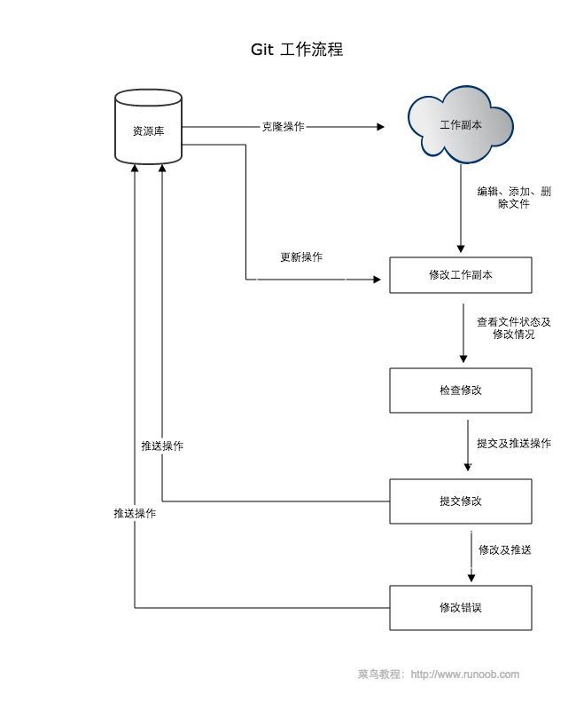

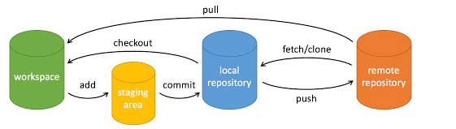

## 3.git基本组成框架

> - Workspace：开发者工作区
> - Index / Stage：暂存区/缓存区
> - Repository：仓库区（或本地仓库）
> - Remote：远程仓库

Workspace：开发者工作区，也就是你当前写代码的目录，它一般保持的是最新仓库代码。

Index / Stage：缓存区，最早叫Stage，现在新版本已经改成index，位于.git目录中，它用来存放临时动作，比如我们做了git add或者git rm，都是把文件提交到缓存区，这是可以撤销的，然后在通过git commit将缓存区的内容提交到本地仓库

Repository：仓库区，是仓库代码，你所有的提交都在这里，git会保存好每一个历史版本，存放在仓库区，它可以是服务端的也可以是本地的，因为在分布式中，任何人都可以是主仓库。

Remote：远程仓库，只能是别的电脑上的仓库，即服务器仓库。

## 4.git常用命令

### 1)git项目创建

新建一个目录，再次目录下执行：git init

### 2)add

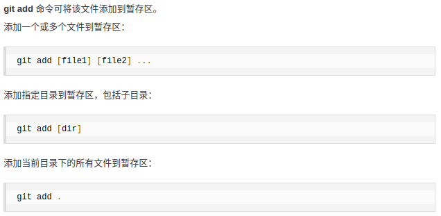

### 3)commit

提交文件到本地库

提交所有在staging area 的文件到registory

```java
git commit -m [message] //message是提交时的备注
```

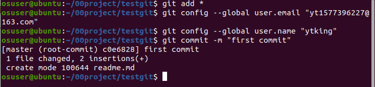

改写提交：git commit --amend

> --amend：重写上一次的提交信息

```
git commit --amend
```

### 4)status

查看提交之后文件是否做了改动：git status

> status：查看当前仓库状态

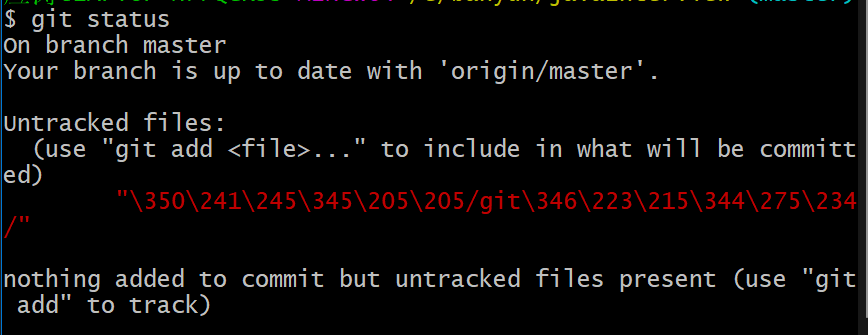

将文件add后

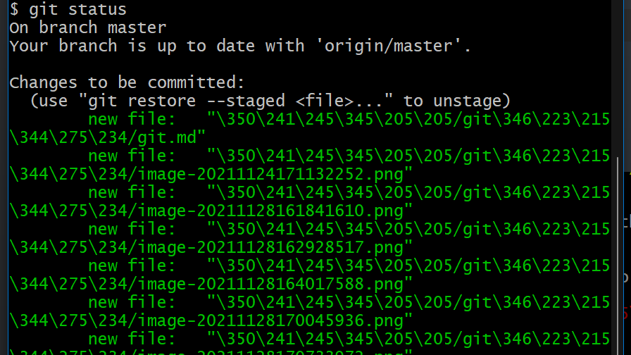

在git下有一个概念是缓存区，这是其它集中式版本控制系统没有的

工作区：工作区就是你当前的工作目录

缓存区：这里存放了你使用git add命令提交的文件描述信息，它位于.git目录下的index文件中

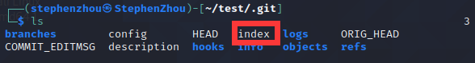

有的低版本中叫stage

这些文件中存储了我们一些提交的缓存数据，git会解析它们，HEAD文件就是指向当前的仓库

最后使用git commit提交时git会提交到当前仓库中，当前的工作区也就成为了最新一次提交的仓库版本。

### 5)push

本地仓库提交到远程仓库并合并

前提：有远程仓库

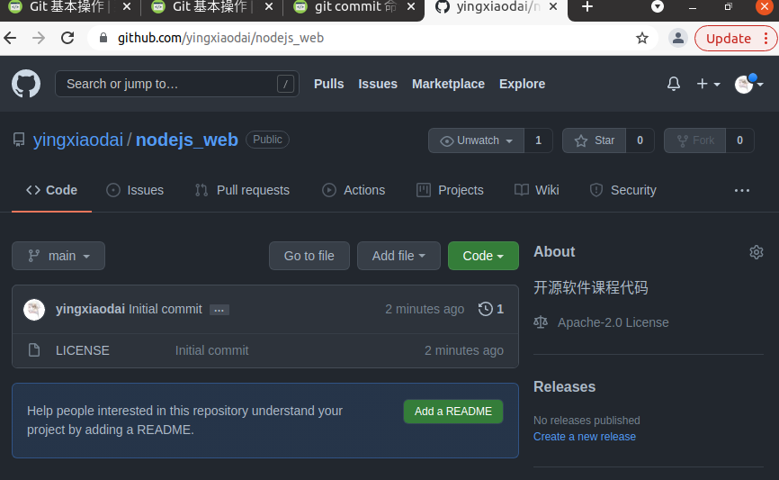

url栏里就是远程仓库地址

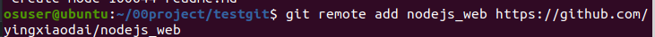

注意事项：github页面上将master分支名称改成了“main”，但push时还是要用master，对应web页面上的main

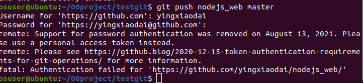

push命令正确，认证失败，需要token

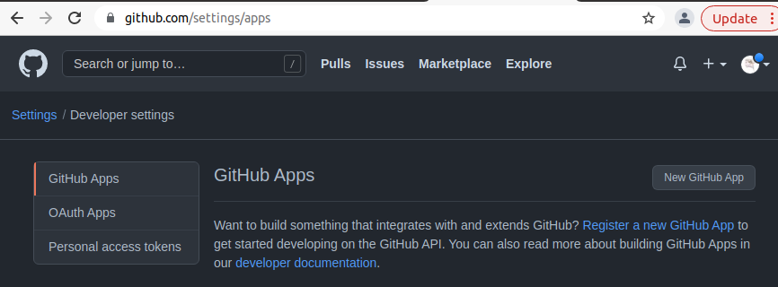

选择Personal access tokens 并创建一个token

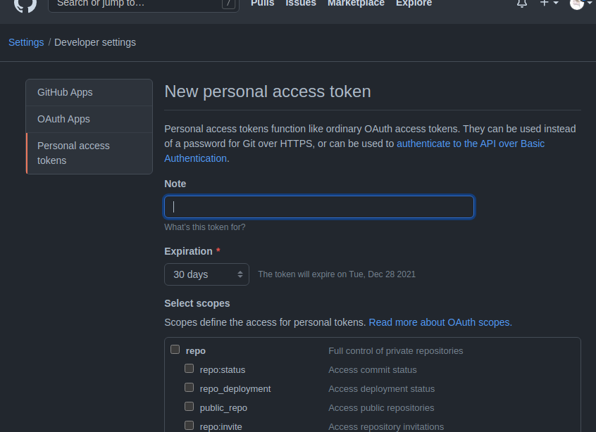

新建完成,将token当成密码

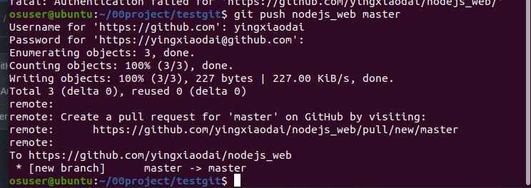

推送成功

```java
git push -u origin master //-u
```

>push：将本地仓库与远程仓库合并
>
>-u：将本地仓库分支与远程仓库分支一起合并，就是说将master的分支也提交上去，这样你就可以在远程仓库上看到你在本地仓库的master中创建了多少分支，不加这个参数只将当前的master与远程的合并，没有分支的历史记录，也不能切换分支
>
>origin：远程仓库的意思，如果这个仓库是远程的那么必须使用这个选项
>
>master：提交本地matser分支仓库

**ps:在远程仓库中提交上去的master分支，而远程仓库默认的是main分支，所以需要切换**

### 6)lone

git将远程仓库关联到本地和拉取指定分支、切换远程分支：

```
git clone
```

当我们远程有仓库时，想要关联到本地只需要使用git clone就可以了，新建一个空目录，不要git init，使用git clone会自动帮我们初始化

因为我们上传的代码在远程仓库中有一个默认的main和我们上传的master分支，github给我们创建了的master分支并没有关联到mian中，我们拉取时，默认拉取的是main分支，我们可以使用**git clone -b分支名** 仓库地址来指定分支

### 7)stash

git保存当前工作切换分支：

```java
git stash
```

在你当前工作区修改了文件或者其它功能时，想要切换或者创建到其它分区是不可能的，如：


我们分支修改了内容，想要切换到其它分区git会终止你这样操作，为的是防止丢失当前工作区内容。我们可以使用git stash命令来保存当前工作状态

```bash
git stash
```

保存工作状态之后可以使用git stash list查看当前存储了多少工作状态

```bash
git stash list
```

那么此时我们就可以切换到其它分支了

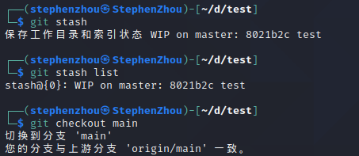

当在别的分支做完事情之后，在切换回刚刚的分支，然后在刚刚的分支中将状态恢复

```bash
git stash pop
```

一般情况下，我们在修改代码时，突然来了一个新的需求，让我们先去做这个需求，但是此时我们正在写的代码还没有完成，是不可以提交的，所以我们先使用git stash保存当前工作状态，在拉取一个分支去这个分支里面干活，干完活之后回到之前的分支，在将工作内容恢复出来继续干活

## git强制合并分支：--allow-unrelated-histories

当我们在使用两个不同的分支时或此分支不是从原生仓库中分支出来的，想要合并不符合GIT规则，所以会弹出：fatal: refusing to merge unrelated histories 的错误，比如当我们在本地开发好了，但是并没有在一开始关联远程仓库，若想提交就会出现这样的错误，我们先拉取下来以后合并分支在后面加上这条语句就可以了

```cpp
git merge master --allow-unrelated-histories
```

