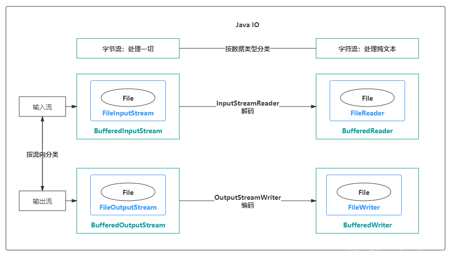
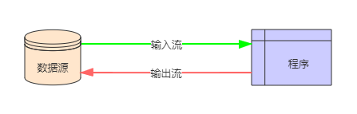
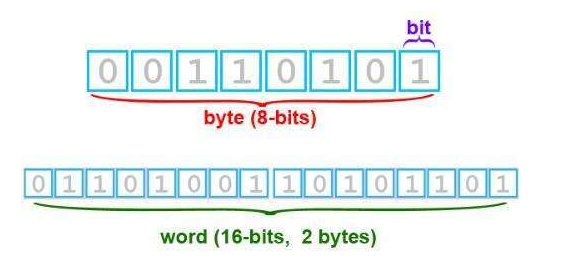
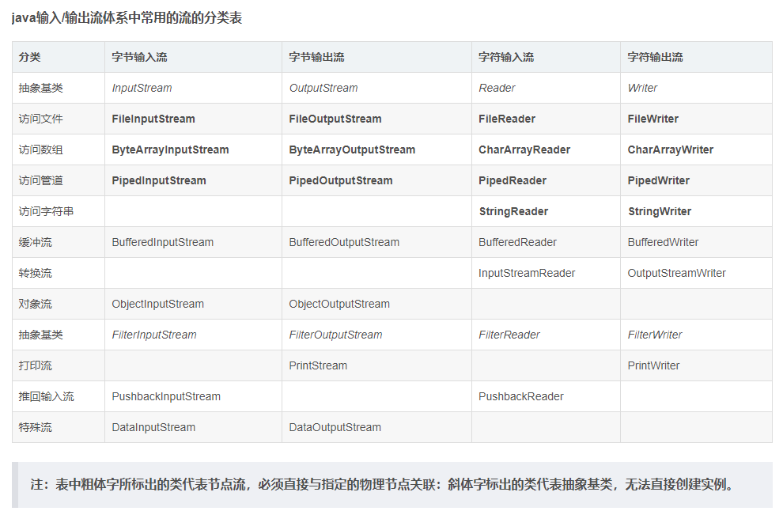

# IO流剖析——吃透Java IO：字节流、字符流、缓冲流


## 1.简介

### 1.1什么是流

Java 中是通过流处理IO 的，流（`Stream`），是一个抽象的概念，是指一连串的数据（字符或字节），是以先进先出的方式发送信息的***通道***。

当程序需要读取数据的时候，就会开启一个通向数据源的流，这个数据源可以是文件，内存，或是网络连接。类似的，当程序需要写入数据的时候，就会开启一个通向目的地的流。这时候你就可以想象数据好像在这其中“流”动一样。

### 1.2流的特点

```
1.先进先出：最先写入输出流的数据最先被输入流读取到。
2.顺序存取：可以一个接一个地往流中写入一串字节，读出时也将按写入顺序读取一串字节，不能随机访问中间的数据。（RandomAccessFile除外）
3.只读或只写：每个流只能是输入流或输出流的一种，不能同时具备两个功能，输入流只能进行读操作，对输出流只能进行写操作。在一个数据传输通道中，如果既要写入数据，又要读取数据，则要分别提供两个流。
```

## 2.IO流分类

IO流主要的分类方式有以下3种：



1. 按数据流的方向：输入流、输出流

   输入与输出是相对于应用程序而言的，比如文件读写，读取文件是输入流，写文件是输出流，这点很容易搞反。

   

2. 按处理数据单位：字节流、字符流

   字节流和字符流的用法几乎完成全一样，区别在于字节流和字符流所操作的数据单元不同，字节流操作的单元是数据单元是**8位**的字节，字符流操作的是数据单元为**16位**的字符。

   Java中字符是采用Unicode标准，Unicode 编码中，一个英文为一个字节，一个中文为两个字节。

   

   如果使用字节流处理中文，如果一次读写一个字符对应的字节数就不会有问题，一旦将一个字符对应的字节分裂开来，就会出现乱码了。为了更方便地处理中文这些字符，Java就推出了字符流

   ```
   字节流和字符流的其他区别：
   
   1.字节流一般用来处理图像、视频、音频、PPT、Word等类型的文件。字符流一般用于处理纯文本类型的文件，如TXT文件等，但不能处理图像视频等非文本文件。用一句话说就是：字节流可以处理一切文件，而字符流只能处理纯文本文件。
   2.字节流本身没有缓冲区，缓冲字节流相对于字节流，效率提升非常高。而字符流本身就带有缓冲区，缓冲字符流相对于字符流效率提升就不是那么大了。
   ```

3. 按功能：节点流、处理流

   **节点流**：直接操作数据读写的流类，比如`FileInputStream`

   **处理流**：对一个已存在的流的链接和封装，通过对数据进行处理为程序提供功能强大、灵活的读写功能，例如`BufferedInputStream`（缓冲字节流）

   处理流和节点流应用了Java的装饰者设计模式。下图就很形象地描绘了节点流和处理流，处理流是对节点流的封装，最终的数据处理还是由节点流完成的。

   

   ```
   在诸多处理流中，有一个非常重要，那就是缓冲流。
   程序与磁盘的交互相对于内存运算是很慢的，容易成为程序的性能瓶颈。减少程序与磁盘的交互，是提升程序效率一种有效手段。缓冲流，就应用这种思路：普通流每次读写一个字节，而缓冲流在内存中设置一个缓存区，缓冲区先存储足够的待操作数据后，再与内存或磁盘进行交互。这样，在总数据量不变的情况下，通过提高每次交互的数据量，减少了交互次数。
   ```

### 2.1分类表



## 3.示例

### 3.1.FileInputStream、FileOutputStream（字节流）

```java
public class IOTest {
	public static void main(String[] args) throws IOException {
		File file = new File("D:/test.txt");

		write(file);
		System.out.println(read(file));
	}

	public static void write(File file) throws IOException {
		OutputStream os = new FileOutputStream(file, true);

		// 要写入的字符串
		String string = "松下问童子，言师采药去。只在此山中，云深不知处。";
		// 写入文件
		os.write(string.getBytes());
		// 关闭流
		os.close();
	}

	public static String read(File file) throws IOException {
		InputStream in = new FileInputStream(file);

		// 一次性取多少个字节
		byte[] bytes = new byte[1024];
		// 用来接收读取的字节数组
		StringBuilder sb = new StringBuilder();
		// 读取到的字节数组长度，为-1时表示没有数据
		int length = 0;
		// 循环取数据
		while ((length = in.read(bytes)) != -1) {
			// 将读取的内容转换成字符串
			sb.append(new String(bytes, 0, length));
		}
		// 关闭流
		in.close();

		return sb.toString();
	}
}
```

### 3.2BufferedInputStream、BufferedOutputStream（缓冲字节流）

```java
public class IOTest {
//缓冲字节流是为高效率而设计的，真正的读写操作还是靠FileOutputStream和FileInputStream，所以其构造方法入参是这两个类的对象
	public static void write(File file) throws IOException {
		// 缓冲字节流，提高了效率
		BufferedOutputStream bis = new BufferedOutputStream(new FileOutputStream(file, true));

		// 要写入的字符串
		String string = "松下问童子，言师采药去。只在此山中，云深不知处。";
		// 写入文件
		bis.write(string.getBytes());
		// 关闭流
		bis.close();
	}

	public static String read(File file) throws IOException {
		BufferedInputStream fis = new BufferedInputStream(new FileInputStream(file));

		// 一次性取多少个字节
		byte[] bytes = new byte[1024];
		// 用来接收读取的字节数组
		StringBuilder sb = new StringBuilder();
		// 读取到的字节数组长度，为-1时表示没有数据
		int length = 0;
		// 循环取数据
		while ((length = fis.read(bytes)) != -1) {
			// 将读取的内容转换成字符串
			sb.append(new String(bytes, 0, length));
		}
		// 关闭流
		fis.close();

		return sb.toString();
	}
}
```

### 3.3InputStreamReader、OutputStreamWriter（字符流）

```java
public class IOTest {
//字符流适用于文本文件的读写，OutputStreamWriter类其实也是借助FileOutputStream类实现的，故其构造方法是FileOutputStream的对象
//Java提供了FileWriter和FileReader简化字符流的读写，new FileWriter等同于
//new OutputStreamWriter(new FileOutputStream(file, true))
    
	public static void write(File file) throws IOException {
		// OutputStreamWriter可以显示指定字符集，否则使用默认字符集
		OutputStreamWriter osw = new OutputStreamWriter(new FileOutputStream(file, true), "UTF-8");

		// 要写入的字符串
		String string = "松下问童子，言师采药去。只在此山中，云深不知处。";
		osw.write(string);
		osw.close();
	}

	public static String read(File file) throws IOException {
		InputStreamReader isr = new InputStreamReader(new FileInputStream(file), "UTF-8");
		// 字符数组：一次读取多少个字符
		char[] chars = new char[1024];
		// 每次读取的字符数组先append到StringBuilder中
		StringBuilder sb = new StringBuilder();
		// 读取到的字符数组长度，为-1时表示没有数据
		int length;
		// 循环取数据
		while ((length = isr.read(chars)) != -1) {
			// 将读取的内容转换成字符串
			sb.append(chars, 0, length);
		}
		// 关闭流
		isr.close();

		return sb.toString()
	}
}
```

### 3.4BufferedReader、BufferedWriter（字符缓冲流）

```java
public class IOTest {
	
	public static void write(File file) throws IOException {
		// BufferedWriter fw = new BufferedWriter(new OutputStreamWriter(new
		// FileOutputStream(file, true), "UTF-8"));
		// FileWriter可以大幅度简化代码
		BufferedWriter bw = new BufferedWriter(new FileWriter(file, true));

		// 要写入的字符串
		String string = "松下问童子，言师采药去。只在此山中，云深不知处。";
		bw.write(string);
		bw.close();
	}

	public static String read(File file) throws IOException {
		BufferedReader br = new BufferedReader(new FileReader(file));
		// 用来接收读取的字节数组
		StringBuilder sb = new StringBuilder();

		// 按行读数据
		String line;
		// 循环取数据
		while ((line = br.readLine()) != null) {
			// 将读取的内容转换成字符串
			sb.append(line);
		}
		// 关闭流
		br.close();

		return sb.toString();
	}
}
```

### 3.4序列化相关

1. **概述**：当两个进程远程通信时，彼此可以发送各种类型的数据。 无论是何种类型的数据，都会以二进制序列的形式在网络上传送。发送方需要把这个Java对象转换为字节序列，才能在网络上传送；接收方则需要把字节序列再恢复为Java对象才能正常读取。这时候就需要用到序列化与反序列化。把Java对象转换为字节序列的过程称为`对象的序列化`。把字节序列恢复为Java对象的过程称为`对象的反序列化`。

2. 对象序列化的作用有如下两种：

   - 持久化： 把对象的字节序列永久地保存到硬盘上，通常存放在一个文件中。
   - 网络通信：在网络上传送对象的字节序列。比如：服务器之间的数据通信、对象传递。

   注意：只有实现了Serializable接口的类的对象才能被序列化。
   而要进行序列化与反序列化，只需要用到以下两个类： ObjectOutputStream、 ObjectIutputStream，这两个类也是比较重要的。

```java
package cn.java_io;
 
import java.io.FileNotFoundException;
import java.io.FileOutputStream;
import java.io.IOException;
import java.io.ObjectOutputStream;
import java.io.Serializable;
 
/**
 ** 1、参与序列化与反序列化的对象，必须实现serializable接口
 */
public class TestObjectOutputStream {
	public static void main(String[] args) throws Exception, IOException {
		//创建Java对象
		Student s=new Student(111,"张三",1);
		//序列化
		ObjectOutputStream oos=new ObjectOutputStream(new FileOutputStream("students"));
          //序列化对象
		oos.writeObject(s);
		//刷新
		oos.flush();
		//关闭
		oos.close();
		
	}
}
```

```
链接：
https://blog.csdn.net/mu_wind/article/details/108674284
```

