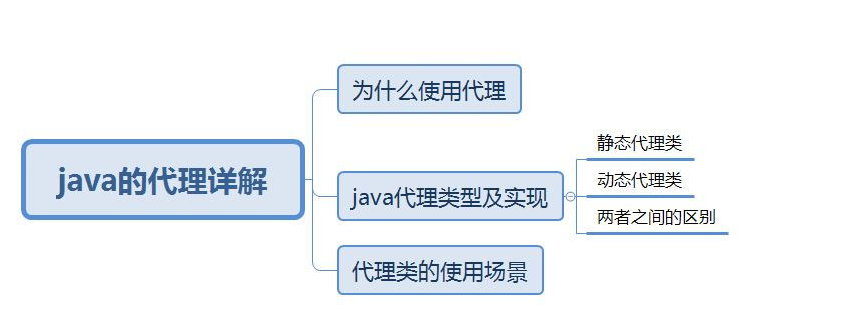

# Java代理详解

！！！**[JDK静态代理、动态代理和CGLIB动态代理](https://juejin.cn/post/7098269942310502437#heading-5)**

总览：

Java的代理类主要有静态代理和动态代理

## 3种代理方式的对比

| 代理方式       | 实现                                                         | 优点                                                         | 缺点                                                         | 特点                                                       |
| -------------- | ------------------------------------------------------------ | ------------------------------------------------------------ | ------------------------------------------------------------ | ---------------------------------------------------------- |
| JDK 静态代理   | 代理类与委托类实现同一接口。在代理类中需要硬编码接口         | 实现简单，容易理解                                           | 代理类需要硬编码接口，在实际应用中可能会导致重复编码，浪费存储空间并且效率较低 |                                                            |
| JDK 动态代理   | 代理类与委托类实现同一接口。代理类要实现 InvocationHandler 接口并重写 invoke 方法。invoke 方法中可以对委托方法进行增强处理 | 不需要硬编码接口，代码复用率高                               | 只能够代理实现了接口的委托类                                 | 底层使用反射机制进行方法的调用                             |
| CGLIB 动态代理 | 代理类将委托类作为自己的父类并为其中的非 final 委托方法创建两个方法，一个是与委托方法签名相同的方法，它在方法中会通过 super 调用委托方法；另一个是代理类独有的方法。在代理方法中，它会判断是否存在实现了MethodInterceptor 接口的对象，若存在则将调用 intercept 方法对委托方法进行代理 | 可以在运行时对类或者是接口进行增强操作，且委托类无需实现接口 | 不能对 final 类以及 final 方法进行代理                       | 底层将方法全部存入一个数组中，通过数组索引直接进行方法调用 |

# 1-静态代理

由程序员创建或者由第三方工具生成，再进行编译；在程序运行之前代理类的.class文件已经存在，这种代理的方式需要代理的对象和目标对象实现一样的接口。

优点： 可以在不修改目标对象的前提下扩展目标对象的功能

缺点：

1. 冗余， 由于代理对象实现与目标对象一致的接口，会产生过多的代理理
2. 不易维护，耦合度太高，一旦接口增加方法，目标对象和代理对象都要进行修改

## 1.1-以更新用户的信息的为例：

### 1.创建接口

```java
     package cn.chen.proxy;

     public interface UserDao {
     void update();
    }
```

### 2.目标对象，实现接口

```java
     public class UserDaoImpl implements UserDao {

     @Override
     public void update() {
     System.out.println("更新信息");
    }
  }
```

### 3.创建代理对象，必须实现接口

```java
  public class ProxyUserDao implements UserDao{

   private UserDao userDao;

  public ProxyUserDao(UserDao userDao){
    this.userDao = userDao;
  }

   /**
   * 对原有的方法进行增强
   */
   @Override
   public void update() {
    System.out.println("核对你的信息");
    userDao.update();
    System.out.println("信息更新成功");
    }
 }
```

### 4.测试

```java
    public class ProxyUserTest {
       public static void main(String[] args) {
        // 目标对象
        UserDao userDao = new UserDaoImpl();

        // 代理对象
        ProxyUserDao proxyUserDao = new ProxyUserDao(userDao);


        System.out.println(proxyUserDao.getClass().getName());
        proxyUserDao.update();
      }
 }
```

### 5.运行结果

```
     cn.chen.proxy.ProxyUserDao
     核对你的信息
     更新用户
     信息更新成功 
```

# 2-动态代理(JDK)

在程序运行时通过反射机制动态生成

优点：动态代理对象不需要实现与目标对象一致的接口，但要求目标对象必须实现接口，否则不能使用动态代理。

缺点： 使用动态代理的对象必须实现一个或多个接口。在代理类没有接口的情况下，可以使用cglib实现动态代理，达到代理类的无侵入。

## 2.1-**静态代理和动态代理的主要区别：**

1. 静态代理在编译时就已经实现，编译完成后的代理类是一个实际的class文件。
2. 动态代理是在运行时动态生成的，即编译完成后没有实际的class文件，是在运行时动态生成类字节码，并加载到jvm中。
3. 静态的代理类需要实现与目标对象一致的接口，耦合度较高，而动态的代理类则不用实现与目标对象一致的接口。

## 2.2-**动态代理的实现：**

java的动态代理利用了JDK Apl,动态地在内存中构建代理对象，从而实现对目标对象的代理功能。

## 2-3主要涉及的类

```java
//java.lang.reflect.Proxy 主要方法为： 
public static Object newProxyInstance(ClassLoader loader,
                                    Class<?>[] interfaces,
                                    InvocationHandler h)
  throws IllegalArgumentException
  
  /*这个方法会给与我们来生成一个代理对象，含有三个参数
  
   classLoader: 类加载器
   interface绑定的接口，也就是把代理对象绑定到那些接口下，可以是多个接口
   invocationHander   绑定对象的逻辑实现
```

```java
//java.lang.reflect InvocationHander,主要方法为： 
Object invoke(Object proxy, Method method, Object[] args)
 /* 这个方法也有三个参数
  proxy  代理的对象
  method 当前的方法
  args 运行参数
```

## 2.4-**以用户的信息更新为例：**

### 1.创建接口

```java
     package cn.chen.proxy;

     public interface UserDao {
     void update();
    }
```

### 2.目标对象，实现接口

```java
    public class UserDaoImpl implements UserDao {

    @Override
    public void update() {
    System.out.println("更新信息");
   }
 }
```

### 3.生成代理对象

```java
public class DynamicProxyUser  implements InvocationHandler {

// 被代理的对象
    private Object object;

     public DynamicProxyUser(){}

    public DynamicProxyUser(Object object) {
        this.object = object;
    }
    /**
     * 处理代理对象的逻辑，所有被代理对象的方法都会在invoke中执行
     * @param proxy 代理的对象
     * @param method  当前方法
     * @param args  方法运行参数
     * @return  方法调用结果
     * @throws Throwable
     */
    @Override
    public Object invoke(Object proxy, Method method, Object[] args) throws Throwable {
        System.out.println("核对你的信息");
        // 执行目标方法
         Object target = method.invoke(object,args);
        System.out.println("更新成功");
        return target;
    }
}
```

### 4.测试：

```java
    public class DynamicProxyTest {
    public static void main(String[] args) {

    // 目标对象
     UserDao userDao = new UserDaoImpl();

     DynamicProxyUser dynamicProxyUser = new DynamicProxyUser(userDao);

     ClassLoader loader = userDao.getClass().getClassLoader();

     // 调用Proxy的newProxyInstance()方法生成最终的代理对象
     UserDao proxy = (UserDao) Proxy.newProxyInstance(loader,new Class[]{UserDao.class},dynamicProxyUser);
     
     System.out.println(proxy.getClass().getName());
     proxy.update();
}
}

 /*运行结果：
  com.sun.proxy.$Proxy0
  核对你的信息
  更新信息
  更新成功       
```

# 3-动态代理(CGLib)

## 3.1-原理

**CGLIB 动态代理中，通过字节码技术（使用了字节码处理框架 `ASM`）为一个类创建子类，并在子类中采用方法拦截的技术拦截所有父类方法的调用，顺势织入横切逻辑。**

字节码、ASM、CGLIB 的层次关系如下图所示。Spring AOP 中使用到了代理技术，既使用了 JDK 动态代理，也使用了 CGLIB 动态代理。


## 3.2-使用步骤

1. CGLIB动态代理中，要求代理类必须要实现 `MethodInterceptor` 接口并重写 `intercept()`。
2. 通过 CGLIB 动态代理，获取代理对象。
3. 通过代理对象调用目标方法时，对目标方法的调用，将被转发到 `MethodInterceptor` 接口的 `intercept()` 方法来进行调用。在 `intercept()` 方法中，我们除了会调用委托方法外，还会进行一些增强操作，如日志的记录，调用量的监控等。

需要注意的是

- CGLIB 动态代理中，**代理类是继承了被代理类（或服务类），即 `enhancer.setSuperclass(Service.class)`**。所以，被代理类的`final` 方法或 `final` 类，不能被代理类继承，也就不能通过代理的方式调用。
- 代理类将委托类作为自己的父类，并为其中的非 `final` 委托方法创建两个方法，一个是与委托方法签名相同的方法，它在方法中会通过 `super` 调用委托方法；另一个是代理类独有的方法。在代理方法中，它会判断是否存在实现了 `MethodInterceptor` 接口的对象，若存在则将调用 `intercept` 方法对委托方法进行代理。

## 3.3-FastClass机制

CGLIB 动态代理中，方法的调用并不是通过反射来完成的，而是通过 `FastClass` 机制来实现对被拦截方法的调用。

**`FastClass` 机制中，不使用反射类（`Constructor` 或 `Method`）来调用委托类的方法，而是动态生成一个新的类（继承 `FastClass`），并为委托类的方法调用语句建立索引，使用者根据方法签名（方法名 + 参数类型）得到索引值，再通过索引值调用相应的方法。**

## JDK动态代理和CGLIB动态代理的对比

1. JDK 动态代理时，需要委托类（被代理类）实现了一个接口。CGLIB 动态代理时，则无此要求，因为代理类是继承的委托类。
2. JDK 动态代理中，代理类通过 Java 反射技术调用委托方法。CGLIB 动态代理中，代理类通过 FastClass 机制，采用方法拦截的技术对委托方法进行调用。

# 4-java代理的应用场景：

1. 切面编程
2. 加事物，加权限
3. 加日志
4. Rpc框架的使用


