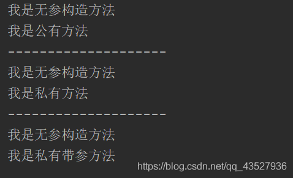
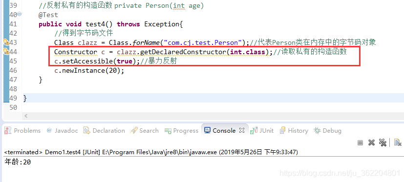
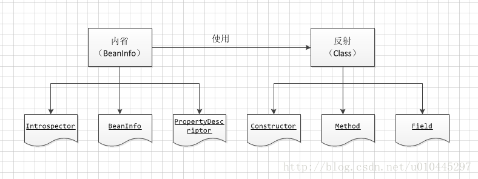

# java反射机制详解

# 1-java中如何创建一个对象的方式

Java中创建对象大概有这几种方式：

1、使用new关键字：这是我们最常见的也是最简单的创建对象的方式

2、使用Clone的方法：无论何时我们调用一个对象的clone方法，JVM就会创建一个新的对象，将前面的对象的内容全部拷贝进去

3、使用反序列化：当我们序列化和反序列化一个对象，JVM会给我们创建一个单独的对象

上边是Java中常见的创建对象的三种方式，除了这三种还有另外一种方式，就是 **“反射”**

# 2-反射概述

## 2.1-什么是反射

JAVA反射机制是在运行状态中，对于任意一个类，都能够知道这个类的所有属性和方法；对于任意一个对象，都能够调用它的任意一个方法和属性；这种动态获取的信息以及动态调用对象的方法的功能称为java语言的反射机制。

要想解剖一个类,必须先要获取到该类的字节码文件对象。而解剖使用的就是Class类中的方法.所以先要获取到每一个字节码文件对应的Class类型的对象.

反射就是把Java类中的各个部分，映射成一个个的Java对象，拿到这些对象后可以做一些事情。

既然说反射是反射Java类中的各个组成部分，所以说咱们得知道一个类中有哪儿些部分？

例如，一个类有：成员变量，方法，构造方法，等信息，利用反射技术咱们可以把这些组成部分映射成一个个对象。


## 2.2-反射的作用

一般来说反射是用来做框架的，或者说可以做一些抽象度比较高的底层代码，反射在日常的开发中用到的不多，但是咱们还必须搞懂它，因为搞懂了反射以后，可以帮助咱们理解框架的一些原理。所以说有一句很经典的话：**反射是框架设计的灵魂。**

## 2.3-反射的常用对象

- **Class**
  Class类的实例表示正在运行的Java应用程序中的**类和接口**
- **Constructor**
  关于类的**单个构造方法**的信息以及对它的访问权限
- **Field**
  Field 提供有关类或接口的**单个字段**的信息,以及对它的动态访问权限.
- **Method**
  Method 提供关于类或接口上**单独某个方法**的信息

反射在内存中的形态



这是一个简单的Animal类,这个Animal.java文件,想要被执行的话,首先会被编译成Animal.class文件.而Animal.class想要被执行的话,就会被类加载器加载到JVM中执行,JVM就会将它加载到内存,而加载之后,字节码文件Animal.class在内存中也会有一个对象的表示, .class文件在内存中的对象就是Class对象,所以说**获得了Class,才能获得它的构造方法,属性以及方法**,相对应的 构造方法在 内存中 对应的是Constructor对象, 属性 对应的就是 Field,而方法呢 对应的就是Method,但是 不管我们想要获得构造方法,属性 还是 方法, 前提都是我们先获得Class对象

## 2.4-Class类在java中的api详解（1.7的API）


`Class` 类的实例表示正在运行的 Java 应用程序中的类和接口。也就是jvm中有N多的实例每个类都有该Class对象。（包括基本数据类型）

`Class` 没有公共构造方法。`Class` 对象是在加载类时由 Java 虚拟机以及通过调用类加载器中的`defineClass` 方法自动构造的。也就是这不需要我们自己去处理创建，JVM已经帮我们创建好了。

### 2.4.1-Class类主要方法

```
getName()：获得类的完整名字。

getFields()：获得类的public类型的属性。

getDeclaredFields()：获得类的所有属性。包括private 声明的和继承类

getMethods()：获得类的public类型的方法。

getDeclaredMethods()：获得类的所有方法。包括private 声明的和继承类

getMethod(String name, Class[] parameterTypes)：获得类的特定方法，name参数指定方法的名字，parameterTypes 参数指定方法的参数类型。

getConstructors()：获得类的public类型的构造方法。

getConstructor(Class[] parameterTypes)：获得类的特定构造方法，parameterTypes 参数指定构造方法的参数类型。

newInstance()：通过类的构造方法创建这个类的一个对象。
```

# 3-获取class类

```java
//示例
@Data
public class Animal {
    public String name;
    private int id;
    public Animal(){
        System.out.println("我是无参构造方法");
    }
    public Animal(int id,String name){
        this.setId(id);
        this.setName(name);
        System.out.println("我是有参构造方法");
    }
    public void eat(){
        System.out.println("我是公有方法");
    }
    private void drink(){
        System.out.println("我是私有方法");
    }
    private void play(String name,String sex){
        System.out.println("我是私有带参方法");
    }
    @Override
    public String toString() {
        return "Animal{" +
                "name='" + name + '\'' +
                ", id=" + id +
                '}';
    }
}
```

```java
    /**
     * 获得Class对象
     * 1.通过类名.class
     * 2.对象.getClass()
     * 3.Class.forName();
     */
    public void demo1() throws ClassNotFoundException {
        //1.通过类名.class的方式
        Class class1 = Animal.class;
        //2.通过对象.getClass()的方式
        Animal animal = new Animal();
        Class class2 = animal.getClass();
        //3.Class类forName();获得(推荐)
        Class class3 = Class.forName("JavaReflectTest.Animal");
    }
//这三种获得Class对象的方法,推荐使用第三种方法,因为我们通常做反射的时候,都是在不知道类的实例的时候进行操作的,注意第三种方法通过Class.forName();来获得Class对象的时候,会抛出一个ClassNotFoundException 没有发现类的异常,如果路径写错了或者没有找到这个类的时候,就会抛出这个异常,这个异常处理,可以选择try…catch处理也可以先向上抛
```

# 4-获取Constructor类

- Constructor类的实例对象代表类的一个构造方法
- 得到某个类所有的构造方法
  Constructor [] constructors = Class.forName(“java.lang.String”).getConstructors();
- 得到指定的构造方法并调用
  Constructor constructor = Class.forName(“java.lang.String”).getConstructors(String.class);
  String str = (String)constructor.newInstance(“abc”);
- Class类的newInstance()方法用来调用类的默认构造方法
  String obj = (String)Class.forName(“java.lang.String”).newInstance();

```java
package JavaReflectTest;

import java.lang.reflect.Constructor;

public class ConstructorTest {
    /**
     *获得无参构造方法
     */
    public void demo1() throws Exception {
        //获得类的字节码文件对应的对象:
        Class class1 = Class.forName("JavaReflectTest.Animal");
        Constructor c = class1.getConstructor();
        Animal animal = (Animal)c.newInstance();//相当于 Animal animal = new Animal();
    }

    /**
     *获得有参构造方法
     */
    public void demo2() throws Exception{
        Class class1 = Class.forName("JavaReflectTest.Animal");
        Constructor c = class1.getConstructor(int.class,String.class);
        Animal animal = (Animal)c.newInstance(2,"猴子");//相当于 Animal animal = new Animal(2,"猴子");
        System.out.println(animal.toString());
    }
    public static void main(String[] args) throws Exception {
        ConstructorTest c = new ConstructorTest();
        c.demo1();
        System.out.println("------------");
        c.demo2();
    }
}
```

运行结果：

## 4.1-反射“私有”的构造函数



在反射私有的构造函数时，用普通的clazz.getConstructor（）会报错，因为它是私有的，所以提供了专门反射私有构造函数的方法 **clazz.getDeclaredConstructor(int.class);//读取私有的构造函数，**用这个方法读取完还需要设置一下暴力反射才可以

# 5-Field类

- Field类代表某个类中的一个成员变量,并提供动态的访问权限
- Field对象的获得
  Field[] fields = c.getFields();//取得所有public属性(包括父类继承)
  Field[] fields = c.getDeclaredFields();//取得所有声明的属性
- 得到指定的成员变量
  Field name = c.getField(“name”);
  **Field name = c.getDeclaredField(“name”);**
- 设置Filed变量是否可以访问
  field.setAccessible(boolean);
  -Field变量值的读取,设置
  field.get(obj);
  filed.set(obj,value);

```java
public class FieldTest {
    //测试共有属性
    public void demo1() throws Exception{
        //获得Class
        Class class1 = Class.forName("JavaReflectTest.Animal");
        //获得属性:
        Field field = class1.getField("name");
        //操作属性:
        Animal animal = (Animal)class1.getConstructor().newInstance();
        field.set(animal,"老虎");// animal.name = "老虎";
        //获取值
        Object obj = field.get(animal);
        System.out.println(obj);
        System.out.println(animal);//这样会自动调用toString()方法
    }
    //测试私有方法
    public void demo2() throws Exception{
        //获得Class
        Class class1 = Class.forName("JavaReflectTest.Animal");
        //获得私有属性:
        Field field = class1.getDeclaredField("id");
        //操作属性:
        Animal animal = (Animal)class1.getConstructor().newInstance();
        //私有属性,需要设置一个可访问的权限
        field.setAccessible(true);
        field.set(animal,1);
        //获取值:
        Object obj = field.get(animal);
        System.out.println(obj);
        System.out.println(animal);
    }
    public static void main(String[] args) throws Exception {
        FieldTest fieldTest = new FieldTest();
        fieldTest.demo1();
        System.out.println("----------------");
        fieldTest.demo2();
    }
}
```

结果：

# 6-Method类

- Method类代表某个类中的一个成员方法
- Method对象的获得
  获得所有方法
  getDeclaredMethods()
  getMethods()
  -获得指定的方法
  getDeclaredMethod(String name,Class<?>…parameterTypes)
  getMethod(String name,Class<?>…parameterTypes)
- 通过反射执行方法
  invoke(Object obj,Object…args)

```java
public class MethodTest {
    //测试公有方法
    public void demo1() throws Exception{
        //获取Class对象
        Class class1 = Class.forName("JavaReflectTest.Animal");
        //实例化
        Animal animal = (Animal)class1.getConstructor().newInstance();
        //获得公有方法
        Method method = class1.getMethod("eat");
        //执行该方法
        method.invoke(animal);// 相当于animal.eat();
    }
    //测试私有方法
    public void demo2() throws Exception{
        //获取Class对象
        Class class1 = Class.forName("JavaReflectTest.Animal");
        //实例化
        Animal animal = (Animal)class1.getConstructor().newInstance();
        //获得私有方法
        Method method = class1.getDeclaredMethod("drink");
        //设置私有的访问权限
        method.setAccessible(true);
        //执行该方法
        method.invoke(animal);//相当于animal.drink();
    }
    public void demo3() throws Exception{
        //获取Class对象
        Class class1 = Class.forName("JavaReflectTest.Animal");
        //实例化
        Animal animal = (Animal)class1.getConstructor().newInstance();
        //获得私有带参的方法
        Method method = class1.getDeclaredMethod("play", int.class, String.class);
        //设置私有的访问权限
        method.setAccessible(true);
        //执行该方法
        Object obj = method.invoke(animal,2,"孔雀"); // 这是有返回值的情况 如果没有返回值可以直接写method.invoke(animal,2,"孔雀");
        System.out.println(obj);//打印返回的东西,没有就是null
    }

    //测试私有带参数的方法
    public static void main(String[] args) throws Exception{
        MethodTest methodTest = new MethodTest();
        methodTest.demo1();
        System.out.println("--------------------");
        methodTest.demo2();
        System.out.println("--------------------");
        methodTest.demo3();

    }
}
```

结果：

# 7-应用场景

## 7.1-**JDBC 的数据库的连接**

在JDBC 的操作中，如果要想进行数据库的连接，则必须按照以上的几步完成

1. 通过Class.forName()加载数据库的驱动程序 （通过反射加载，前提是引入相关了Jar包）
2. 通过 DriverManager类进行数据库的连接
3. 连接的时候要输入数据库的连接地址、用户名、密码 通过Connection 接口接收连接

```java
public class ConnectionJDBC {  
  
    /** 
     * @param args 
     */  
    //驱动程序就是之前在classpath中配置的JDBC的驱动程序的JAR 包中  
    public static final String DBDRIVER = "com.mysql.jdbc.Driver";  
    //连接地址是由各个数据库生产商单独提供的，所以需要单独记住  
    public static final String DBURL = "jdbc:mysql://localhost:3306/test";  
    //连接数据库的用户名  
    public static final String DBUSER = "root";  
    //连接数据库的密码  
    public static final String DBPASS = "";  
      
      
    public static void main(String[] args) throws Exception {  
        Connection con = null; //表示数据库的连接对象  
        Class.forName(DBDRIVER); //1、使用CLASS 类加载驱动程序 ,反射机制的体现 
        con = DriverManager.getConnection(DBURL,DBUSER,DBPASS); //2、连接数据库  
        System.out.println(con);  
        con.close(); // 3、关闭数据库  
    } 
```

## 7.2-**Spring 框架的使用**

在 Java的[反射机制](https://so.csdn.net/so/search?from=pc_blog_highlight&q=反射机制)在做基础框架的时候非常有用，行内有一句这样的老话：反射机制是Java框架的基石。一般应用层面很少用，不过这种东西，现在很多开源框架基本都已经封装好了，自己基本用不着写。典型的除了hibernate之外，还有spring也用到很多反射机制。最经典的就是xml的配置模式。

Spring 通过 XML 配置模式装载 Bean 的过程：

1. 将程序内所有 XML 或 Properties 配置文件加载入内存中
2. Java类里面解析xml或properties里面的内容，得到对应实体类的字节码字符串以及相关的属性信息
3. 使用反射机制，根据这个字符串获得某个类的Class实例
4. 动态配置实例的属性

**Spring这样做的好处是：**

1. 不用每一次都要在代码里面去new或者做其他的事情 以后要改的话直接改配置文件，代码维护起来就很方便了
2. 有时为了适应某些需求，Java类里面不一定能直接调用另外的方法，可以通过反射机制来实现

**模拟 Spring 加载 XML 配置文件：**

```java
public class BeanFactory {
       private Map<String, Object> beanMap = new HashMap<String, Object>();
   
    /**
       * bean工厂的初始化.
       * @param xml xml配置文件
       */
       public void init(String xml) {
              try {
                     //读取指定的配置文件
                     SAXReader reader = new SAXReader();
                     ClassLoader classLoader = Thread.currentThread().getContextClassLoader();
                     //从class目录下获取指定的xml文件
                     InputStream ins = classLoader.getResourceAsStream(xml);
                     Document doc = reader.read(ins);
                     Element root = doc.getRootElement();  
                     Element foo;
                    
                     //遍历bean
                     for (Iterator i = root.elementIterator("bean"); i.hasNext();) {  
                            foo = (Element) i.next();
                            //获取bean的属性id和class
                            Attribute id = foo.attribute("id");  
                            Attribute cls = foo.attribute("class");
                           
                            //利用Java反射机制，通过class的名称获取Class对象
                            Class bean = Class.forName(cls.getText());
                           
                            //获取对应class的信息
                            java.beans.BeanInfo info = java.beans.Introspector.getBeanInfo(bean);
                            //获取其属性描述
                            java.beans.PropertyDescriptor pd[] = info.getPropertyDescriptors();
                            //设置值的方法
                            Method mSet = null;
                            //创建一个对象
                            Object obj = bean.newInstance();
                           
                            //遍历该bean的property属性
                            for (Iterator ite = foo.elementIterator("property"); ite.hasNext();) {  
                                   Element foo2 = (Element) ite.next();
                                   //获取该property的name属性
                                   Attribute name = foo2.attribute("name");
                                   String value = null;
                                  
                                   //获取该property的子元素value的值
                                   for(Iterator ite1 = foo2.elementIterator("value"); ite1.hasNext();) {
                                          Element node = (Element) ite1.next();
                                          value = node.getText();
                                          break;
                                   }
                                  
                                   for (int k = 0; k < pd.length; k++) {
                                          if (pd[k].getName().equalsIgnoreCase(name.getText())) {
                                                 mSet = pd[k].getWriteMethod();
                                                 //利用Java的反射极致调用对象的某个set方法，并将值设置进去
                                                 mSet.invoke(obj, value);
                                          }
                                   }
                            }
                           
                            //将对象放入beanMap中，其中key为id值，value为对象
                            beanMap.put(id.getText(), obj);
                     }
              } catch (Exception e) {
                     System.out.println(e.toString());
              }
       }
}
```

# 扩展


这是Spring配置文件里的常见的bean配置，看起来可以用反射很轻易的就可以实现：解析xml然后把xml里的内容作为参数，利用反射创建对象。

**1、**除了上述的Spring配置文件里会用到反射生成bean对象，其他常见的MVC框架，比如Struts2、SpringMVC等等一些框架里还有很多地方都会用到反射。

前端页面录入的一些信息通过表单或者其他形式传入后端，后端框架就可以利用反射生成对应的对象，并利用反射操作它的set、get方法把前端传来的信息封装到对象里。

相关文章：[利用Java反射模拟一个Struts2框架 Struts2主要核心设计 手动实现Struts2核心代码](https://blog.csdn.net/ju_362204801/article/details/78907931)，这篇里边包含了XML解析、反射的东西，模拟了一个Struts2的核心代码

**2、**框架的代码里经常需要利用反射来操作对象的**set、get**方法，来把程序的数据封装到Java对象中去。

如果每次都使用反射来操作对象的**set、get**方法进行设置值和取值的话，过于麻烦，所以JDK里提供了一套API，专门用于操作Java对象的属性(**set/get**方法)，这就是**内省**

关于内省相关的内容：[Java反射——内省（Introspector）以及BeanUtils内省框架](https://blog.csdn.net/ju_362204801/article/details/90672396)

**3、**平常用到的框架，除了配置文件的形式，现在很多都使用了注解的形式。

其实注解也和反射息息相关：使用反射也能轻而易举的拿到类、字段、方法上的注解，然后编写注解解析器对这些注解进行解析，做一些相关的处理

所以说不管是配置文件还是注解的形式，它们都和反射有关。注解和自定义注解的内容：[Java中的注解以及自定义注解](https://blog.csdn.net/ju_362204801/article/details/90697479)

写在最后：**反射是框架的灵魂，具备反射知识和思想，是看懂框架的基础**。

## 扩展-内省

## 1-内省是什么、实现方式

```
Java语言对Bean类属性、事件的一种缺省处理方法。例如类A中有属性name,那我们可以通过getName,setName来得到其值或者设置新的值。通过getName/setName来访问name属性，这就是默认的规则。Java中提供了一套API用来访问某个属性的getter/setter方法，通过这些API可以使你不需要了解这个规则（但你最好还是要搞清楚），这些API存放于包java.beans中。
```

```
一般的做法是通过类Introspector来获取某个对象的BeanInfo信息，然后通过BeanInfo来获取属性的描述器（PropertyDescriptor），通过这个属性描述器就可以获取某个属性对应的getter/setter方法，然后我们就可以通过反射机制来调用这些方法。
```

## 2-内省和反射区别：区别：

 	 反射是在运行状态把Java类中的各种成分映射成相应的Java类，可以动态的获取所有的属性以及动态调用任意一个方法，强调的是运行状态。
 	  内省(IntroSpector)是Java 语言对 Bean 类属性、事件的一种缺省处理方法。　JavaBean是一种特殊的类，主要用于传递数据信息，这种类中的方法主要用于访问私有的字段，且方法名符合某种命名规则。如果在两个模块之间传递信息，可以将信息封装进JavaBean中，这种对象称为“值对象”(Value Object)，或“VO”。方法比较少。这些信息储存在类的私有变量中，通过set()、get()获得。内省机制是通过反射来实现的，BeanInfo用来暴露一个bean的属性、方法和事件，以后我们就可以操纵该JavaBean的属性。



 在Java内省中，用到的基本上就是上述几个类。 通过BeanInfo这个类就可以获取到类中的方法和属性。例如类 A 中有属性 name, 那我们可以通过 getName,setName 来得到其值或者设置新的值。通过 getName/setName 来访问 name 属性，这就是默认的规则。 Java 中提供了一套 API 用来访问某个属性的 getter/setter 方法，这些 API 存放于包 java.beans 中,一般的做法是通过类 Introspector 的 getBeanInfo方法 来获取某个对象的 BeanInfo 信息,然后通过 BeanInfo 来获取属性的描述器(PropertyDescriptor),通过这个属性描述器就可以获取某个属性对应的 getter/setter 方法,然后我们就可以通过反射机制来调用这些方法，这就是内省机制。

## 3-内省代码演示

### 3.1-直接通过属性的描述器PropertyDescriptor类

```java
    @Data
    @NoArgsConstructor
    @AllArgsConstructor
    public class Point {     
        private Integer x;     
        private Integer y;     
      }     
   
   import java.beans.PropertyDescriptor;     
   import java.lang.reflect.Method;     
       
   public class Reflect {     
       
       public static void main(String[] args) throws Exception {     
           Point point = new Point(2, 5);     
           String proName = "x";     

           getProperty(point, proName);     
           setProperty(point, proName);     
       }     

       private static void setProperty(Point point, String proName) throws Exception {     
           PropertyDescriptor proDescriptor = new PropertyDescriptor(proName, Point.class);     
           Method methodSetX = proDescriptor.getWriteMethod();     
           methodSetX.invoke(point, 8);     
           System.out.println(point.getX());// 8     
       }     

       private static void getProperty(Point point, String proName) throws Exception {     
           PropertyDescriptor proDescriptor = new PropertyDescriptor(proName, Point.class);     
           Method methodGetX = proDescriptor.getReadMethod();     
           Object objx = methodGetX.invoke(point);     
           System.out.println(objx);// 2     
       }     
  }      
```

### 3.2-通过类 Introspector 来获取某个对象的 BeanInfo 信息

通过类 Introspector 来获取某个对象的 BeanInfo 信息，然后通过 BeanInfo 来获取属性的描述器（ PropertyDescriptor ），通过这个属性描述器就可以获取某个属性对应的 getter/setter 方法，然后我们就可以通过反射机制来调用这些方法。

```java
//将3.1中的getProperty()修改成如下形式：
private static void getProperty(Point point, String proName) throws Exception {     
        BeanInfo beanInfo = Introspector.getBeanInfo(point.getClass());     
        PropertyDescriptor[] proDescriptors = beanInfo.getPropertyDescriptors();     
        for(PropertyDescriptor prop: proDescriptors){     
          if(prop.getName().equals(proName)){     
            Method methodGetx = prop.getReadMethod();     
            System.out.println(methodGetx.invoke(point));//8     
            break;     
          }     
       }     
   }   
```

ps:通常把javabean的实例对象称之为值对象 （Value Object）,因为这些bean中通常只有一些信息字段和存储方法，没有功能性方法。一个JavaBean类可以不当JavaBean用，而当成普通类 用。JavaBean实际就是一种规范，当一个类满足这个规范，这个类就能被其它特定的类调用。一个类被当作javaBean使用时，JavaBean的 属性是根据方法名推断出来的，它根本看不到java类内部的成员变量(javabean的成员变量通常都是私有private的)。

### 3.3-开源工具类Beanutils

```java
public static void main(String[] args) throws Exception {     
        Point point = new Point(2, 5);     
        String proName = "x";     
        BeanUtils.setProperty(point, proName, "8");     
        System.out.println(point.getX());// 8     
        System.out.println(BeanUtils.getProperty(point, proName));// 8     
        System.out.println(BeanUtils.getProperty(point, proName).getClass().getName());// java.lang.String     
        
        BeanUtils.setProperty(point, proName, 8);     
       System.out.println(BeanUtils.getProperty(point, proName).getClass().getName());// java.lang.String     
   }     
   //我们看到虽然属性x的类型是Integer，但是我们设置的时候无论是Integer还是String，BeanUtils的内部都是当成String来处理的。  
```

BeanUtils支持javabean属性的级联操作：

```java
public static void main(String[] args) throws Exception {     
    Point point = new Point(2, 5);//在point中加一个属性 private Date birth = new Date();并产生setter/getter方法     
    String proName = "birth";     
    Date date= new Date();     
    date.setTime(10000);     
    BeanUtils.setProperty(point, proName, date);     
    System.out.println(BeanUtils.getProperty(point, proName));     
         
    BeanUtils.setProperty(point, "birth.time", 10000);     
    System.out.println(BeanUtils.getProperty(point, "birth.time"));//10000     
}     
//之所以可以 BeanUtils.setProperty(point, "birth.time", 10000);这样写，那是因为Date类中有getTime()和setTime()方法，即Date类中等于有time这个属性。   
```

BeanUtils和PropertyUtils对比：

```java
public static void main(String[] args) throws Exception {     
    Point point = new Point(2, 5);     
    String proName = "x";     
    BeanUtils.setProperty(point, proName, "8");     
    System.out.println(BeanUtils.getProperty(point, proName));//8     
    System.out.println(BeanUtils.getProperty(point, proName).getClass().getName());//java.lang.String     
         
// PropertyUtils.setProperty(point, proName, "8");//exception:argument type mismatch     
    PropertyUtils.setProperty(point, proName, 8);     
    System.out.println(PropertyUtils.getProperty(point, proName));//8     
    System.out.println(PropertyUtils.getProperty(point, proName).getClass().getName());//java.lang.Integer     
}     
//BeanUtils它以字符串的形式对javabean进行转换，而PropertyUtils是以原本的类型对javabean进行操作。如果类型不对，就会有argument type mismatch异常。  
```

